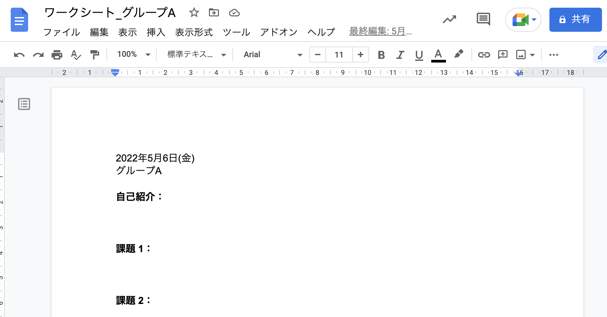
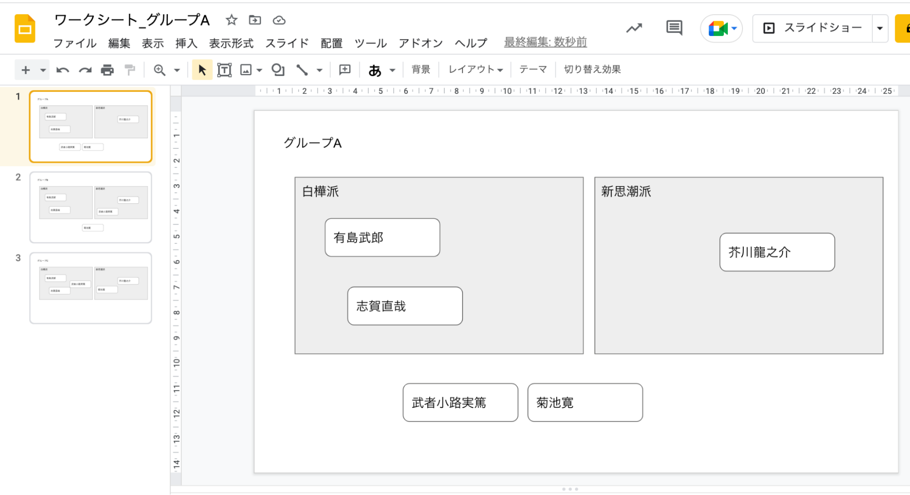
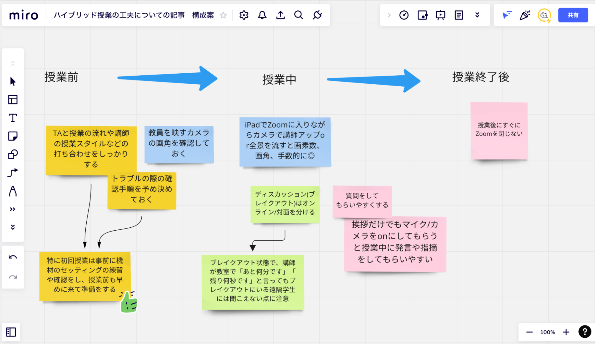
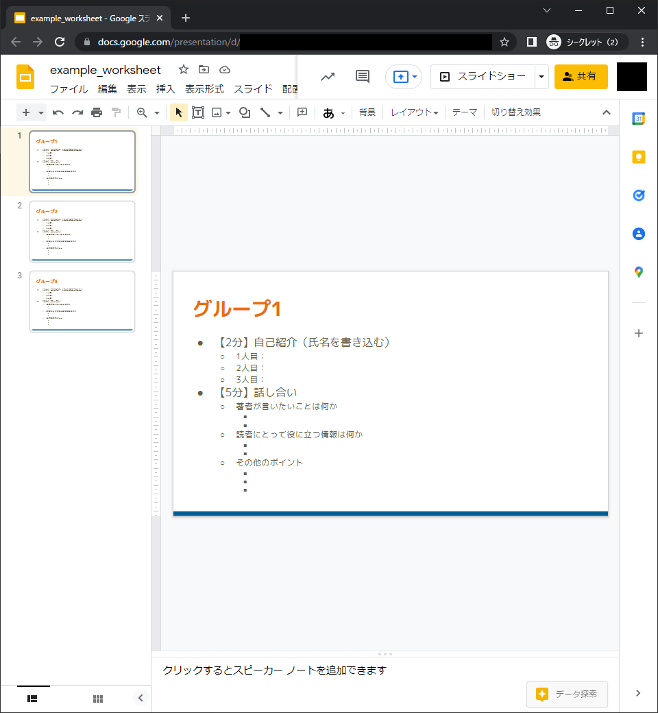

オンライン授業におけるグループディスカッションでは，ブレイクアウト機能を使用するのが一般的です．対面授業であれば教員は教室全体を見渡したりグループを見回ったりすることができますが，ブレイクアウトルームはそれぞれが独立した部屋になっており，教員がメインルームにいながらグループごとの議論の進行状況を直接知る方法はありません（ブレイクアウトルーム1つ1つに直接参加して様子を見に行くことは可能です．）

教員がメインルームにとどまりつつ，各グループの様子を間接的に把握して全体を見渡す手がかりとして，クラウドツールを利用したワークシート（作業用紙）の共有が挙げられます．

ディスカッション中，学生たちはワークシートに議事録やワークの成果を記入します．教員は，ワークシートが記入されていく様子をリアルタイムで閲覧することで，各グループの進捗を窺い知ることができます．

また，ワークシートをクラウド上に残しておくことで活動の記録となり，共有・振り返り・フィードバックの際に便利です．

☞おまけ：ブレイクアウトディスカッションの詳細な方法や注意点については，下記のページを参照してください．

* Zoom：[Zoom ブレークアウトルーム機能を使う](/zoom/usage/breakout/)｜utelecon
* [オンラインのグループディスカッションで生じやすい問題とその対策案](/articles/group-discussion/)

## 用途に合ったクラウドツールを使用しましょう

複数人が同時に書き込み，且つ教員がリアルタイムでそれを閲覧するためには，クラウドツールを使用するとよいでしょう．

### 議事録に向いているツール

実際のオンライン授業では，GoogleドキュメントやGoogleスライドなどの文書作成ツールが多用されています．白紙に文字を打ち込むだけの簡単な操作で，多くの受講者にとって扱いやすいツールです．

〈Googleドキュメントで作成したワークシートの例〉

〈Googleスライドで作成したワークシートの例〉

### ホワイトボードの代わりになるツール

ブレインストーミングに向いているツール（意見出し）の可視化には，ホワイトボードに付箋を貼るようなイメージを再現できて，複数名で同時に操作するオンラインツールを使用すると良いでしょう．

ツールには，[Padlet](https://padlet.com/dashboard)・[Google Jamboard](https://jamboard.google.com/)・[Miro](https://miro.com/ja/)などが挙げられます．特にMiroは，操作がしやすく，少々込み入った作図にも対応しているため，便利です．

〈Google Jamboardを使って作成したワークシートの例〉

〈Miroを使って作成したワークシートの例〉

## 提供するワークシートを予め用意しておきましょう

予めワークシートのテンプレートをグループの数に合わせて用意しておくと，URLを配布してすぐにディスカッションを始めることができます．

### ワークシートの記載内容

ワークシートの内容は，以下のような例が考えられます．

#### 記載内容

* 授業タイトル，日付，グループ番号，参加者の名前などの情報
* 課題内容，設問，所要時間などの概要（学生の備忘録として有効）

#### スタイル

* 穴埋め形式，一問一答形式
* 話し合う課題や論点を提示したもの
* ほぼ白紙のまま

課題の内容や目的，学生の習熟度などに合わせて相応しい形式にしましょう．

〈ワークシートの記載内容の例（Googleスライドにて1グループで1シートを使用）〉

### ワークシートの形式

GoogleスライドやGoogleドキュメントなどの文書作成ツールを使用する場合，グループごとに1つずつファイルを設ける方法と，1つのファイルの中で1グループにつき1ページ（1シート）を使用する方法があります．

それぞれの方法の特性を踏まえ，相応しい方法を選択しましょう．

#### グループごとに1ファイルずつ使用する場合

**メリット：**

* グループごとに独立した成果物ができます．
* 学期を通してグループが変わらない場合，継続して同じファイルを使用することができます．

**デメリット：**

* 教員は，ディスカッション中に閲覧する際，ブラウザ上で複数のファイル（タブ）を同時に開いて行き来する必要があります．
* 学生同士で他のグループの様子を見たい場合，他のファイルを開いて見に行く必要があります．

#### 1つのファイル内でグループごとにページを分けて使用する場合

**メリット：**

* 教員は，1つのファイルを開いて全てのグループの様子を閲覧できます．
* 学生は，同じファイル内の他のグループの内容を閲覧しやすい状態になります．

**デメリット：**

* 他のグループの使用しているページを誤って編集してしまうことがあります．
* スライドツールではなくドキュメントツールの場合，記入している最中に，自分たちよりも早い番号のグループの人たちが記入することによって，自分たちのページが急にずれて見づらくなってしまうことがあります．（ページブレイクを挿入する工夫が必要ですが，完全には防げません．）

☞おまけ：グループごと，または授業の回ごとに何度も同じ内容のシートを複製することが手間である場合，Google Apps Script（通称：GAS）という簡単なプラグラミング技術を使って自動化する方法があります．utelecon「[GASを使ってGoogleドライブでファイルやフォルダを複製する方法](/articles/gas/copy)」をぜひ参照してください．

## 必要に応じて介入しましょう

ワークシートを閲覧していて，例えば，

* なかなか書き込みが進まず，あまり議論が活発に行われていないように見えるグループ
* 興味深い書き込みを行っているグループ

など，気に掛かる点を見つけたら，教員がグループに介入する方法が幾つかあります．

### 自らブレイクアウトに参加する

ブレイクアウトを開始した後に，主催者は自ら任意のグループに移動することができます．（Zoom・Webex・Google Meet，全てにおいて可能です．）

### ワークシートにコメントを記入する

Googleドキュメントを使用したワークシートであれば，教員も同時に記入できます．気になる記述を見付けてその場でコメントを付けたり，ヒントや追加の指示を投げかけたりと，直接テキストでやりとりすることができるため，チャットの代用となります．

〈ワークシートに教員がコメントを書き入れる例〉

## ディスカッション後にも活用できます

### ディスカッション後の全体共有に活用

グループごとに議論の経過がまとまっているため，ディスカッション終了後の共有・意見集約・質疑応答の時間に使用することができます．

各グループが議論の内容や意見を発表する際に画面共有したり，グループ同士でお互いのワークシートにコメントを付け合うなどしても良いでしょう．（教員が率先して最初にコメントを付けたり，コメントの例を示しておくことで，学生たちもコメントを追加しやすくなり，議論が活発になる可能性があります．）

### 記録として活用

クラウド上で保存しておくことで、授業終了後に簡単に振り返ることができます．

学生にとっては学習の記録になります．教員にとっては，成績を付ける際の参考材料になったり，今後の授業の参考資料になったりします．

## まとめ

以上，この記事では，オンラインでグループディスカッションを実施する際のワークシートの活用方法を紹介しました．

ワークシートの形式や使用方法は，課題の内容，学生の人数や性質によって異なります．学生からのフィードバックをこまめに得つつ，最適な形式を模索していけると良いでしょう．

## あわせて読みたい記事

[オンラインのグループディスカッションで生じやすい問題とその対策案](/articles/group-discussion/)

[GASを使ってGoogleドライブでファイルとフォルダを複製する方法](/articles/gas/copy)

[使えるツールから探す](/online/tools)

[Zoom ブレークアウトルーム機能を使う](/zoom/usage/breakout/)

[オンライン授業情報交換会 第1回 グループワークをする(1)](/events/luncheon/2020-04-22/)

[オンライン授業情報交換会 第11回 オンライン授業で使えるツール(1)](/events/luncheon/2020-06-24/)

