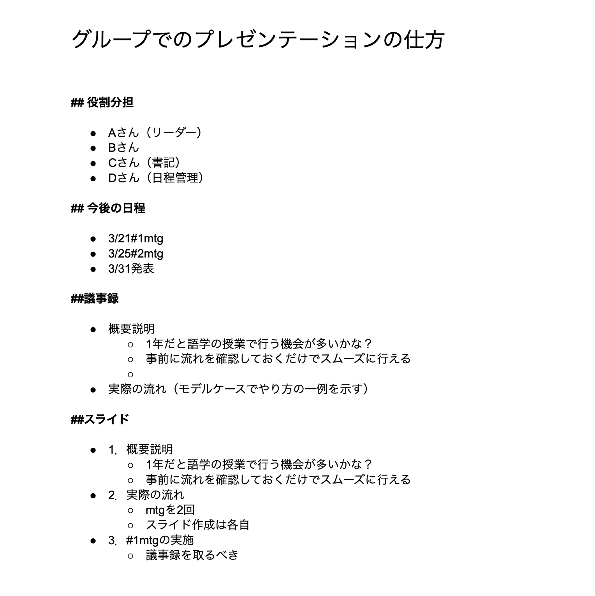
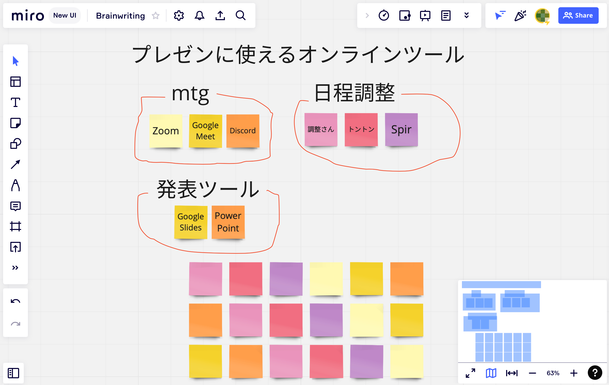

## この記事のハイライト
大学の授業では，グループでプレゼンテーションを行う機会がしばしばあります．その準備をオンラインで行うことも一般的になりましたが，その場合，対面で行うときとは異なる様々な工夫が必要です．この記事では学生が授業で発表を行うシーンを想定し，オンラインで効率よくグループでのプレゼンテーションを準備する方法を紹介します．  
特に東京大学では，語学の授業など，前期教養課程においてグループでのプレゼンテーションを初めて経験する方も多いと思います．この記事を事前のイメージの把握や，実際に準備する際の参考にしてください．  
なお，この記事ではスライドを用いた発表をモデルケースとして説明しています．レジュメを用意するなど他の発表形態の場合も，参考になる箇所を適宜応用してください．

## 実際の流れ
この記事では，スライドを用いた発表をモデルケースとし，以下の流れで実際のプレゼンの準備，発表の仕方を説明します．
1. 事前準備
2. 1回目のミーティング〜スライド内容の決定
3. 各自でスライド等の資料作成
4. 2回目のミーティング〜プレゼン準備
5. 実際にプレゼンを行う

### 1．事前準備
#### 役割分担の決定
プレゼンの準備等を効率よく行うために，リーダーやスケジュール管理，議事録担当など役割分担を決めておくとよいでしょう．

#### 発表準備に用いるツール
プレゼンの準備，発表をするにあたっては，以下のようなツールを使用すると便利です．
なお，グループ全員が共通のツールを準備する必要があることに注意してください．
- 資料共有ツール
- 発表ツール
- ミーティングツール

資料共有ツールとしては，Googleドライブが主要なものとして挙げられます．特に東京大学構成員の場合，Googleドライブは，大学から付与されているGoogleアカウントで利用することができるので便利です．グループでの共有を行うときは，共有フォルダを作成し，そこに発表原稿やミーティング事録を保存することで効率的にグループ内で資料の共有，編集を行うことができます．  
なお，この共有をする際にはグループ全員が共同編集をできるようにしておくと便利です．詳しくは以下の記事をご覧ください．(参考：[Googleドライブの使い方](/articles/google-drive/#google-ドライブとは))

発表のスライドを作成するツールとしては，PowerPointやGoogleスライド等が有用です．どちらのツールも共同編集機能があり，ファイルの所有者だけでなく，複数人で話し合いもしつつ編集が行えます．例えば，Googleスライドはドラフトの共有用，Power Pointは最後の細かい仕上げ用といった使い分けをするのもよいかもしれません．また，スライド作成の際に共同編集機能を用いると，「話す」と「作る」が同時進行で行えるため，効率よくスライド作成を行えます.  
オンラインで会議を行う際のミーティングツールとしては，Zoomが主要なものとして挙げられます．ミーティングの内容や決定事項の記録のためにも，会議中は議事録を取った上で録画を残しておくとよいでしょう．議事録を作成する際には，Googleドキュメントなど共同編集機能のあるツールを用いるとよいでしょう（議事録作成については後述します）．  
オンラインでのグループ作業にあたっては，ここに挙げたもの以外にも様々なツールがあるため，用途に応じて使い分けることが大事です．[こちら](/articles/student-communication/)の記事に様々なツールの特徴がまとめられているので，必要に応じてご覧ください．

#### 日程調整
まず，発表当日までにどれくらいの準備期間があるのかを確認しておきましょう．  
その発表に向けて，複数回のミーティングを行うと安心です（この記事では，2回のミーティングを行うことを想定しています）．  
その際のスケジュール管理には，[こちら](/articles/student-communication/)の記事で紹介されているツールが便利です．

#### 連絡手段の確保
グループ間の連絡手段も最初に確保しておきましょう．  
グループの規模や授業形態などに応じて，LINEやSlackなどのツールを使い分けるとよいでしょう．

### 2．1回目ミーティングの実施
日程が調整できたら，早速ミーティングを開催しましょう．ここでは，ミーティングの進め方の例を紹介します．  
あくまで一例ですので，ご自身のやりたいことに合わせて，内容や順番を調整してください．

#### 議事録の作成
ミーティングが盛り上がっても，終了後にアイディアや決定事項を忘れてしまうとあまり意味がありません．  
それを防ぐためにも，議論内容を記録した議事録を作成することをお勧めします．  
その際には，グループ全員で共同編集できるGoogleドキュメントなどを使い，画面共有をしながらリアルタイムで書き込みを行うと効率的です．  
Zoomの録画機能は共有画面も動画として保存されますので，それを併用するのもよいでしょう．
* 参考
  * [Googleドキュメントの基本的な使い方](/articles/google-document/)
  * 議事録のフォーマット例
  

#### 1回目ミーティングの流れ
##### ①プレゼンの条件の確認  
事前に指定されたプレゼンの制限時間やスライドの枚数の指定，テーマの条件などを確認しておきましょう．

##### ②プレゼンテーマの大まかな決定  
必ずしもこの段階でテーマを固める必要はありませんが，先にある程度の方向性を決定しておくことでこの後の話し合いをスムーズに進められます．

##### ③意見を出し合う  
②で設定したプレゼンテーマ，もしくは話し合いのトピックなどに基づき，アイデアを出し合います．  
その際には，まず個人で考えて内容を簡単に書き留めておき，その後グループ全員で共有することで円滑に意見出しを行えます．  
また，リーダーのナビゲーションでミーティングの話題を変更しつつ意見を出し合う過程を繰り返すことで，より相互の共通意識の基盤が構築されやすくなります．  
話し合いに詰まって意見が出てこなくなった場合には，ブレインストーミングと呼ばれる手法を用いるのも効果的です．オンラインでブレインストーミングを行う場合は，MiroやJamboardといったオンラインホワイトボードツールを利用することで，効率よくグループでの意見出し，集約ができます．
* 参考
  * [Miroについて（外部サイト）](https://miro.com/ja/online-whiteboard/)  
  * [Jamboardについて（外部サイト）](https://workspace.google.co.jp/intl/ja/products/jamboard/)
  * Miroの使用例
  

##### ④意見をまとめるディスカッションの実施  
③で出てきた意見の整理，統合などを行います．その際に，徐々に発表する内容等を意識しながら意見をまとめるとよいでしょう．  
なお，この②〜④の過程が発表内容を決めるための根幹をなす大事な部分ですので，話し合いが不十分と感じたら2回に分けて行うなど，時間をかけて実施することをおすすめします．

##### ⑤発表資料の作成準備  
②〜④を通じてまとまったアイデアをもとに，発表する内容を決め，それをもとにスライドごとの内容や順番を決定します．  
その後，スライドごとの作成者等の役割分担を決定します．その際に，実際の発表者まで決めておくと，その後の準備が効率的です．

##### ⑥次回ミーティングの日程等確認  
今回話し合われた内容を手短に確認（ラップアップ）したうえで，次回ミーティングの実施時間を決めていきます．その際には，次回のミーティングまでに各自がやるべきことを意識しておくとよいでしょう．

### 3．各自でスライド等の資料作成
ミーティングで決まった役割分担をもとに，スライド資料を各自で作成します．スライド等の作成資料は，共同編集機能を使い，全員で同じファイルに書き込むとよいでしょう．  
このとき，LINEなどのコミュニケーションツールを用いて，各自が適宜進捗報告を行い，全員の進捗を共有しておくことが，計画的に作業を進めるために重要です．  
資料作成の際に生じた疑問点等も全体で共有しておくことで，次のミーティングが効率よく行えます．必要であれば発表原稿も作成しておきましょう．

### 4．2回目ミーティングの実施
以下の手順を一例として示しておきます．
* 話し合い  
  * まず1回目のミーティングの積み残しの処理，及び，各自の資料作成で生じた疑問点の解消を行います．それに基づいて，スライド資料等の修正も行いましょう．
* プレゼンの練習  
  * スライド送り等の役割を決定し，発表の練習をします．  
  * スライド送りは，本番でのスムーズな進行のためにも，1人が代表して行うとよいでしょう．なお，スライドにアニメーションや視覚効果をつけている場合は，そのタイミングも入念に確認しておきましょう．

### 5．プレゼンの実施
事前の準備に基づきプレゼンを行います．オンラインでの発表の場合，オンライン特有のトラブルも考えられるので，あらかじめ余裕を持って機材の準備等をして発表に臨むと良いでしょう．  
以上がグループプレゼンの実施方法の一例です．それぞれの条件に応じて細部を変更しながら，自分たちにあったより良いプレゼンを作り上げていってください．

---

執筆: <a href="/about/oes">オンライン教育支援サポーター</a>S. A.
