--- 
title: OneNoteで板書する  
---

## 本記事のハイライト  

* この記事はOneNoteを用いた板書方法について書かれています．
* OneNoteの主な使用場面
    * 授業中のリアルタイムでの板書（ホワイドボード，ノートとして）
    * 別に用意しておいたPDF，PowerPointなどの資料を読み込み，それに書き込む形で板書
    * 授業資料・板書のページを予め作成する
    
## アプリケーションについての説明
OneNoteはMicrosoft社が提供するアプリケーションの一つで，電子ノートとしての機能を備えています．授業ではリアルタイムの板書や，読み込んだスライドや文書（PDF，Power Point，Wordなどに対応）への手書きでの書き込みなどに用いることができます．  

本記事では主にタブレットとタッチペンを用いて板書をする，資料に書き込む方法について紹介します．  

### 仕様表
* 提供元
    * Microsoft 
    * 公式サイト：[Microsoft OneNote デジタル ノート アプリ](https://www.microsoft.com/ja-jp/microsoft-365/onenote/digital-note-taking-app)
* 使用可能な環境
    * 端末・OS（詳細は[公式サイト](https://www.microsoft.com/ja-jp/microsoft-365/microsoft-365-and-office-resources)をご覧ください）
        * Windows （PC，タブレット，Phone等）
        * iOS （Mac，iPad， iPhone等）
        * Android （スマートフォン）
        * Web 
    * 必須またはオプションのアクセサリ
        * 必須ではないが，iPadやSurfaceといったタブレットと専用のタッチペン(Apple PencilやSurface Penなど)の利用を強く推奨．
        * オンライン授業で使用する場合は，Zoom等のビデオ会議用ツールが別途必要．
    * インストールに必要なドライブ容量
        * Windows 10: 156.01MB
        * macOS: 481.7MB
        * iOS : 212.5MB
* 運用コスト
    * 費用
        * Microsoftアプリケーションは大学ライセンスにより無料．
        * 別途タブレットやタッチペン等．
        * 以下はApple Pencil, Surface Penの値段の例
        * Apple Pencil（第2世代）15,950円（税込）
        * Surfaceスリムペン 17,490円（税込）
    * 授業を受ける学生側が準備すること
        * 原則無し
        * 共有方法によっては受講生は大学アカウントでMicrosoftにログインする必要あり．

## インストール方法

OneNoteは，以下のいずれかの方法でインストールできます．

* （macOSの場合）[Microsoftの公式サイト](https://www.microsoft.com/ja-jp/microsoft-365/onenote/digital-note-taking-app)
からMicrosoft365をインストール
* （iOS, Androidの場合）各種ダウンロードアプリ（Playストア，App Storeなど）からインストール
* （Windowsの場合）Windows10搭載デバイスでは「OneNote for Windows 10」が初期搭載
* [Web版サイト](https://www.onenote.com/hrd?omkt=ja-JP)からも利用可能

## 利用方法 - 基本編

### ツールについて
OneNoteの基本的な操作については公式サイトに載っています．
* [OneNote for Windows 10 の基本タスク](https://support.microsoft.com/ja-jp/office/onenote-for-windows-10-%E3%81%AE%E5%9F%BA%E6%9C%AC%E7%9A%84%E3%81%AA%E4%BD%9C%E6%A5%AD-081573f8-2e8f-45e5-bf16-0900d4d3331f)
* [OneNote for Mac の基本タスク](https://support.microsoft.com/ja-jp/office/onenote-for-mac-%E3%81%AE%E5%9F%BA%E6%9C%AC%E7%9A%84%E3%81%AA%E4%BD%9C%E6%A5%AD-0206acf2-77da-42ab-a2e8-b69ae450f6a0)
* [OneNote Online の基本タスク](https://support.microsoft.com/ja-jp/office/onenote-online-%E3%81%AE%E5%9F%BA%E6%9C%AC%E7%9A%84%E3%81%AA%E4%BD%9C%E6%A5%AD-80b7e897-88df-49e7-8bfe-a3467a428da0)
* [OneNote for iOS (iPhone および iPad) の基本タスク](https://support.microsoft.com/ja-jp/office/microsoft-onenote-%E3%81%AE%E5%9F%BA%E6%9C%AC%E7%9A%84%E3%81%AA%E4%BD%9C%E6%A5%AD-51bcc28e-8778-4632-b702-0c61b24c9917)
* [OneNote for Android の基本タスク](https://support.microsoft.com/ja-jp/office/android-%E7%89%88-microsoft-onenote-46b4b49d-2bef-4746-9c30-6abb5e20b688)

以下では，板書に必要なツールとその使い方について簡単に紹介します．  

本記事で紹介するツールの画像等は，iPadを用いてOneNote for iOSを利用したときのものです．使用するデバイス等によっては一部デザインや機能に違いがある場合があります．  

#### ノートに描画する

##### ペン，蛍光ペン

手書きに用いる最も基本的なツールです．ペンと蛍光ペンの2種類があり，実際のペンや蛍光ペンと同じような感覚で使用できます．また，ペンや蛍光ペンの色と太さを変更することも可能です．  

以下はペン・蛍光ペンを使用した様子と，色・太さを変更する様子です．

【ペン・蛍光ペンを使用した様子】

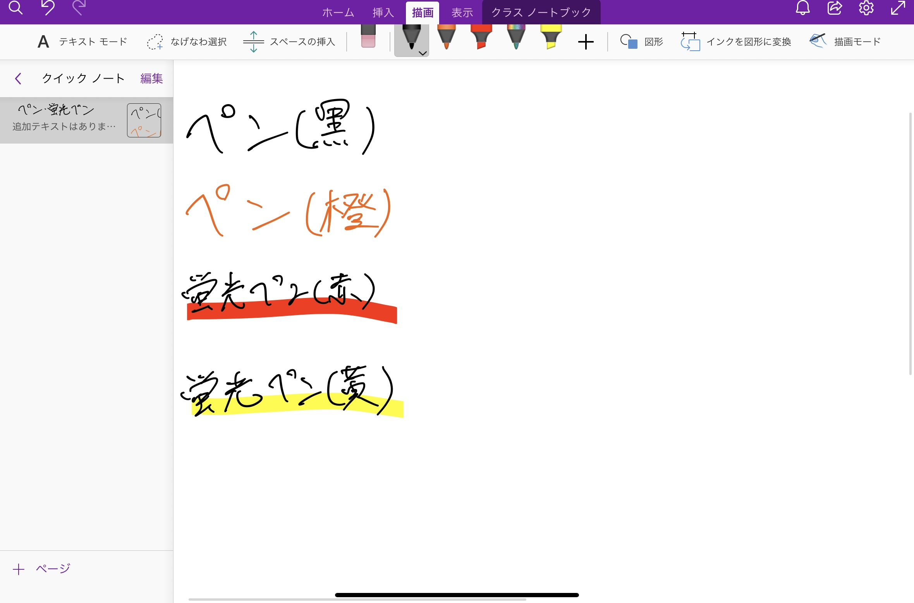

ペン・蛍光ペンの太さ，色はペンのアイコンをタッチして出る以下の画面の黒枠部分から変更できます．  

【色・太さの変更方法】 

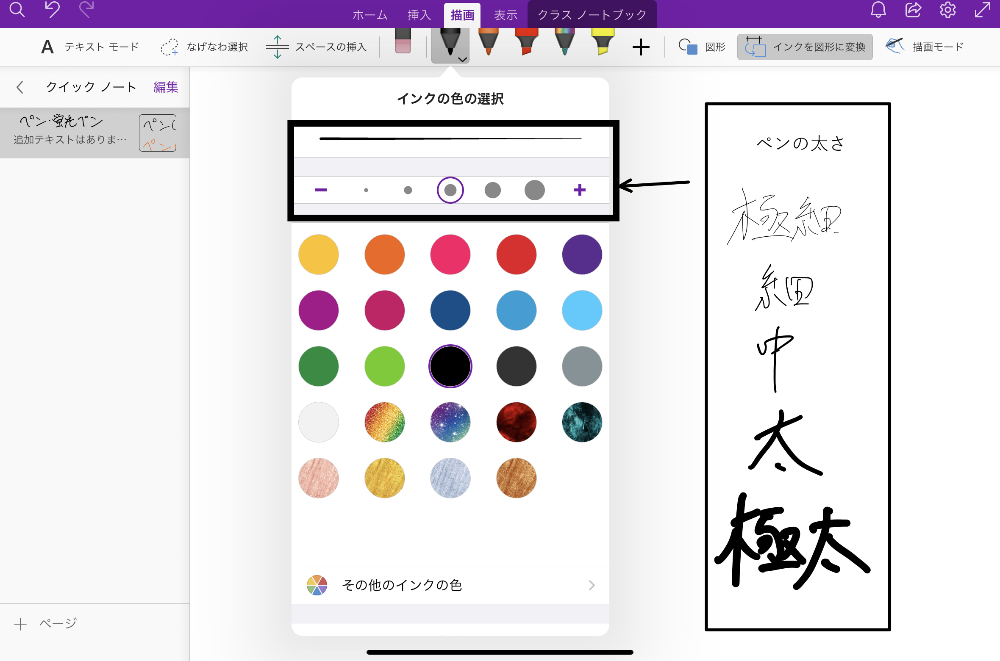  
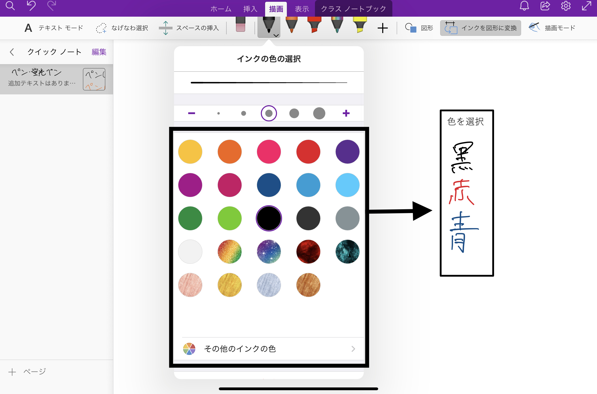

##### 消しゴム

ペンや蛍光ペンで描画した文字や線を消すことができます．こちらのツールも実際の消しゴムと同じような感覚で使用できます．  

消しゴムのアイコンをクリックすると，ペンや蛍光ペンから消しゴムに切り替わります．消しゴムのアイコンをさらにタッチすることで消しゴムの大きさ(消す範囲の広さ)を変更できます．また，「ストローク」は触れたストローク(一筆分)のみを消去することができます．  

以下は消しゴムの大きさの切り替えををする様子です．  

【消しゴムの大きさの切り替え】  

##### テキストモード

テキストモードでは，ノート上の好きな場所を選択し，そこにキーボードを用いて文字を入力することができます．同じMicrosoftのアプリケーションであるWordやPowerPointにおけるテキストボックスのような機能です．  

入力した文字は，ホームから色・大きさを変えるなど，編集することができます．  

以下はテキストを入力した様子と編集画面の様子です．  

【テキストを入力した様子】

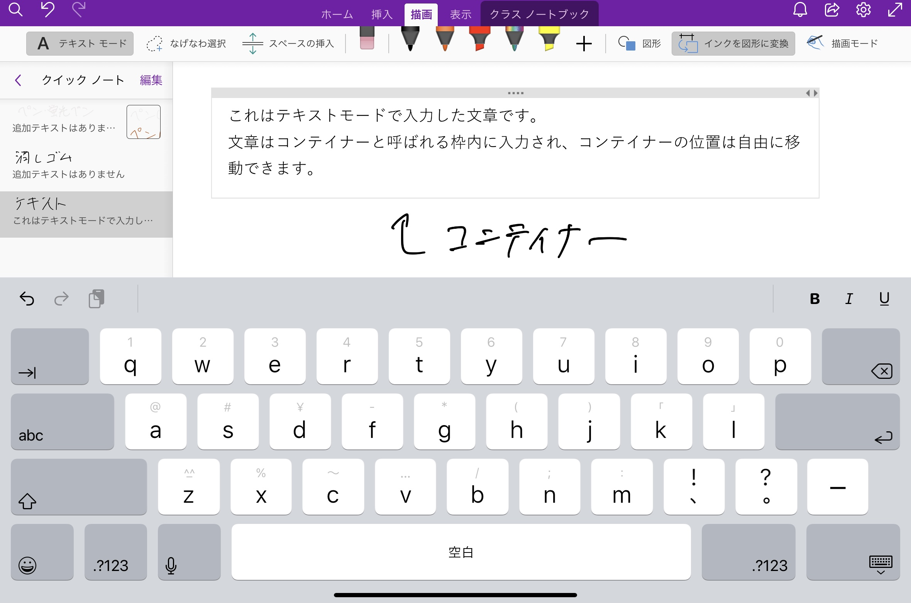

【テキストの編集画面】

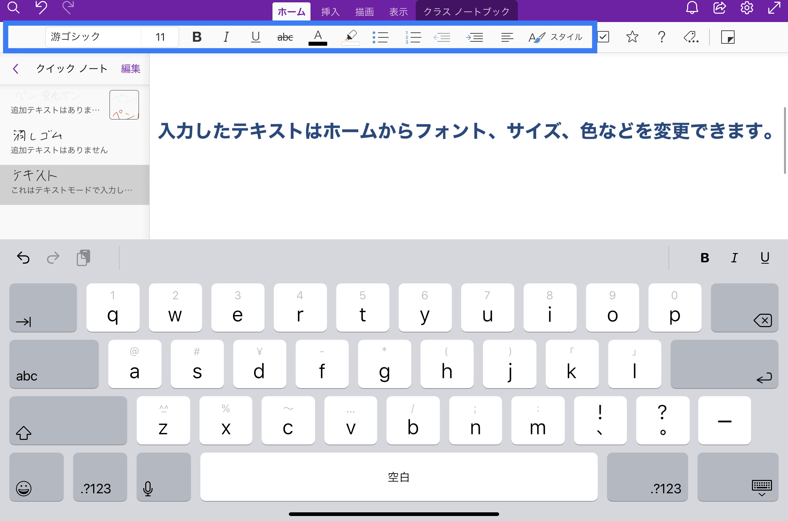

##### なげなわ選択

なげなわ選択を用いると，入力・描画した文字等をまとめて移動，拡大・縮小，コピー＆ペーストといった操作をすることができます．  

なげなわ選択の状態で操作したい部分を囲むと，その部分にのみこれらの操作を適用することができます．  

以下はなげなわ選択を用いた様子です．  

【なげなわ選択を使用する様子】

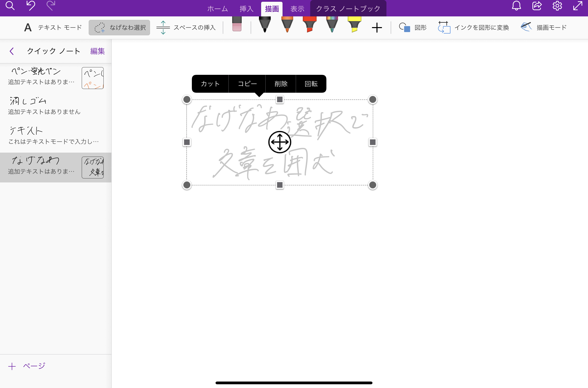

##### 図形

描画の図形ツールを用いると，直線や円等の図形を綺麗に描くことができます．  

以下の画像のように直線や矢印，円などを描けます．ペンをタッチした後に，「図形」をタッチして図形を選択すると，選んだペンの色で図形を描けます．  

【図形ツールを用いて図形を描いた様子】

また，「インクを図形に変換」を選択した状態で円や三角などの図形を描くと，手書きした図形に補正がかかり，綺麗な図形を描くことができます．  

【変換前の手書き図形】

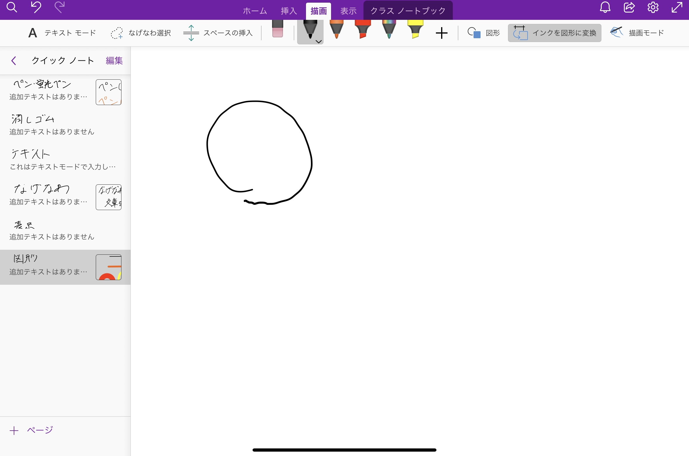

【「インクを図形に変換」で補正された図形】

### 用紙のデザインを変更する

#### ページデザイン

表示のタブから用紙の色やスタイルを変更することができます(標準では無地)．  

それぞれ「用紙の色」「用紙のスタイル」をタッチすると，複数の色や罫線・方眼紙といったスタイルを選択することができます．  

以下の画像はページのデザインを変更した様子です．  

【用紙の色の変更】

【用紙のスタイルの変更】

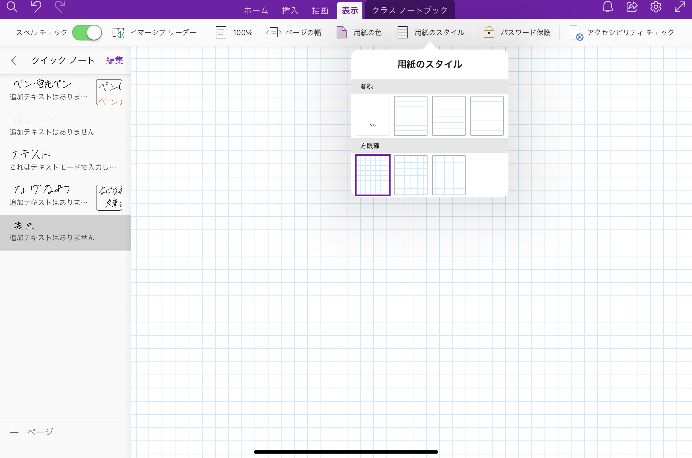

#### 用紙サイズ

OneNoteのページは基本的にはサイズの設定(A3，A4等)ができません．しかし例外として，デスクトップ版アプリケーションのOneNoteをインストールして用いる場合は，ページのサイズを変更することができます．  

サイズを設定したい場合は，上記の公式サイトからデスクトップ版をインストールしてください．また，Windows10に初期搭載されているOneNote for Windows 10でも用紙のサイズ設定が不可のため，この場合もデスクトップ版のインストールが必要です．  

デスクトップ版で表示タブから「用紙サイズ」を選択すると，ページのサイズや向きなどを設定できます．  

Windows搭載PCでデスクトップ版を利用してページのサイズの設定を行う方法は，以下の画像をご参照ください．  

【表示タブを選択】

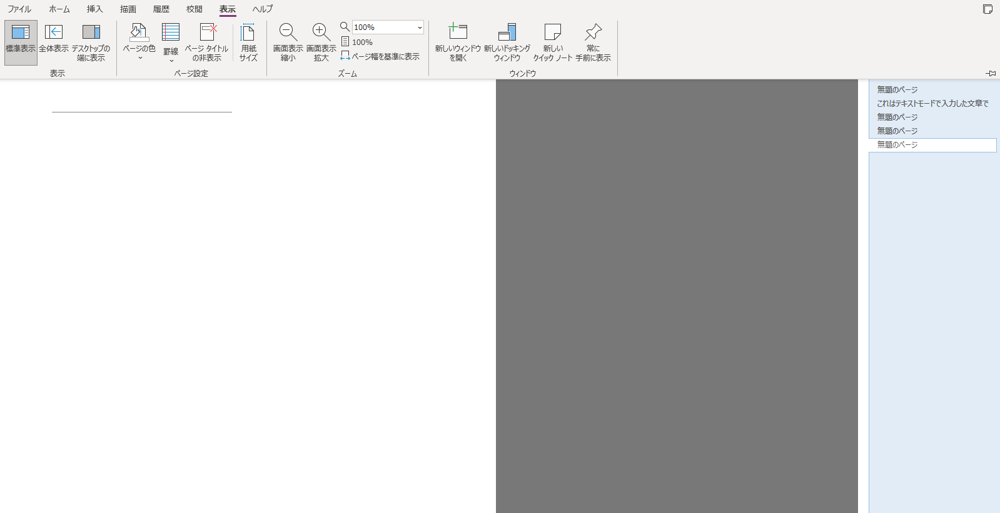

【表示タブを選択した後「用紙サイズ」を選択】

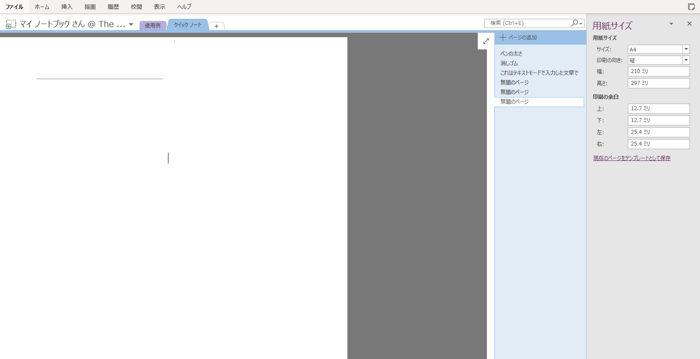

### ノートブック・セクション・ページを設定する

実際に板書やメモを書いていくのがページで，ノートブック・セクションはページを管理するための分類です．  

ページが最小単位で，セクションが複数ページのまとまり，ノートブックは複数セクションのまとまりとなります．このようにページをまとめることでページの管理がしやすくなります．  

使い方は自由ですが，以下の画像は一例です．  

【ノートブック・セクション・ページの分類例】
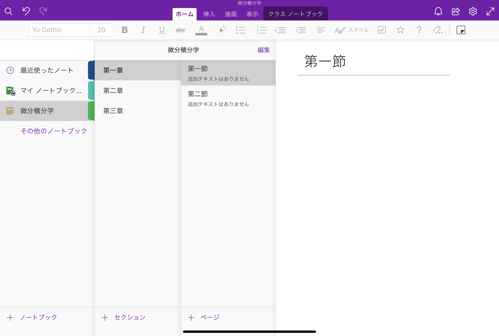

好きな位置を選択し，「挿入」のタブを選ぶと，様々な画像やファイルなどを挿入することができます．  

#### 画像

「画像」を選ぶと端末等に保存されている画像を挿入することができます．また，「オンライン画像」からは検索によりネット上の画像を探してきて挿入することができます．（著作権には注意が必要です．）

#### ファイル，PDF

「ファイル」からは画像や動画ファイルだけでなく，文書ファイルなども挿入することができます．  

また，「PDF」をタッチするとPDFファイルを挿入することができます．PDFファイルはファイルが開いた状態で挿入されるため，中身に書き込み等を加えることができます．  

以下の画像はファイルを挿入した様子です．  

【PDFを挿入する様子】

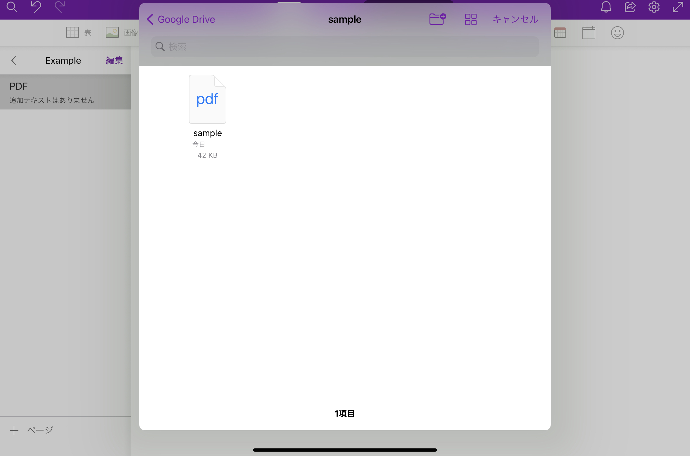
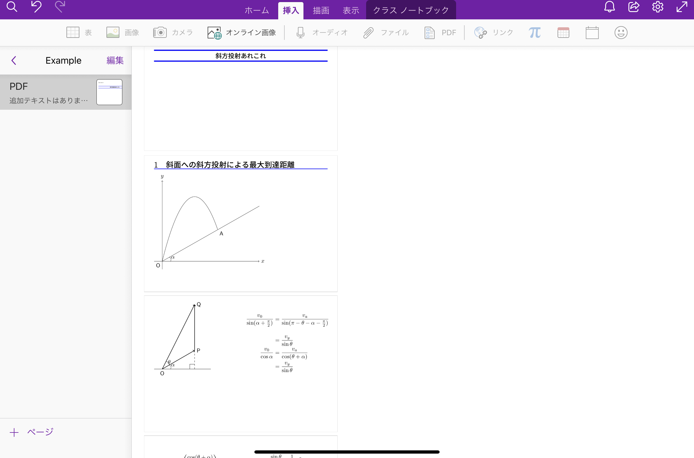

挿入したいファイルを選択するとこのように挿入されます．  

## 授業での使用方法

### 準備

#### ホワイトボードとしての準備

何も書かれていない状態のページにリアルタイムで書き込みをしていくことで，対面授業におけるホワイドボードや黒板での板書をOneNote上で再現できます．この場合，基本的に初期状態のまま始めることが出来ます．ペンの太さや用紙のスタイルなどで変更を加えたい場合は，これまで紹介した方法を参考に授業前に変更しておくとスムーズです．

#### 事前に用意しておいたPowerPointやPDFを読み込む
        
OneNoteではPowerPointなどで作成したファイル(PDF化した状態で)を読み込んで，そこに書き込みを加えていくことができます．ファイルのインポートは，上で紹介したPDFの挿入方法を参考にしてください．事前に用意しておいた資料を読み込んでおき，授業で書き込みをすると以下の画像のようになります．

【用意しておいた資料を読み込み，書き込みをした例】
<figure>

<figcaption> </figcaption>
</figure>
        
#### 事前にOneNoteのページを作成しておく

OneNoteを用いて予め授業資料を作っておくことも可能です．板書が多い場合などは授業前に大枠を書いておくと，授業中の板書の負担が減ります．また，これまでに紹介したツールなどを用いてイラストや図表などを多く用いた資料も作ることができます．  

### 画面共有

受講している学生とリアルタイムで板書を共有する最も簡単な方法は，OneNoteを利用している画面をそのままZoomで画面共有することです．   
Zoomでの画面共有の方法は，uteleconの「[画面共有](https://utelecon.adm.u-tokyo.ac.jp/zoom/usage/screen_sharing.html)」を参考にしてください．  

以下の画像はZoomを用いてOneNoteの画面共有を行った様子です．

【Zoomを用いた画面共有】
<figure>

<figcaption> </figcaption>
</figure>

本記事では詳述しませんが，OneNoteをiPadを使用している場合は，「AirPlay（またはその他のミラーリングソフト）」を用いた画面共有を行うこともできます．

### 板書をする

準備，共有ができたら実際に授業を行います．  
これまでに紹介したツール等を用いて好きなように板書をすることができます．  
実際に描画している様子については，[公式サイトの動画](https://support.microsoft.com/ja-jp/office/%E3%83%93%E3%83%87%E3%82%AA-onenote-%E3%81%A7%E6%8F%8F%E7%94%BB%E3%81%8A%E3%82%88%E3%81%B3%E3%82%B9%E3%82%B1%E3%83%83%E3%83%81%E3%82%92%E8%A1%8C%E3%81%86-e5d9e43e-96a0-442a-85e9-298e029aa76c?wt.mc_id=otc_onenote)もご参照ください．  

### 資料配布

オンライン授業では受講生の様子が分かりにくいことからも，授業資料を配布することは非常に有効です．   
ここではリンクを共有して資料を配布する方法とpdfとして配布する方法を紹介します．

#### リンクを共有する

リンクを共有することで受講生はそのリンクからOneNoteの画面を開くことができます．受講生側がOneNoteをインストールしていなくとも，ブラウザからリンクを開くことができるため問題ありません．  

この方法で配布することのメリットとしては，一度リンクを共有すれば，以降の授業で加えていった板書や後から加えた変更が，リンクをその都度共有しなくとも受講生側に反映される（更新を促す必要はあり）ことが挙げられます．また，授業前にリンクを共有しておけば，受講生は板書に追いつけなくなったときに流れてしまった部分を見ることができます．  

リンクを共有する方法については以下の画像をご参照ください．  

【リンクの送信の方法】
<figure>

<figcaption> </figcaption>
</figure>

【公開範囲・編集の許可】
<figure>

<figcaption> </figcaption>
</figure>

#### PDFとして配布する

OneNoteの画面はPDFとして配布することも可能です．  
PDFで配布することのメリットは，受講生が扱い慣れていることが多いため，管理や使用が楽な点にあります．  
以下の画像の「ページのコピーを送信」から共有，または保存すると，PDF化されます．  

【PDF化して配布】
<figure>

<figcaption> </figcaption>
</figure>

## グッドプラクティス・応用例の紹介

* [入江薫　先生：数理統計I，Ⅱ](/good-practice/interview/irie)
  * 入江先生の授業ではOneNoteを板書代わりに用いて，それをZoomで画面共有するという方法が用いられていました．
  * 入江先生はOneNoteを授業で使う際，以下の点を工夫されていました．  
    * Microsoft SurfaceとSurfacePenを用いて板書をした．
    * 指さしができないのが不便だったが，マーカー機能で代用した．
    * 横向きにすると一度に表示される量が少なくなりスクロールが早くなってしまうため，縦向きに用いた．
    * 縦向きにすることで字が小さくなるが，学生側がZoomの画面拡大機能を用いることで解決した．

