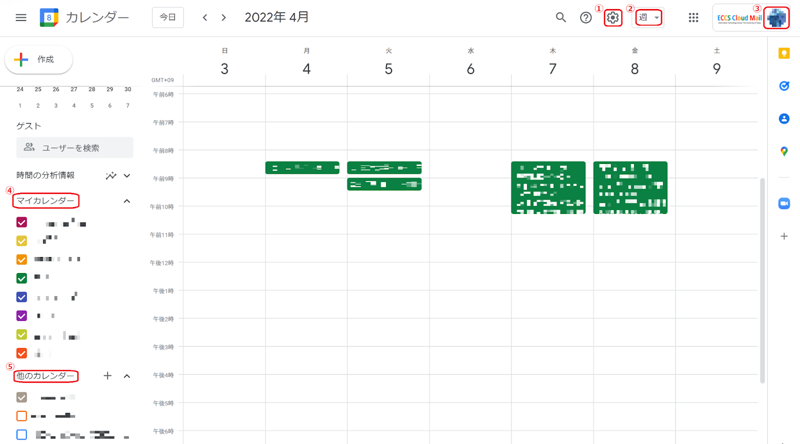
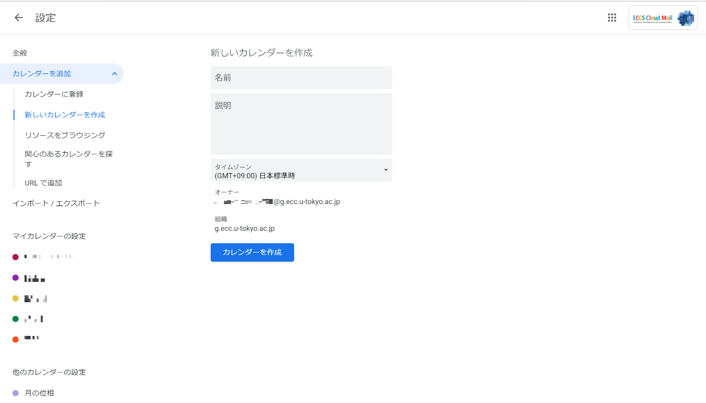
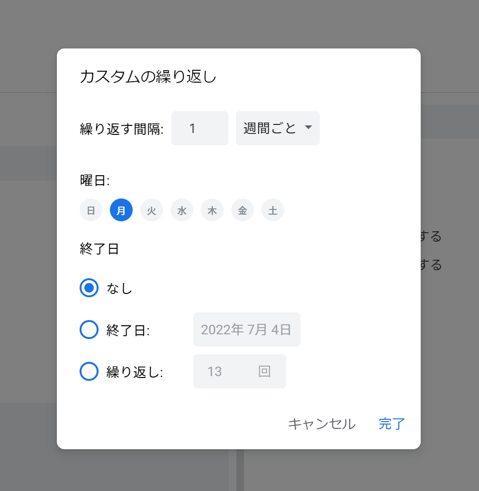
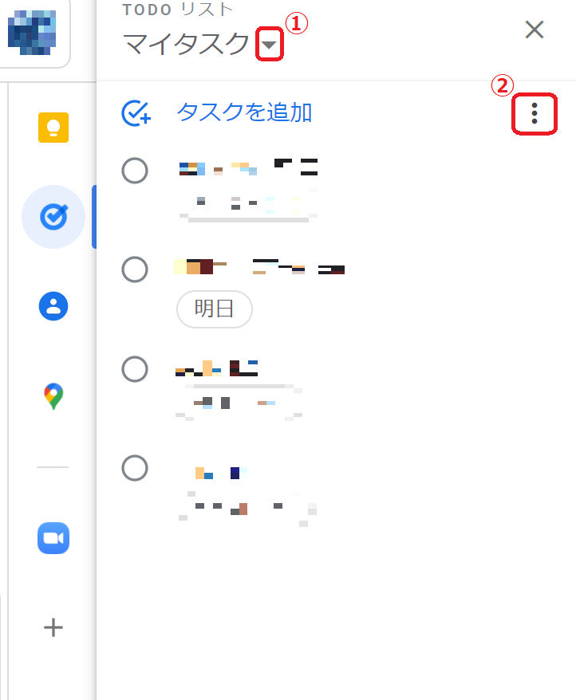
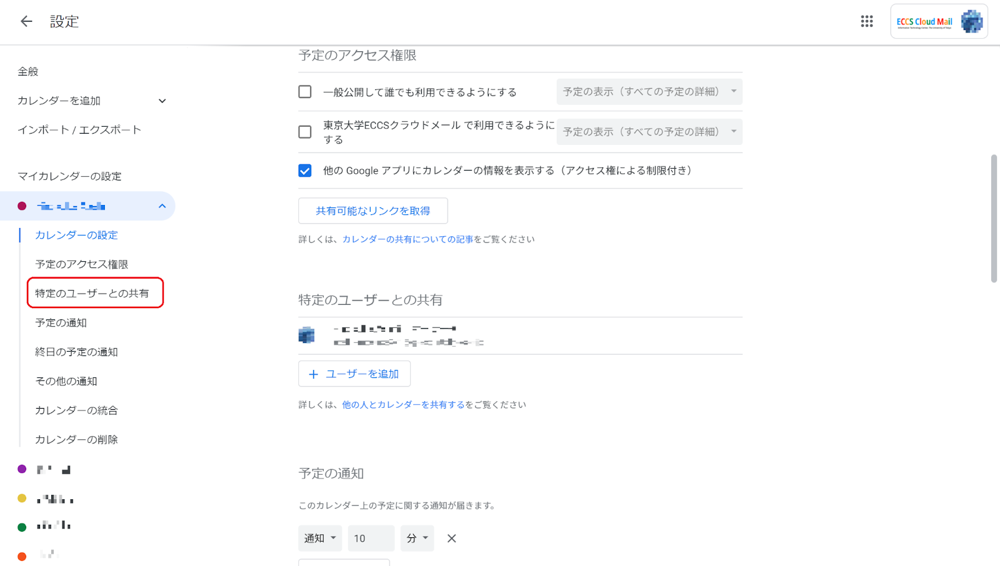

## この記事のハイライト

この記事では，オンラインツールを使った上手な予定管理の方法を紹介します．大学生になると，今まで以上に予定を自分で組み立て，調整していかなければなりません．予定の管理・調整がうまくできれば，より有意義な大学生活を送ることが可能になるのではないでしょうか．以下では，オンラインツールを活用した予定管理方法について，学生の場合を例に説明しますが、一般的なお役立ち情報も載せましたので、ご一読ください．

## 使いどころ

予定管理が必要となる場面として，ここでは下記の3ケースを取り上げます．

- 日々の雑多な予定の確認・管理
- サークルや研究室のミーティングなど繰り返される予定の確認・管理
- タスクの仕分けと期限や優先順位の管理

## オンラインツールを使うメリット

予定管理にカレンダーつきの手帳を使う人も多いですが，コロナ禍の影響でのオンライン化を含めた活動の変化・多様化に伴い，紙ではすべての予定を管理しきれないことも増えてきているでしょう．また、他の人との予定調整をオンライン上で行うことも多々あると思います．オンラインツールはこうした複雑なスケジュールを可視的に管理するのに有益です．オンラインツールを使った予定管理の優れている点は具体的に以下のようなものがあります．

- スマホやPCなど，どこからでもアクセスできる
- 予定入力のフォーマットが出来上がっているので，指示に従えば簡単に予定を記入できる
- PDFで配布された授業資料やオンライン会議のURL情報など，オンライン化された活動予定に付随する様々な情報を簡単に集約できる
- 紙と違い，予定が変わった時の編集が楽である
- メンバーが異なる様々なグループを生成でき、予定を共有しやすい

## 具体的なツール

### Googleカレンダーを使う
予定管理に使用するカレンダーツールは様々なものがありますが，東京大学のGoogleアカウント（ECCSクラウドメール）を持っていれば利用することができるという点から，ここではGoogleカレンダーを用いてオンラインツールを活用した予定管理の方法を紹介します．

### 東京大学のGoogleアカウント（ECCSクラウドメール）について
東京大学のGoogleアカウント（ECCSクラウドメール）は東大が契約しているアカウントであり，一般の無料アカウントとはドメイン名が異なります．一般的な無料Gmailアカウントを使ってもカレンダーを充分に使えますが，ECCSクラウドメールを使えばより多くの機能を使うことができます．

ECCSクラウドメールの取得方法については「[ECCSクラウドメール (Google Workspace)](/eccs_cloud_email)」を参考にしてください．

以下，本記事ではECCSクラウドメールでのログインを想定して説明します．

### 基本的な使い方

数字をつけたアイコンには，それぞれ以下の機能があります．

- ①設定
- ②表示の変更
- ③アカウントの変更
- ④マイカレンダー
- ⑤他のカレンダー

以下，アイコンごとの具体的な機能を説明します．

#### ①設定（プレファレンス）
- ここをクリックすれば個人の好みに合わせたカレンダーの細かい設定を行うことができます．例えば，予定の「通知設定」や「ビューの設定」などを自分の使いやすいように変更できます．
- 他にも，「ごみ箱」にある削除済みの予定を確認することもできます．

#### ②表示の変更
- 「日」，「週」，「月」，「年」，「スケジュール」，「4日（カスタムビュー）」のいずれかのうちから表示を選択することができます．
- 「カスタムビュー」では自分の好みに合わせて表示をカスタマイズできます．この「カスタムビュー」はデフォルトでは「4日」に設定されていますが，「設定」の中にある「カスタムビューの設定」から「3日」や「2週間」など自分が使いやすいように変更できます．

#### ③アカウントの変更
- 複数Googleアカウントを持っている場合、ここをクリックすることでアカウントを変更することができます．
- アカウントを変えると，そのアカウントのカレンダーに切り替わります．

#### ④マイカレンダー
- マイカレンダーの欄には，カレンダーの共有設定において「変更および共有の管理権限」 の権限が与えられているカレンダーが表示されます．
- 「変更および共有の管理権限」 は，カレンダーの共有者に付与できる最も強い権限で，予定の変更・共有設定など，カレンダーの持ち主であるオーナーと同様の操作を行うことが可能となっています．

#### ⑤他のカレンダー
- ここには「変更および共有の管理権限」以外の権限が与えられているカレンダーが表示されます．
- 具体的には，予定の表示や予定の変更のみの権限が与えられているカレンダーが表示されます．

### 閲覧の仕方

#### ①PCから閲覧する
- [こちら](https://calendar.google.com/calendar/render?hl=ja)をクリックしてGoogleカレンダーを開きます．
- アカウントをECCSクラウドメール（あるいはご自分の使いたいアカウント）の情報を入れてログインしてください．

#### ②スマートフォンから閲覧する
- Googleカレンダーのアプリをインストールし，アプリを開きます．
- アプリにアカウントを登録すれば，他のデバイス（PCなど）とカレンダーを同期させることができます．

#### ③他のカレンダーアプリから閲覧する
- Googleカレンダーはカレンダー情報を.iCal形式に書き出すことができるので，この形式を読み込める他のカレンダーツールでGoogleカレンダーのカレンダー情報を読み込み，閲覧することが可能です．
- 例えば，iPhoneのiCalenderからGoogleカレンダーで組んだ予定を閲覧することも可能です．
- 詳しくは[こちら](https://support.google.com/calendar/answer/37111?hl=ja)の公式ドキュメントをご参照ください．

## 場面ごとの予定の組み方
### 雑多な予定の確認・管理
ここでは，一般的な予定の追加と設定の仕方を説明します．大学では様々なコミュニティに所属することになり，様々な種類の予定が入ると思いますが，それらを上手に分類して管理することでより充実した活動ができると思われます．

#### 基本的な予定の入れ方
{:#basic_schedules}

- 予定を入れたい時間帯をクリックすると，上のような予定の入力画面が現れます．
- 左上の「+作成」をクリックしても，同じ画面が出てきて予定を追加することができます．

#### 予定に入力する情報
##### A. 予定の種類
- ここで予定の種類を細かく設定できます．
- 個人的な予定管理で主に使うのは「予定」，または「タスク」です．
- 「サイレントモード」や「外出中」は，例えば他の人からの会議の招待などを断りたい時間帯があるときに設定します．
- 「予約スケジュール枠」は，不特定多数の人に自分の空き時間を知らせたい場合に使います．「予約スケジュール」が設定されると、他の人は設定された予約枠にエントリーして会議などを設定できます．

##### B. 予定の内容
- こちらのアイコンそれぞれの右横にある入力欄に予定に必要な情報を書き込みます．
- アイコンの詳細については，下の[設定できる予定の内容](#schedule_settings)をご覧ください．

##### C. その他のオプション
- こちらから，より詳細な予定の内容を設定できます．
- クリックすると下図のような設定画面が表示されます．「B.予定の内容」で入力できる内容を，「その他のオプション」の画面で入力することもできます．各欄で入力できる内容については，下の[設定できる予定の内容](#schedule_settings)をご覧ください．
基本的に「B.予定の内容」で設定できる項目さえ入力しておけば予定の内容としては足りますが，例えば下図の「⑦ゲストの追加」におけるゲストの権限設定などはこの画面でしか設定できません．

##### 設定できる予定の内容
{:#schedule_settings}
###### ①日時の設定
- ここで予定の日時を設定します．
- タイムゾーンを設定できると同時に，繰り返しの設定や，終日の予定の選択もできます．

###### ②場所の追加
- Googleマップのリンクなど，予定の場所を書き込むことができます．
- Zoom会議のURLもここに貼り付けることで，ワンクリックで会議に参加できるようになります．

###### ③通知の設定
- 最大5つまで通知を設定することができます．
- 画面上に出るポップアップ通知だけではなく，メールでの通知も設定することが可能です．

###### ④予定のカテゴリ分け
- 予定をマイカレンダーのうちのいずれかに分類することができます．
   - （マイカレンダーのうち）カレンダーを共有するグループが複数ある場合，ここをクリックすることで，どのグループと予定を共有するのかを選択することができます．
- また，予定の色を変更することで見やすくするなどの調節ができます．

###### ⑤予定のプライバシー設定
- 他の人とカレンダーを共有する際に予定を表示させるかどうかを設定できます．
- 詳細は[こちら](https://support.google.com/calendar/answer/34580)をご参照下さい．

###### ⑥予定の説明の追加
- 予定に付け加えたい情報を書き込むことができます．
- 外部からファイルを読み込んだり，例えばGoogleドキュメントを埋め込むこともできます．

###### ⑦ゲストの追加
- メールアドレスを登録してゲストを追加することで，予定をゲストと共有したり共同編集したりすることができます．
- ゲストの権限に関しては，「その他のオプション」からしか設定できません．

#### カテゴリごとの予定の分け方
マイカレンダーの機能を使えば，予定を分類して管理することができます．例えばアルバイトの予定，遊びの予定，授業の予定などを異なるカレンダーにそれぞれまとめることで，予定の整理や確認が簡単になります．

- 「他のカレンダー」の右隣りにある「＋」をクリックして，「新しいカレンダーを作成」を選択すると，上のような画面が表示されます．
- 新しいカレンダーの名前と説明を書き込んだ後，「カレンダーを作成」をクリックするとマイカレンダーに新しくカレンダーが追加されます．
- あとは予定を作成する際に適切なカレンダーを選択して予定を登録すれば，予定をカテゴリごとに区分できます．

### 定期的な予定の管理
例えばサークルや研究室のミーティング，授業，アルバイトなど，大学生活を送るうえで定期的な予定が入ることも多いと思います．定期的とはいえ，忙しい時などは予定を忘れることもあるかもしれません．それを回避するためにきちんと予定を管理する必要があります．

#### 定期的な予定の日時設定

- 定期的な予定の場合は，日時設定のプルダウンボタンから繰り返しを設定する必要があります．
- 繰り返しの設定は様々あり，日単位や年単位まで設定することができます．
- 更に細かく設定したければ「カスタム」という項目をクリックします．すると，以下のようなウインドウが表示されます．
- 繰り返しの間隔や曜日の指定，繰り返しの終了条件などを細かく設定することができます．

#### 定期的な予定の削除方法

- 定期的な予定を削除しようとすると，上のようなウインドウが表示されます．
- 予定を1回分だけ削除したい場合は，「この予定」を選択します．
- 削除したい予定以降の繰り返しの予定も削除したい場合は，「これ以降のすべての予定」を選択します．
- 過去の繰り返しも含めてすべて削除したい場合は，「すべての予定」を選択します．

### タスクの仕分けと管理
大学では課題提出や申請書の提出など，様々な締め切り付きの案件があります．これらの締め切り付き案件もオンラインツールを使うと効率的に管理することができます．また，締め切りまでにいくつかのマイルストーンが存在する場合も，Googleカレンダーに付随するTodoリストというタスク管理機能を使えば，期限を守って計画的にタスクを進めていくことができます．

#### Todoリストの使い方
GoogleカレンダーにはTodoリストというタスク管理機能が存在します．これを活用してタスクの期限や優先順位を管理することができます．

Todoリストを使う方法は二種類あります．予定の種類から「タスク」（①）を選択する方法と，右のアドオンバーから「Todoリスト」（②）を選択する方法です．

②のアイコンをクリックすると，以下の画面が表示されます．

ここには作成したタスクのリストが表示され，以下のようなことができます．
- タスクのタイトルとその詳細，期限を確認できます．
- タスクを追加したり，それぞれのタスクの左にチェックを入れて「完了」とすることができます．
- タイトルの右のプルダウンボタン（①）をクリックして新しいリストを作ることもできます．タスクをカテゴリ分けしたい時に便利です．
- ②のボタンから，リストの詳細な設定ができます．
- 優先度順など，タスクの並び替えも可能です．自分の使いやすいように並べるとよいでしょう．

## その他の便利な機能
### 別アカウントのカレンダーの統合
{:#combine_calendars}
複数のGoogleアカウントを使い分けており，それぞれのアカウントで独立してカレンダーを使っている場合，予定がそれぞれ別のGoogleカレンダーに分散するため，調整が面倒になります．このようなときは，異なるアカウントのカレンダーを一つに統合することで，より見やすく，予定を一元管理することができるようになります．

1. 共有したいアカウントのGoogleカレンダーを開きます．
1. 「設定」から共有したいマイカレンダーを選択します．
1. 「特定のユーザーとの共有」を選択し，「＋ユーザーを追加」をクリックします．

1. 共有するGoogleアカウントを入力し，カレンダーに対する権限を設定します．権限の種類には以下の4つがあります．
- 予定の表示
  - 時間枠のみ，詳細は非表示
  - すべての予定の詳細
- 予定の変更
- 変更及び共有の管理権限

併せて[こちら](https://support.google.com/calendar/answer/37100)もご参照ください．

### Googleグループとの連携
Googleカレンダーを使用して，Googleグループのメンバー全員を予定に招待する，または全員にカレンダーを共有することができます．

#### グループ全体を予定に招待する
- 個々の予定について，グループメンバーを招待することができます．
- [基本的な予定の入れ方](#basic_schedules)で説明した通り，「ゲストを追加」 ボックスに招待するグループの名前を入力します．
- この機能を使用するには，グループの会話とメンバーのメールアドレスを表示する権限が必要です．グループの設定からご確認ください．これらの権限がない場合，ユーザーは招待状を受け取れますが，各自のカレンダーに手動で予定を追加する必要があります．
- Googleグループの権限設定については，[こちら](/articles/google-groups/)の記事をご参照ください．

#### グループ全体に予定を共有する
- 作成したカレンダーをグループメンバーに共有することができます．
- [別アカウントのカレンダーの統合](#combine_calendars)で説明した通り，共有先をグループのメールアドレスに変えることでカレンダーを共有できます．
- 併せて[こちら](https://support.google.com/calendar/answer/37082)の公式ドキュメントもご参照ください．

### デフォルトのアカウントの設定方法
Googleグループに限りませんが，Googleのサービスを使っていると，大学のECCSクラウドメールではなく，個人のGoogleアカウントで自動ログインしてしまっていることがあります．これは，サービスに最初にログインしたアカウントがデフォルトのアカウントに設定されるために起こるものです．デフォルトのアカウントを変更したい場合は，アカウントのアイコンをクリックしてすべてのアカウントからログアウトした後，デフォルトで使用したいアカウントで最初にログインするようにしましょう．

---

執筆: <a href="/about/oes">オンライン教育支援サポーター</a> H. A.

