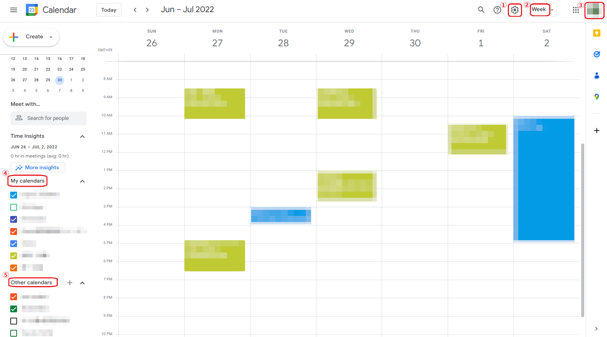
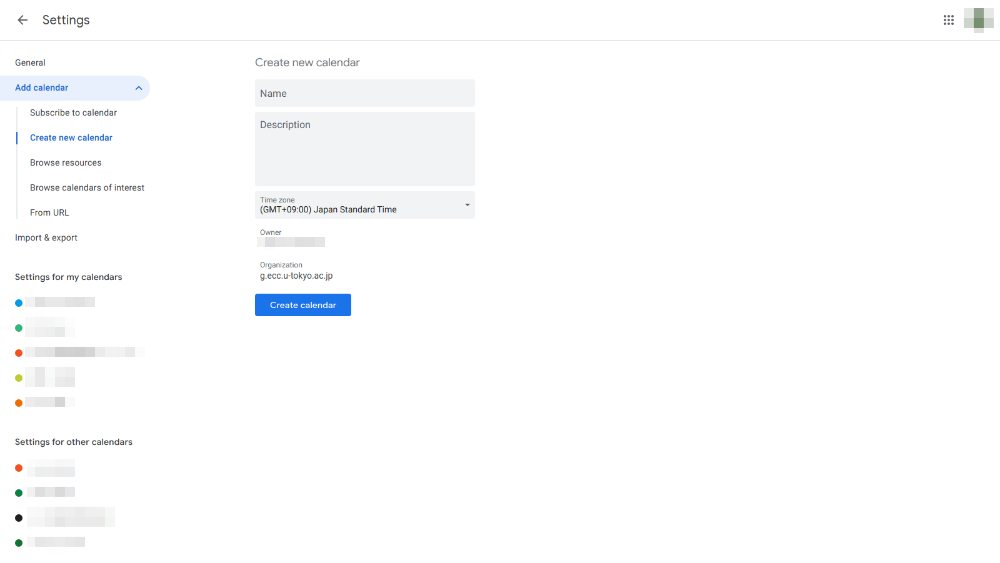
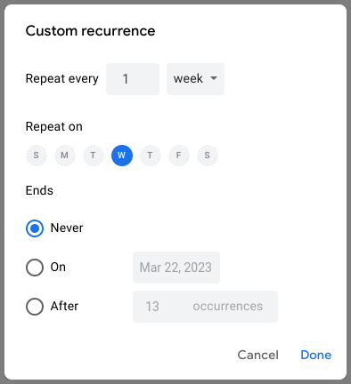
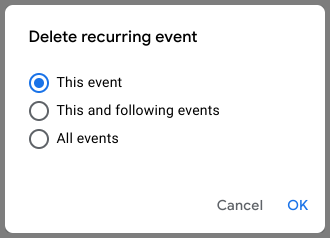
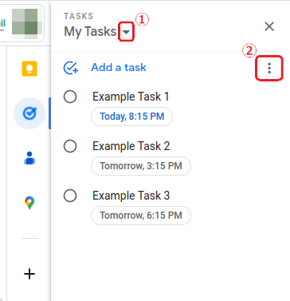
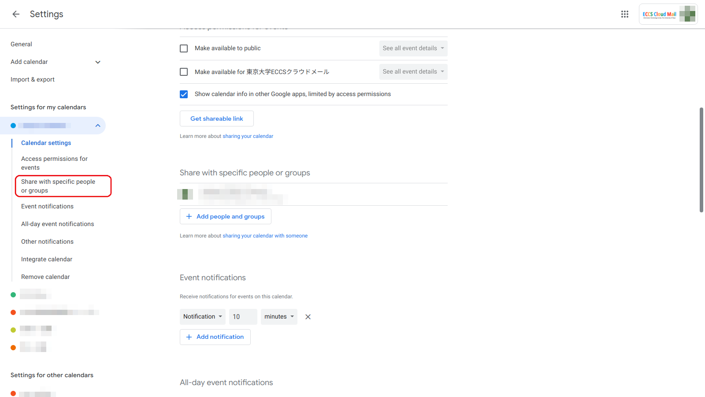
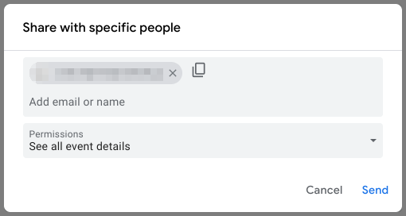

## Highlights of This Article

In this article, we will introduce how to use online tools to better manage your schedule. As a university student, you will have to organize and coordinate your schedule by yourself more than ever before. If you can manage and coordinate your schedule well, you will be able to have a more meaningful campus life. This article explains how to manage your schedule with online tools using the case of a student as an example. And we have also included some useful information in general, so please take a moment to read through it.

## When You Have to Manage your Schedule

The following three cases are examples of situations in which schedule management might be necessary.

- Confirmation and management of various daily schedules
- Checking and managing repeated events such as club and lab meetings
- Sorting tasks and managing deadlines and priorities

## Advantages of Using Online Tools

Many people use diaries with calendars to manage their schedules, but as activities have changed and diversified (for instance, by shifting online in the wake of the corona pandemic), it is becoming increasingly difficult to keep track of all appointments on paper. In addition, we often need to coordinate our schedules with others online. Online tools are useful for visually managing such complex schedules. The advantages of using online tools for schedule management are as follows.

- You can access it from anywhere, such as with smartphones and PCs.
- The schedule format is already prepared, so it is easy to fill in the schedule by following the instructions.
- You can easily integrate a variety of information associated with online activity schedules, such as class materials distributed in PDF format and URL information for online meetings.
- Unlike paper, it is easy to edit when schedules are changed.
- You can create various groups with different members, making it easy to share schedules.

## Specific Tools

### Using Google Calendar

There are a variety of calendar tools used for managing appointments. In this section, we will introduce how to use Google Calendar to manage appointments using online tools, since it can be used by anyone with a University of Tokyo Google account (ECCS Cloud Email).

### Google Account (ECCS Cloud Email) at the University of Tokyo

The University of Tokyo Google account (ECCS Cloud Email) is the University of Tokyo’s school account and its domain name is different from that of a general free account. You can use the calendar with a general free Gmail account, but you can access more features with ECCS Cloud Email.

Please refer to "[ECCS Cloud Email (Google Workspace)](/en/eccs_cloud_email)" for information on how to set up your ECCS Cloud Email account.

In the following, this article assumes that you are logging in with an ECCS Cloud Email account.

### Basic Instructions

Each numbered icon has the following functions.

- ① Settings
- ② Changing display
- ③ Changing account
- ④ My Calendars
- ⑤ Other Calendars

The following is a description of the specific function of each icon.

#### ① Settings (Preferences)

- Click here to set up your own personalized calendar settings. For example, you can change the "Notification settings" and "View options" of appointments to suit your personal preferences.
- You can also view deleted events in the "Trash" box.

#### ② Changing display

- You can choose to display the schedule in "Day," "Week," "Month," "Year," "Schedule," or "4 Days (Custom View)."
- You can change the view to suit your own preferences in the "Custom View." The default setting for this "Custom View" is "4 days," but you can change it to, for example,  "3 days" or "2 weeks" from "Set custom view" in "Settings" to suit your own preferences.

#### ③ Changing account

- If you have more than one Google account, you can change the account by clicking here.
- When you change the account, the calendar will switch to the calendar of that account.

#### ④ My Calenders

- The "My calendars" column shows the calendars for which you have the "Make changes & manage sharing" access permission enabled in the calendar sharing settings.
- "Make changes & manage sharing" is the most powerful access permission that can be granted to the calendar sharer, allowing him or her to perform the same operations as the owner of the calendar, such as changing appointments and sharing settings.

#### ⑤ Other calendars

- Calendars with permissions other than "Make changes & manage sharing" will be displayed here.
- Specifically, calendars that are authorized only to view and change appointments are displayed.

### How to Check Calendars

#### 1. Check from PC

- Click [here](https://www.google.com/calendar) to open Google Calendar.
- Log in to your account with the information for your ECCS Cloud Email (or the account you want to use).

#### 2. Check from smartphone

- Install the Google Calendar application and open it.
- You can also register an account with the app to synchronize your calendar with other devices (e.g. your PC).

#### 3. Check from other calendar applications

- Google Calendar can export calendar information to .iCal format, allowing you to check your Google Calendar information using other calendar tools that can read this format.
- For example, you can check appointments made in Google Calendar from iCalendar on your iPhone.
- For more information, please refer to the official article [here](https://support.google.com/calendar/answer/37111?hl=en).

## How to Manage Your Schedule In Various Scenes

### Checking and managing various schedules

This section describes how to add and set up appointments in general. In university, you will belong to various communities and will have various types of appointments. If you can categorize and manage them well, you will be able to make your activities more enjoyable and fulfilling.

#### Basic instructions for scheduling appointments

- If you click on the time zone where you want to add an appointment, an appointment scheduling screen similar to the one shown above will appear.
- Clicking the "+Create" button in the upper left corner will also bring up the same screen for adding appointments.

#### Information to be entered in the schedule

**A. Type of appointment**

- You can set the type of appointments in detail here.
- You will mainly use "Event" or "Tasks" to manage your personal schedule.
- "Silent mode" and "Out of office" are used when you want to decline meeting invitations from other people, etc.
- A "Bookable appointment schedule" is used when you want to let an unspecified number of people know when you are available. Once an "appointment schedule" is set, others can make entries in the set reservation slots to set up meetings, etc.

**B. Contents of the appointment**

- You can enter the necessary information for the appointment in the input box to the right of each of the icons shown here.
- For more information on what each icon means, please refer to the ["Appointment details"](#appointment-details) below.

**C. Other options**

- You can set up more advanced options for your schedule here.
- When you click on the button, the following window will be displayed. The information that can be entered in "B. Appointment details" can also be entered using the "Other options" screen. Please refer to the ["Appointment details"](#appointment-details) below for the details that can be entered in each field. Entering the items found in "B. Appointment details" are generally sufficient to set up a meeting, but some settings can only be entered using the "Other options" screen; for example, the guest’s permission settings in "7. Add Guest."

<strong>Appointment details</strong>

**① Settings date and time**

- This is where you set the date and time of the appointment.
- You can also set the time zone and set a repeating or all-day schedule.

**② Adding locations**

- You can add the location of the appointment, such as a link to Google Maps.
- The URL of a Zoom meeting can also be pasted here, allowing you to join the meeting with a single click.

**③ Setting notifications**

- Up to five notifications can be set.
- In addition to pop-up notifications that appear on the screen, you can also set email notifications.

**④ Categorizing schedules**

- You can classify your appointments under one of the groups in My calendars.
  - If there are multiple groups (in My calendars) with which you want to share your calendar, you can click here to select which group you want to share the appointment with.
- You can also change the color of the appointments to make them easier to see.

**⑤ Privacy setting of schedules**

- You can set whether or not to display events when you share your calendar with others.
- For details, please refer to [this page](https://support.google.com/calendar/answer/34580).

**⑥ Adding a schedule description**

- You can add any information you want to your schedule.
- You can also import external files or embed a Google Docs document, for example.

**⑦ Adding guests**

- By adding a guest with an email address, you can share and co-edit the schedule with the guest.
- Guests' access rights can only be set from the "Other Options" menu.

#### How to sort the schedule by category

My Calendar allows you to categorize and manage your appointments. For example, you can organize your part-time job schedule, plan to hang out with your friends, class schedule, and so on into different calendars, making it easier to organize and check your schedule.

- Click the "+" to the right of "Other Calendars" and select "Create New Calendar" to display the screen shown above.
- After entering the name and description of the new calendar, click "Create Calendar" to add the new calendar to My Calendars.
- To organize your appointments by category, simply select and register the appropriate calendar when creating an appointment.

### Managing Regular Appointments

In your college life, you will sometimes need to schedule regular appointments, such as club and lab meetings, classes, and part-time jobs, for example.. Even in the case of regular appointments, you may forget your schedule when you are busy. To avoid this, you need to keep track of your schedule.

#### Setting recurring appointment dates and times

- To set a recurring appointment, you need to use the pull-down button in the date/time settings.
- There are various recurrence settings, and appointments can be specified down to the date and year.
- For more detailed settings, click on the "Custom" button. A window will appear as shown below.
- You can set the repeating interval, the day of the week, and the end date of the repeating cycle in detail.

#### How to delete a recurring appointment

- When you delete a recurring appointment, a window like the one shown above will appear.
- If you want to delete just one event, select "This event."
- If you also want to delete all recurring events after the event you want to delete, select "All subsequent events."
- If you want to delete all events, including events that recurred in the past, select "All events."

### Sorting and Managing Tasks

There are many deadlines at the university, such as submitting assignments and filing forms. Online tools can help you manage these deadlines efficiently. If you have several milestones before the deadline, you can also use the Todo List task management function in Google Calendar to keep track of your tasks and keep them on time.

#### How to use the Todo List

Google Calendar has a task management function called Todo List. You can use it to manage task deadlines and priorities.

There are two ways to use the Todo List. One is to select "Tasks" (①) from the "Appointment Types" menu, and the other is to select "Todo List" (②) from the add-on bar on the right.

When you click the icon marked ②, the following screen will appear.

Here you will see a list of the tasks you have created, and you can do things such as the following:

- You can confirm the task title, its details, and the due date.
- You can add tasks or check the checkbox to the left of each task to mark it as "completed."
- You can also create a new list by clicking the pull-down button to the right of the title (①). This is useful when you want to categorize tasks.
- The button marked ② allows you to adjust detailed settings for the list.
- You can also sort tasks by, for example, their priority. We recommend that you arrange them in a way that is convenient for you.

## Other Useful Features

### Integration of calendars from different accounts

If you have multiple Google accounts and use separate calendars for each account, your events are scattered between different Google calendars, which can be troublesome to coordinate. In such a case, you can integrate the calendars of different accounts into one calendar for better visibility and centralized management of events.

1. Open the Google Calendar of the account you want to share．
2. Go to Settings and select the calendar you want to share.
3. Select "Share with specific people or groups" and click "+Add people and groups".
   
4. Enter the Google account you want to share and set the access rights to the calendar. There are four types of permissions.

    - Show schedules
      - See only free/busy (hide details)
      - See all event details
    - Make changes to events
    - Make changes and manage sharing

Please refer to [this page](https://support.google.com/calendar/answer/37100) as well.

### Connect with Google Groups

Using Google Calendar, you can invite all members of a Google Group to an appointment or share your calendar with everyone.

#### Invite the entire group to an appointment

- You can invite group members to individual appointments.
- Enter the name of the group you want to invite in the "Add Guest" box as described in ["Basic instructions for scheduling appointments"](#basic-instructions-for-scheduling-appointments).
- To use this function, you must have access to the group's conversations and members' email addresses. Please check the group's settings. If you do not have these rights, users will receive the invitation, but they will need to add the event to their own calendars manually.
- Please refer to [this article (currently in Japanese)](/articles/google-groups/) for details on setting Google Groups permissions.

#### Share schedules with the entire group

- You can share your calendar with group members.
- As explained in the ["Integration of calendars from different accounts"](#integration-of-calendars-from-different-accounts), you can share calendars by granting permission to the group's email address.
- Please also refer to [this official article](https://support.google.com/calendar/answer/37082).

### How to Set an Account as Your Default

When you use Google services, including but not limited to Google Groups, you may find that you are automatically logged in with your personal Google account instead of your university's ECCS Cloud Email. This happens because the account with which you first log in to the service is set as your default account. If you want to change the default account, log out of all accounts by clicking on the account icon, and then log in for the first time with the account you want to use as the default.

