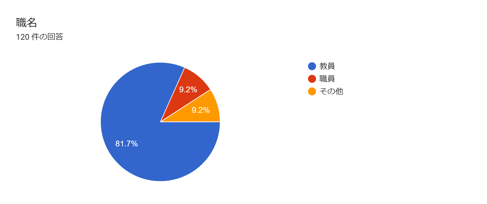

　An online course on  "How to use Zoom with online class in mind" was conducted on March 19, 2020, from 15:00 to 17:00. 
  
  
　Specifically, we first described the main forms of online classes, and the basic flow of a simple online lesson using Zoom (how to create a room, how to enter and exit, etc.). After that, as a practical part, microphone and camera settings, participant management (mute control), screen sharing (material presentation), chat (question and answer), raising hand (question and answer), voting (question from teacher) , Breakout (group work) and other functions were introduced.  
  
  
　we are sorry for those who could not participate because the meeting exceeded 1000 people immediately after the start. We will release a video of the course at a later date, so we hope you can watch it.  
　Also, thank you for those who participated on the day. Even after the basic course, individual consultation time was set up, and 500 people remained for about 30 minutes from the start, and 200 people remained for about 1 hour and 30 minutes from the start. Thank you for your participation. 
  
[Handouts](workshop_how_to_use_zoom.pdf)  
  
## Operation system on the day
　The operation on the day was coordinated by two instructors: one instructor explained along the slide, and the other instructor constantly checked the chat, sharing important questions and comments as needed. took. In addition, Dr. Taura, Director of the Information Technology Center, responded to questions that came up by chat.   
    
## What we have learning from the online course with 1000 participants
　Following the flow of the presentation materials, people were able to get to know about various functions while actually experiencing Zoom.
In addition, because it is difficult for participants to work together only with Zoom, we implemented Google Spreadsheets, so participants could share information on copyright-free materials and their own experience using Zoom in lessons. 

* 基本的にうまくいったところ
  * 音声，映像トラブルなしに進められました（一部，音声が聞こえないというコメントがありましたが，参加者側のデバイス設定が原因でした）  
  * チャットも問題なく使えていました（後半になるにつれ，チャットの画面が少々重くなっていきましたが使えました）．
  * 手を挙げる機能もうまく働いていました．  
  * 投票機能（開催者から参加者に多肢選択の質問をする機能）は開催者側は問題なく使えました．しかし，一部の参加者が回答できない場合があったようです．  
  * レコーディングもうまくいっていました（2時間30分のmp4ファイルで，サイズは376MBでした）  
 
* うまくいかなかったところ
  * Google スプレッドシートが機能しなかった
    * Some tools might be unavailable due to heavy traffic in this file と出てしまい，書き込めなかった
	* 現在アクセスログを分析して，何人ぐらいで書き込めなくなるのかを調べようと思っています（2020年3月19日現在では，1000人がスプレッドシートで協働するのは難しいようです）  
  * ブレークアウトセッションが機能しなかった
    * セッションの割り当て後に「すべてのセッションを開始」を押しても無反応でした
    * 基礎講座後に個別相談をそのまま行っていたのですが，200名ほどになった時に再度試したところ，開始することができました
 
 
    
## アンケート結果
　120名が事後アンケートにご回答してくださいました．  
　参加者の8割が教員と多く，全体評価として有用であったと回答いただいた方が9割を超えました．  
　改善の余地はあるものの，評価いただけて講師陣は少しほっとしています．  

  

  

    
## おわりに
　1000人のオンラインワークショップは初めての試みでしたが，基本的には問題なく進められて良かったです．特に大人数授業をされる方にとって今回の開催報告が役立てば幸いです．  
　参加者のみなさま，またポータルサイト構築に携わっている多くの方々，ご参加・ご協力本当にありがとうございました．  
　これからも意義ある講座や情報提供をしていきたいと思っておりますので，引き続きどうぞよろしくお願いいたします．  

（吉田塁，栗田佳代子）