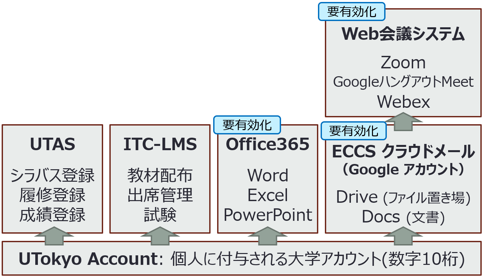
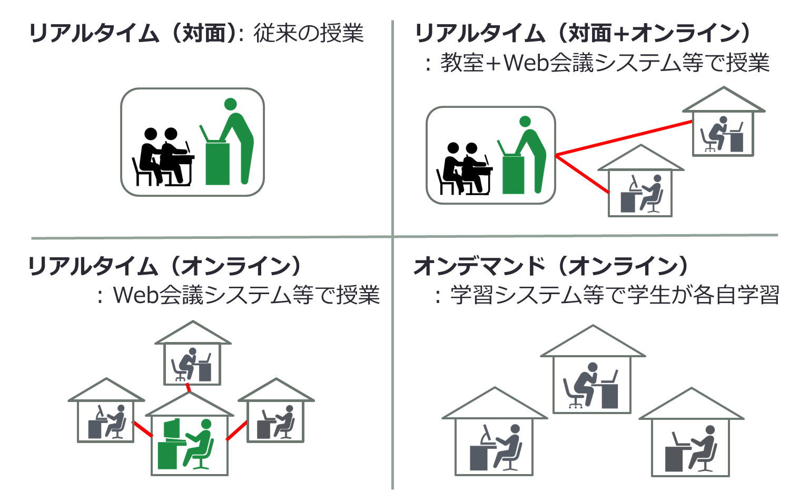

更新日: 2020年4月2日

## Introduction

As stated by the <a href="https://www.u-tokyo.ac.jp/ja/about/president/COVID-19-message.html" target="_blank">Dean's message</a>  the University of Tokyo has decided to introduce online classes to the S semester in 2020 in order to prevent the spread of the new coronavirus COVID-19. It says that "Face-to-face lectures will be minimized and online classes will be encouraged and promoted. " However, since the message was issued on March 18, the situation has become more serious and it has become necessary to prepare for a full online class scenario.

This is the first time for many faculty members to conduct online classes and the time available for preparation is very limited. Under such circumstances, various efforts have already been made in various places in order to provide students with the same learning environment.

This portal has been created in an attempt to help reduce the burden on faculty and staff when the university promotes online classes. In this portal, we are going to provide the following information that is useful for smoothly bringing online the lessons we have been conducting in-person.

* What is an online class
* What kind of system environment is available at our university
* What can the system actually do
* Specific ways to teach online courses
* What resources are available

However, it is still not enough. There is a way you could help. Some teachers may have already started classes online; if you are one of them, we would be grateful if you could send a message to [utelecon-inquiries@googlegroups.com](mailto:utelecon-inquiries@googlegroups.com)telling us what you know, and suggesting methods. In this portal, we would like to share such information with those who need it.

We believe that the knowledge accumulated and shared in this portal will help create a community that achieves our goal of an online system, and  will ultimately support maintaining or improving a high-quality learning environment for our students.

A message from all the members editing this Portal
　

## To use the ICT system for Education at the University of Tokyo

There are several ICT systems for education at the University of Tokyo  

The broad picture is as shown above. The UTokyo Account, which indicates that you are a member of the University of Tokyo,  is the basis for using many services. UTAS for syllabus registration, and ITC-LMS for distributing teaching materials and attendance management can be used if you have a UTokyo Account. However, activation is required separately for Office 365 (which gives you access to Word and Excel) and ECCS Cloud Mail (which gives you access to Google services). Also, if you want to use the video conferencing system (Zoom, Webex, Google Hangouts Meet) with your University account, you will need to activate it using ECCS Cloud Mail.

Even if you already have an Office 365 or Google account, if you want to share video files with students only within members of the university, or want to use Google Drive (file storage) without worrying about capacity, please enable each account.    

The following is a description of each service and procedures required to use them. If you encounter any problems during the following procedures, notify us at[utelecon-inquiries@googlegroups.com](mailto:utelecon-inquiries@googlegroups.com) Please include (a) in which steps below, (b) what you did, and (c) what was the result. (If you only tell us that it didn't work, we often cannot figure out what the problem was).

1. **UTokyo Account:** This account indicates that "you are a member of the University of Tokyo", which is the basis for all other services. If you are a new faculty member, you will find your account number (10 digits, common ID) and initial password on the documents that are handed to you after April 1, 2020.
  * **（New faculty members）Task:** [Change the initial password](https://utacm.adm.u-tokyo.ac.jp/webmtn/LoginServlet)[video](https://youtu.be/tTpAlqVhEXQ)
1. **UTAS (Academic Affairs System):** A system used to register syllabi and grades. Information regarding online classes will most likely be provided via this system as well. Your UTokyo Account must be set correctly in order to use this. 
 * **Task:** If you can use your UTokyo Account, there is no need to do anything in particular.
1. **ITC-LMS (Learning Management System):** Used for posting materials, submitting assignments, and managing attendance for the class in which you are responsible. UTAS is usually used before the course starts (syllabus registration) and after the course ends (grades registration), whereas ITC-LMS is used during the course period. Your UTokyo Account must be set correctly in order to use this system. 
 * **Task:** If you can use your UTokyo Account, there is no need to do anything in particular. (Reference: [ITC-LMS teacher page](../lms_lecturers/)）
1. **ECCS Cloud Mail (Google Mail/ G Suite for Education):**  A Google service that is available to all faculty and staff. A Google account (ECCS cloud mail account) is issued to all faculty and staff. This is required to use the University's video conferencing system account. Also, because it is a Google account, you can use Google Drive for file storage, Google Docs for document  service, Google Spreadsheet for spreadsheet service, YouTube for video distribution service, etc. To use this, you need to have set up UTokyo Account correctly, and activate the system when you start using it. 
  * **Task:** [UTokyo Account利用者メニュー](https://utacm.adm.u-tokyo.ac.jp/webmtn/LoginServlet) の「ECCSクラウドメール」からアカウント名, 「ECCSクラウドメール(パスワード変更)」からパスワードを設定して, G Suite for Educationを有効化して下さい (<a href="https://hwb.ecc.u-tokyo.ac.jp/wp/literacy/email/initialize/" target="_blank">手順についての詳細</a>).
  * **作業:** 上記が終わってから実際にG Suite for Education が使える(Googleにログインできる)ようになるまで, 最大1時間ほどお待ち下さい（毎時0分に更新で反映まで5分程度かかります）. その後，<a href="https://mail.google.com/a/g.ecc.u-tokyo.ac.jp" target="_blank">ECCSクラウドメール</a>に移動して，設定したアカウント名（ご自身が設定した英数字）とパスワードを入力して，Gmail にログインできることを確認してください．
1. **Office 365 (Microsoft):** 文書作成ソフトの Word, 表計算ソフトの Excel， プレゼンテーションソフトの PowerPoint などが利用できるようになります．使うためにはUTokyo Accountが正しく設定されている必要があるのと, 使い始める際にシステムの有効化を行う必要があります.
  * **作業:** [UTokyo Account利用者メニュー](https://utacm.adm.u-tokyo.ac.jp/webmtn/LoginServlet) から「Office 365 ProPlus利用許諾」に合意し, Office 365の有効化をして下さい ([手順動画](https://youtu.be/OYl5P67mDYI)). 
1. **Web会議システム:** リアルタイムにオンラインで授業を配信したり，授業用の動画を録画するために利用できます．本学では，[Zoom](../zoom/)，[Webex](../webex)，[GoogleハングアウトMeet](google_hangouts_meet) が利用できます．どれにしようか迷われている方は，利用しやすい Zoom をおすすめします．利用する準備方法はそれぞれのページをご覧ください．

ここで，注意してほしいのは, Google，Microsoft，Zoomも, すでに自分で使っているという方もいらっしゃると思いますが, そういった方も**大学のアカウントで使えるように**していただくことが重要です．これらのアカウントを使えるようにすることで，本学構成員向けのサービスを利用できるようになり，例えば，Google Drive で学内限定で共有されたファイルを閲覧したり，学生に学内限定でファイルを共有したり，Zoom で通常アカウントでは参加者数の上限が100名のところ，500名の会議を行うことができたりするようになります.

ECCSクラウドメール(Google)とOffice 365(Microsoft)の有効化の手順は前述していますが, それらのシステムでどんなことができるかも含め, 東京大学[初年次ゼミナールのページ](https://fye.c.u-tokyo.ac.jp/students/)にある, 『東京大学ICT活用ハンドブック（文理共通）』 ([2019年度版](pdf/01_2019_ict.pdf))で詳しく説明しているため，必要に応じて御覧ください． 

## オンライン授業の主な形態  
　ここでは，従来の授業と比較しながら，オンライン授業の主な形態3つを紹介し，それぞれの形態の説明とオンライン授業（メディア授業）としての要件の説明を行います．  

　従来の授業は，リアルタイムに対面で行うものです．一方，オンライン授業には大きく分けて，リアルタイムに対面かつオンラインで行う形態（同期ハイブリッド型），リアルタイムにオンラインのみで行う形態（同期オンライン型），学生が自身のペース（オンデマンド）でオンライン学習する形態（非同期オンライン型）があります．  
　以下，それぞれについて説明します．
  
  
* リアルタイム（対面+オンライン）型（同期ハイブリッド型）
  * 実際の教室で授業をして，Web会議システムなどでその内容を配信する形態です．  
  * この形態のオンライン授業（メディア授業）としての要件は，「同時かつ双方向に行われる」ことです．Web会議システムを利用すれば，チャットや音声による通話ができるためその要件を満たせますし，映像配信であったとしてもコメントなどを受け付ける機能があれば，その要件を満たすことができます．
  * 参考: リアルタイム（対面+オンライン）型（同期ハイブリッド型）の準備方法（途中）
  * 参考: [オンライン基礎講座「授業のオンライン化を念頭に置いた、Zoom の使い方」](https://utelecon.github.io/events/2020-03-19/)
   
   
* リアルタイム（オンライン）型（同期オンライン型）
  * Web会議システムなどを用いて教員と学生全員がオンラインでつながり授業を行う形態です．  
  * この形態のオンライン授業（メディア授業）としての要件は，「同時かつ双方向に行われる」ことです．Web会議システムを利用すれば，チャットや音声による通話ができるためその要件を満たせますし，映像配信であったとしてもコメントなどを受け付ける機能があれば，その要件を満たすことができます．
  * 参考: リアルタイム（オンライン）型（同期オンライン型）の準備方法（途中）
  * 参考: [オンライン基礎講座「授業のオンライン化を念頭に置いた、Zoom の使い方」](https://utelecon.github.io/events/2020-03-19/)
   
     
* オンデマンド（オンライン）型（非同期オンライン型）
  * 学習管理システムなどで教員が用意した教材をもとに学生が個別に学習する形態です．例えば，以下のような方法が考えられます．
    * 学生は教員が作成した動画教材，もしくは OCW（Open Course Ware）や MOOC（Massive Open Online Course）などの既存の動画教材を毎週決められた範囲で視聴し，別途課題提出や掲示板での質疑応答を行う
    * Web会議システムを用いてリアルタイムに行った授業の録画を後から視聴して，課題提出や掲示板での質疑応答を行う
  * この形態のオンライン授業（メディア授業）としての要件は，以下の2つです．例えば，教員が Web 掲示板（ITC-LMSにその機能有）を用意して学生同士が意見交換できるよう促し，適宜授業内容に関して小テスト，問いかけ，質疑応答などを行うことで要件を満たせます．
    1. 以下の2つの方法どちらかを用いて，設問解答、添削指導、質疑応答等による十分な指導を併せ行うことが必要
      * 毎回の授業の実施に当たって、指導補助者が教室等以外の場所において学生等に対面すること
	  * **又は**，当該授業を行う教員若しくは指導補助者が当該授業の終了後すみやかにインターネットその他の適切な方法を利用すること
  
    1. 当該授業に関する学生の意見交換の機会の確保が必要（学習管理システム ITC-LMS の掲示板機能で実現可能）
  * 参考: オンデマンド（オンライン）型（非同期オンライン型）の準備方法（途中）
  * 参考: [オンライン基礎講座「ライブ配信ではない，動画やテキストなどを用いたオンデマンド型オンライン授業の作り方」](https://utelecon.github.io/events/2020-03-27/)

## 各授業方法のオンライン化（執筆中）

* 質疑応答のオンライン化
* [板書のオンライン化](how_to_teach_online_handwriting)
* 輪読のオンライン化
* グループワークのオンライン化

## 具体的なツールの使い方（執筆中）

* 学習環境の整え方
  * [ITC-LMSの使い方](../lms_lecturers/)
  * Google Classroom の使い方
   
   
* 教材の作り方
  * [オンライン基礎講座「ライブ配信ではない，動画やテキストなどを用いたオンデマンド型オンライン授業の作り方」](https://utelecon.github.io/events/2020-03-27/)にてそれぞれのトピックを説明しているため，記事が出来上がるまではそちらの動画を御覧ください
  * Googleドキュメントの音声認識を使った素早いテキスト入力の方法
  * PowerPoint を用いた簡単な動画の作り方
  * Web 会議システムを使った動画の作り方
   
   
* ファイルのアップロードと共有方法
  * Google Drive の使い方
  * One Drive の使い方

## ご共有いただいた実践例・参考情報（随時募集中）

ここで，ご共有いただいた資料を紹介いたします．ご共有いただいた先生方，誠にありがとうございます．  
資料をお持ちの方でご共有いただける場合は[utelecon-inquiries@googlegroups.com](mailto:utelecon-inquiries@googlegroups.com)にご連絡いただけると幸いです．  
もしくは，Github に詳しい方は，[utelecon の Github](https://github.com/utelecon/utelecon.github.io/)を fork して，以下のリストに情報を付け加えていただき，pull request を送っていただければ幸いです．  
現時点では，箇条書きでご紹介させていただきますが，情報が増えてきましたら別途整理などさせていただく予定です．  
また，各授業方法のオンライン化の項目などで別途ご紹介させていただく可能性があること，ご了承いただければ幸いです．  

* PC1台でできるオンライン講義 [\[Powerpoint\]](materials/online_example_1pc.pptx) [\[動画(MPEG4)\]](materials/online_example_1pc.mp4) (工学系・川原先生): 板書の授業をオンラインで行うための方法を動画付きで説明いただいています
* Zoom利用の手引き0.3 [\[PDF\]](materials/zoom_v03.pdf)（工学系・相田先生）: Mac のスクリーンショットを多用した Zoom の使い方を解説いただいています
* Google meetを使ったグループワーク型授業の例 [\[PDF\]](materials/google_meet_groupwork.pdf)  (工学系・柳澤先生): オンラインにおいてグループワークをする方法が説明されています（Zoomのブレークアウトでは教員の声などを伝えられませんが，その点を克服している画期的な方法です）
* スマートフォンと書画カメラで手書き講義をPCで行う方法 [\[PDF\]](materials/doc-cam-lecture.pdf) (工学系・古関先生): A4の紙をリアルタイムの板書がわりとして書画カメラで撮影し配信する方法が説明されています
* PCとタブレットを使って黒板ライクに講義をする方法 [\[PDF\]](materials/pc+ipad.pdf) (工学系・熊田先生, 鈴木先生): タブレット上にホワイトボード的に板書，必要に応じてタブレット画面をスライドやPDFの資料にも切り替えて行う方法が紹介されています
* ペンタッチ機能をもったWindowsタブレット一台（Surfaceなど）で資料に手書きをしながら配信する方法 [\[動画(YouTube)\]](https://www.youtube.com/watch?v=gj-xBZEgt-A) (情報理工学系・川原研博士課程・笹谷さん)：授業pdfを開き画面共有しながらそこに書き込んだり，OneNoteなどを共有して直接書き込む方法の紹介です．

## リンク集（随時募集中）

