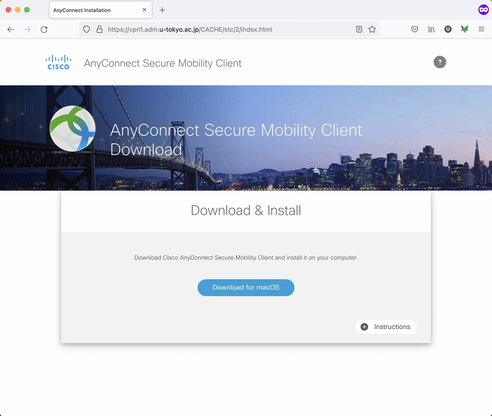

This page describes how to use UTokyo VPN on macOS devices.



### Preparation: Download and Install the VPN Client Application
{:#setup}

Install the application “AnyConnect” on your device to connect to UTokyo VPN.

**Step A:** Go to [https://vpn1.adm.u-tokyo.ac.jp](https://vpn1.adm.u-tokyo.ac.jp). When the UTokyo Account authentication page appears as illustrated below, log in with your UTokyo Account.

{:.medium.center.border}



**Step B:** After the log-in, a download page for the AnyConnect client application, as illustrated below, will appear. Click “Download for macOS” to download the client application.

After these steps, install the application as you would do for any other macOS application.

{:.medium.center.border}
{:.medium.center.border}



**Step C:** During the installation of AnyConnect, a window with the following message “System Extension Blocked” may appear, please click the “OK” button. A window with the following message will appear “AnyConnect System Extension Blocked”. Please follow the instructions to allow the system software from “Cisco AnyConnect Socket Filter”, which is displayed in the “General” in “Security & Privacy” in “System Preferences”. Additionally, a window like the second picture below will also appear, please click “Allow”. 

<figure class="gallery">
  
  
</figure>

**Step D:** If the installation was completed successfully, a folder named “Cisco” is created in the Applications folder. In the folder, the AnyConnect client application “Cisco AnyConnect Secure Mobility Client.app” is installed. 

{:.medium.center.border}

You are now ready to use VPN.

Note: After installing the AnyConnect client application on a macOS 11 Big Sur or later, three extensions with the name “Cisco AnyConnect Socket Filter” are added to the “Network” in the “System Preferences”. These extensions are necessary for shifting networks between VPN and others such as Wi-Fi or LAN. They do not record the contents of communications or send the information outside the host. These extensions' statuses are always “connected (green dot)” regardless of a real connection to the UTokyo VPN. 

{:.medium.center.border}

### Steps to connect to the UTokyo VPN
{:#connect}

The following steps are required, every time to use the VPN. Please note that your device will not connect automatically to the VPN immediately after booting your PC.

**Step E:** After launching the “Cisco AnyConnect Secure Mobility Client” installed following the Preparation steps, the window illustrated below will appear. Enter **vpn1.adm.u-tokyo.ac.jp** as the VPN connection destination. Click the “Connect” button. 

{:.medium.center.border}

**Step F:** After clicking the “Connect” button, the following UTokyo Account authentication window appears. Log in with your UTokyo Account.

{:.medium.center.border}




**Step G:** If the window displaying “Connected: vpn1.adm.u-tokyo.ac.jp” appears as illustrated below, your device is connected to the VPN. Communication is performed via this VPN while connected to the University of Tokyo campus network. Except for some communication platforms such as Zoom and WebEx that do not require a VPN connection and e-journal sites, all communications occur via this VPN, connecting to the University of Tokyo campus network.

**Step H:** To view the current connection status, click on the “Cisco AnyConnect Secure Mobility Client” icon again. If the window displaying “Connected to vpn1.adm.u-tokyo.ac.jp” illustrated below appears, your device is connected to the UTokyo VPN.

To disconnect from the VPN, click the “Disconnect” button in this window.

{:.medium.center.border}

---

[Back to the UTokyo VPN home page](.)
