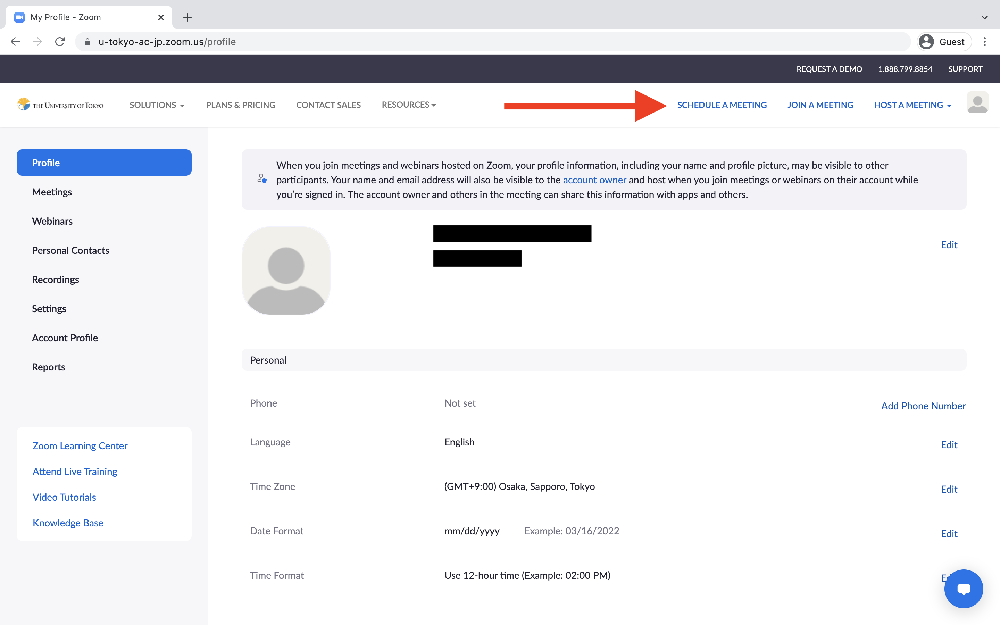
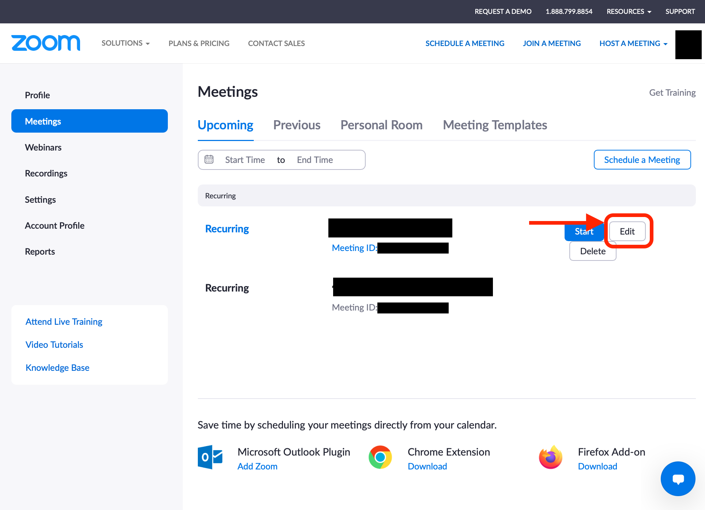

## Scheduling Meetings
{:#create}

This section provides information on how to schedule a Zoom Meeting from the Zoom webpage.

1. Access to your [Zoom My Account page](https://zoom.us/profile) from a web browser. Click “Schedule a Meeting” on the top right corner of the page. 
{:.medium}  

2. Select the meeting options and click “Save” to finish scheduling your meeting. For supplementary explanation on the meeting options, see [“Zoom Meeting Options”](#settings).
{:.medium}  
{:.medium}  

3. After saving, copy and send out **the invite link** to participants via email.  
{:.medium}  
  * **The password information is included in the URL** by default. Therefore, sharing the password separately is not required.
  * The text obtained by clicking “Copy Invitation” contains unnecessary information such as how to join the meeting by dialing. We recommend that **you only share the URL of the meetings**, instead of copying the whole invitation.  
  * By clicking “Show all occurrences”, you can edit the date/time settings or add another session to the scheduled recurring meetings. (For example, while the recurring meeting is set on Tuesdays, another class would be held on Thursday).

## Editing Meeting Options
{:#edit}

Editing meeting options of scheduled Zoom meetings is possible.

1. Access your [Zoom Meeting page](https://u-tokyo-ac-jp.zoom.us/meeting#/upcoming) from a web browser.
{:.medium} 
2. All scheduled meetings will be listed on the page. Click “Edit” on the right side of the meeting you would like to make changes to.
{:.medium}
3. Edit the meeting options and click “Save”. The meeting will be scheduled. The URL for the meeting will remain the same if no changes were made to its Meeting ID and password.
{:.medium}  

## Zoom Meeting Options
{:#settings}

This section explains some of the important meeting options. 

  * **Regular meetings**: You can set up meetings on a regular basis. (Reference: [How to set up a room with the same URL for all  lectures](how/faculty_members/schedule)．．
  * **Security**: 
    * **Passcode**: **It is desired to have one**. In the default setting, however, participants can join the room by simply clicking the URL since the passcode is embedded in the link.
      * If you uncheck "Embed passcode in invite link for one-click join" in the [Zoom settings](https://zoom.us/profile/setting), participants are required to enter the passcode to join. 
    * **Waiting Room**: When the waiting room is activated, participants are placed there until the host lets them into the main conference room. Using the advanced setting, the host can send particular groups of participants to the waiting room, such as those whose email address does not have a domain given by the University of Tokyo (g.ecc.u-tokyo.ac.jp etc.). In order to avoid unintentionally sending legitimate participants to the waiting room, you should make sure that it is properly set up (refer to [Setting up the waiting room](waiting_room)). Regarding possible settings for classes at the University of Tokyo, please see [Restricting access to the Zoom conference room for classes](/faculty_members/zoom_access_control).
    * **Student Authentication**: If you activate this option and select "Sign in with University account(大学アカウントでサインイン)", non-UTokyo Zoom accounts cannot join the room. Make sure that the domain designated as UTokyo Zoom accounts is `.u-tokyo.ac.jp.` Please check [Student Authentication](auth) for more information.
      * However, it is not recommended to use this option in the first weeks since students might have troubles creating a UTokyo Zoom account.
      * Regarding possible settings for classes at the University of Tokyo, please see [Restricting access to the Zoom conference room for classes(/faculty_members/zoom_access_control)].
* **Meeting Options**:
  ***Allow participants to join before host**: It is recommended to activate this option unless you have some problems with students joining the room before you. You can also decide when students can join.
  * **Mute all participants when they join a meeting**: It is recommended to activate this option unless you have certain reasons to do otherwise.

## (Reference) Scheduling Meetings on the Mobile App

You can also schedule meetings in the mobile app. Please refer to [How to Schedule Meetings in the Mobile App](create_room_software). However, please note that not all the settings explained in this article can be modified in the meetings created with the mobile app.

