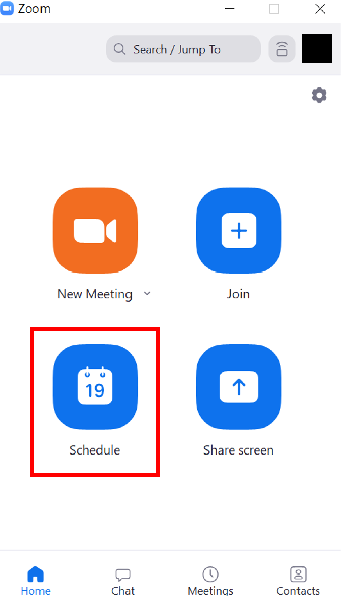
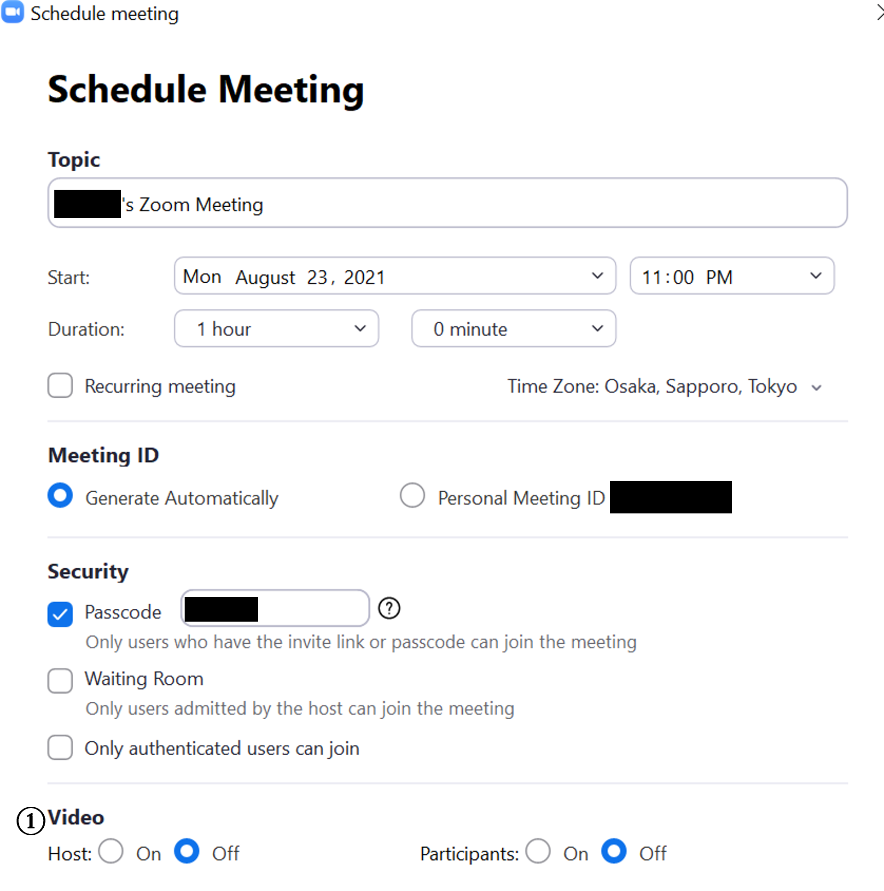
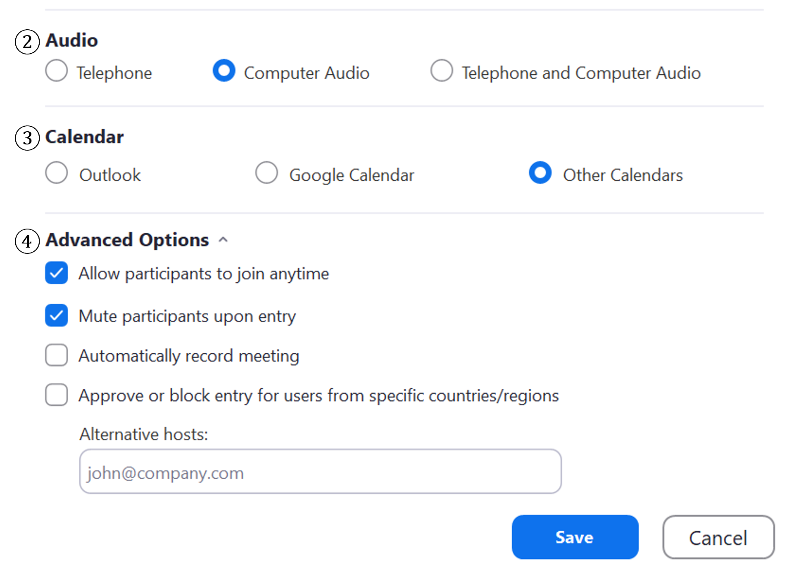

This page provides information on how to schedule a Zoom Meeting with the Zoom App. Settings options may be restricted when scheduling a meeting with the Zoom App. On such occasions, read the instructions in “[Scheduling a Zoom Meeting(Web Portal)](create_room)” and schedule your meetings on the Zoom webpage. For information on scheduling regular meetings, see “[How to set up a room with the same URL for all lectures] (how/faculty_members/schedule).”

1. Open the Zoom App.
2. Click “Sign In” to access the Zoom sign-in page.
  
3. On the Zoom sign-in page, press “SSO”, or “Sign in with SSO”. (Signing in with UTokyo Account email address and password via Zoom App is unavailable.)
  
4. Enter `u-tokyo-ac-jp` in the “Company Domain” field. (Note that `ac` is preceded and followed by a hyphen, not a period.)
  
5. You will be redirected to the UTokyo Account sign-in webpage. Sign in to your UTokyo account. (It is possible that this page will not appear if you have already signed into your UTokyo Account.)
  
6. Press “Schedule”.
  
7. Schedule the meetings with the information as follows.
    
   

  The following are some supplementary explanations.  
  - **Video** : Whether to have video on or off at the beginning of the meeting can be set for both host and participants individually.  
  - **Audio** : Selecting “Computer Audio” is recommended unless there are special needs to connect to Zoom from telephones.  
  - **Calender** : Synchronizing with Outlook or Google Calendar is also possible. However, it is recommended to select “Other Calendars” to copy and paste the meeting information.   
  - **Advanced Options**:   
    - **Allow participants to join anytime**: Participants are not allowed to join the meeting before the host if this option is disabled. We recommend that you enable this option if you would like other participants to join the meeting earlier and have a talk.   
    - **Mute participants upon entry**: We recommend that you enable this option if you would like to announce something at the beginning of the meeting.

8. Check the meeting information and **copy the Zoom meeting URL** listed under “Join Zoom Meeting”. Send email notifications to participants.

  

* **The password information is included in the URL** by default. Therefore, sharing the password separately is not required. 
* Some participants may access the Zoom meeting with the URL listed on the right of “Find your local number” if you also shared information other than the abovementioned URL. We recommend that you **only share the URL of the meetings**, instead of copying the whole invitation.
