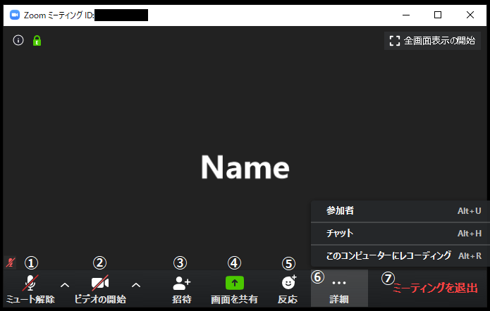
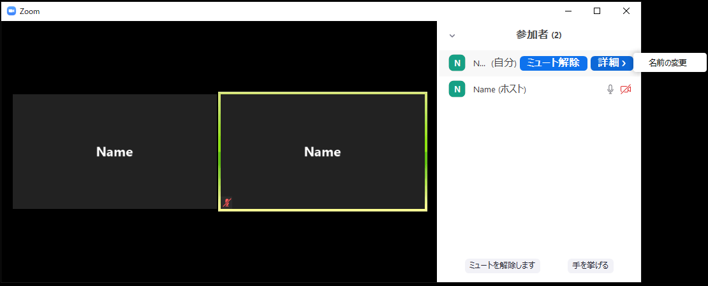

In this section we give concrete directions on how to use Zoom.  

The following screen is displayed when entering a meeting room（this screenshot shows a meeting room with only 1 participant）.
If you move the mouse cursor over the Zoom screen, the menu bar shown in the figure below will pop up.  
    
The menu buttons are explained from left to right （some version may not display all the buttons as here）．
  1. **Microphone mark** : Press this to mute (mute) or unmute (the screen shows "mute off" because it is currently muted). Pressing the arrow mark next to it enables you to make settings related to the microphone.
  1. **Video mark** : Press to turn the video on or off (the screen shows "Start Video" because the camera is currently off). Pressing the up mark next to it will allow you to make video settings.
  1. **Invitation** : You can send an invitation by e-mail. Since the organizer and participants already know the URL of the conference room, they can invite others by sharing the meeting URL.
  1. **Screen Share** : You can share screens in your device.
  1. **Reactions** : You can express reactions by sending "applause" or "agree" emoji.
  1. **Details** : Menus that could not fit on the screen are included here (If the screen width is large enough, all menus will be displayed on the screen and "Details" may not be displayed).
      **Participants** : Displays a list of participants.  
	  **Chat** : text chat.  
	  **Record on this computer** : You can record if your host allows it. This button is often not used by anyone other than the organizer.  
  1. **Leave meeting** : Leave the meeting. A confirmation screen appears after you press it, so you do not exit immediately when you press the button.
  
  
The following describes the details of the menu items mostly used.

## マイクの詳細設定
  
  
  
マイクマーク横の上マークを押すと，追加でメニューが出てきます．以下，それぞれについて簡単に説明します．
  * **マイク** : 使いたいマイクを選択できます（別途マイクを付けている場合，複数の選択肢が出てくるため，目的のものを選択してください）．
  * **スピーカー** : 使いたいスピーカーを選択できます（別途スピーカーを付けている場合，複数の選択肢が出てくるため，目的のものを選択してください）．
  * **スピーカーとマイクをテストする** : メニュー名の通り，スピーカーとマイクをテストできます．
  * **電話のオーディオに切り替える** : 電話で参加するための情報が出てきます．基本的には使いません．
  * **コンピューターのオーディオから退出** : メニュー名の通り，コンピュータのオーディオから退出します．ミュートと異なり，退出してしまうため，ミュートにしたい場合はマイクマークを押してください．基本的には使いません．
  * **オーディオ設定** : オーディオに関する設定ができます．「ミーティングの参加時にマイクをミュートに設定」「スペースキーを長押しして，一時的に自分をミュート解除」など詳細な設定ができます．
  
  
## ビデオの詳細設定
  
  
  
ビデオマーク横の上マークを押すと，追加でメニューが出てきます．以下，それぞれについて簡単に説明します．
  * **カメラ** : 使いたいカメラを選択できます（別途カメラを付けている場合，複数の選択肢が出てくるため，目的のものを選択してください）．
  * **ビデオ設定** : ビデオに関する設定ができます．「ミーティングの参加時にビデオをミュートに設定」「ビデオに参加者の名前を常に表示」など詳細な設定ができます．
  
  
## 画面の共有
  
メニュー「画面の共有」を押すと，共有する画面の選択肢が出てきます．希望のものを選択して「共有」を押すと，画面の共有が始まります．
  
  
  
  * 「画面」を選択すると，共有する人の画面そのものが全員に共有されます（画像のようにマルチモニタなどで画面が複数ある場合は画面1，画面2と選択肢が増えます）．
  * 「ホワイトボード」を選択すると自由に描けるホワイトボードが全員に共有されます．
  * 「iPhone/iPad」を選択すると iPhone/iPad の画面共有ができるようになります（プラグインが必要）．同じ WiFi ネットーワーク内にあるデバイスから AirPlay 経由で共有できます．
  * 現在開いているウィンドウも選択肢に表示されます．ウィンドウ単位で画面共有することもできます．ウィンドウ以外の場所を見られたくない場合は，そのウィンドウを選択して画面共有することをおすすめします．
  
  
## 参加者
  
メニュー「参加者」を押すと，参加者一覧が見られる画面が出てきます．
    
  
  * 「手を挙げる」: これを押すと，開催者および参加者が「手を挙げている」ことがわかるようになります．
  * 自分の名前のところにマウスカーソルを合わせると，ミュートのオン，オフ，詳細より表示される名前の変更
  

  
## チャット
  
メニュー「チャット」を押すと，テキストチャットができるようになります．ここで，注意が必要なのは，途中からログインすると過去のテキストチャットが確認できない点です．そのため，テキストを送付したいメンバーが全員いる状態でテキストを送付することが重要になります．
    
  
  * 「送信先」を変更することで，メッセージの送信先を「全員」や個人に変更できます．デフォルトでは全員に送信されるようになっています．
  * 「ファイル」を選択することによって，コンピュータにあるファイルや Dropbox などにあるファイルを送信できるようになります．
