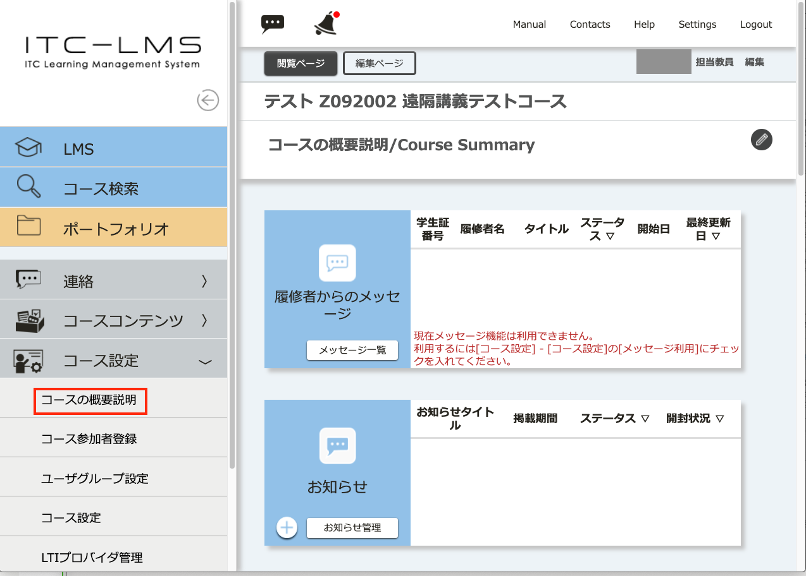
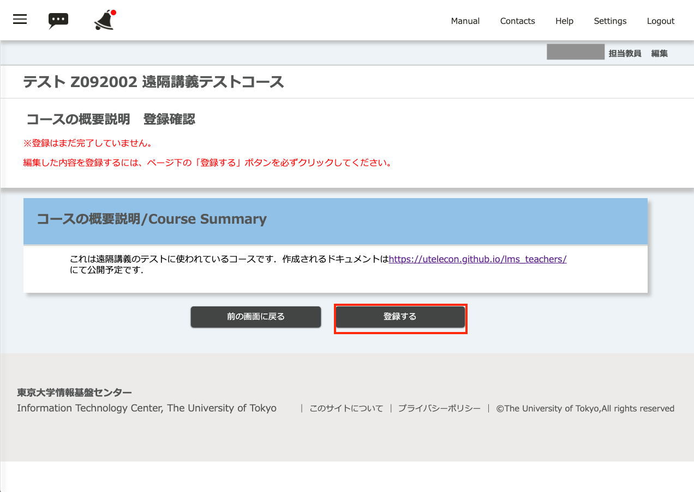
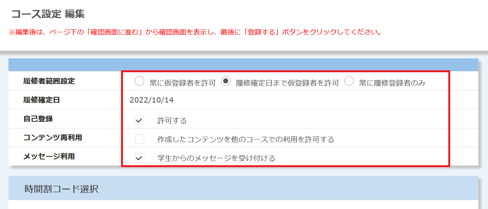
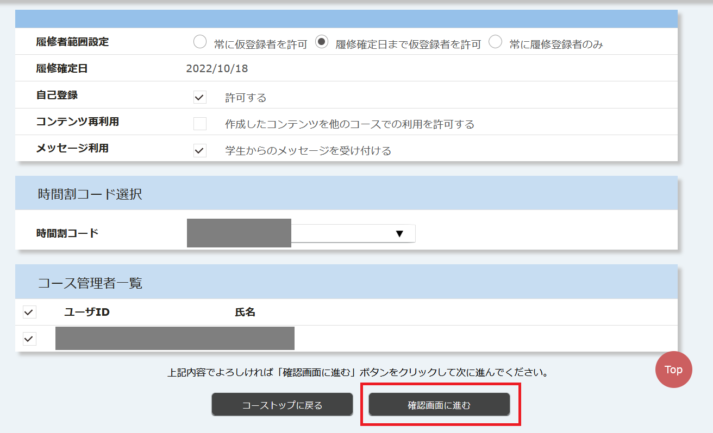
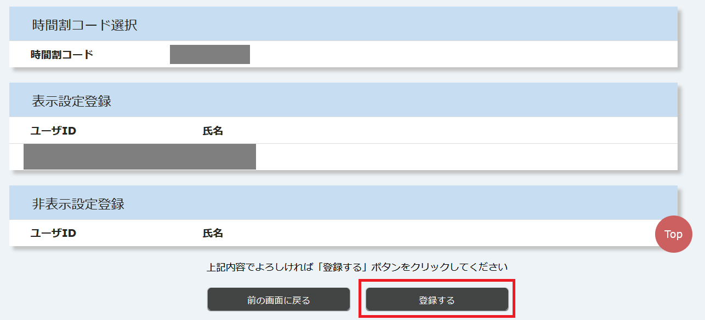
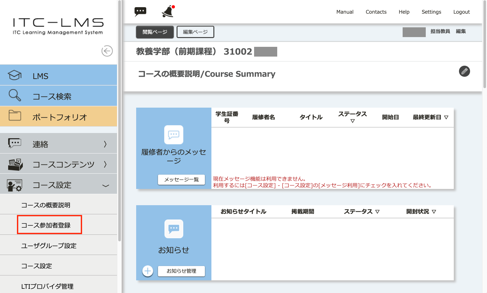
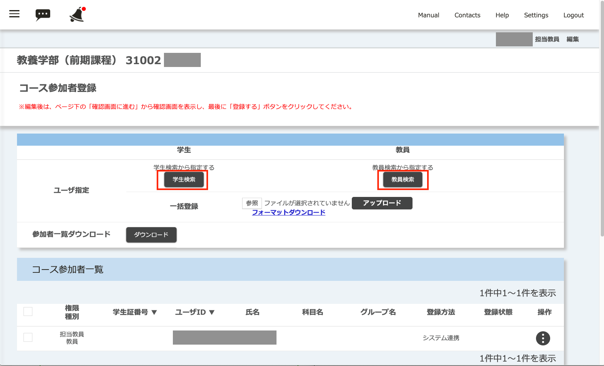
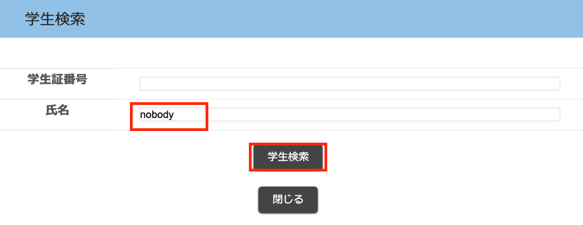
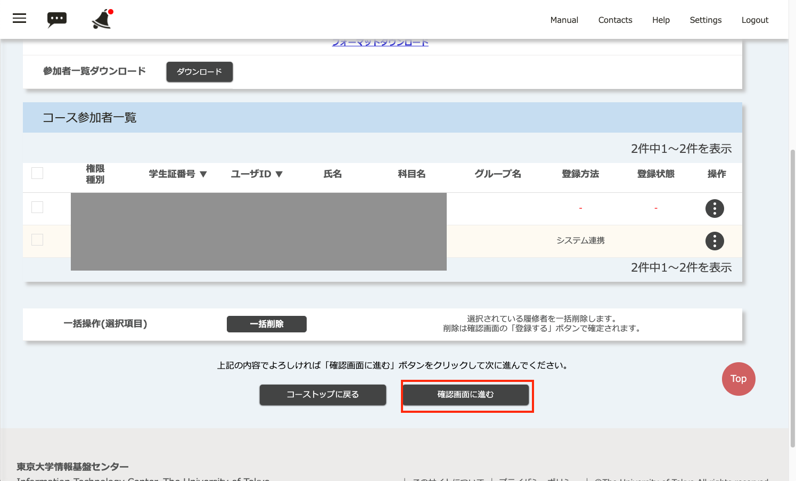
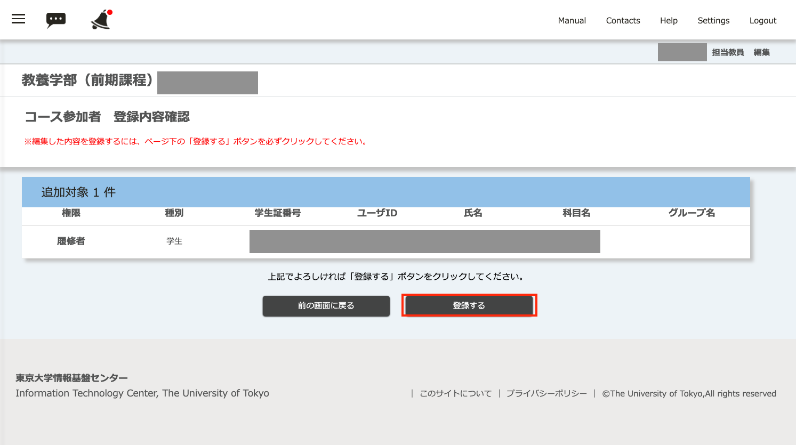

ITC-LMSではタームやセメスター単位で開講される科目のことを「コース」と呼びます．自分の担当する科目に合わせて，まずはコースの設定をします．

## コースの概要説明

学生がITC-LMS上でコース検索した時や，時間割から該当授業のコースを選択したトップ画面に表示するドキュメントを設定できます．

* 固定的に学生に伝えたいことは，ここにに書くと良いでしょう．
* テレビ会議システムを使う時の URL をここに書く学生が見つけやすいのですが，学生はコース検索の機能を使うと，コース登録しなくてもこの説明は見ることができます．コース受講者以外に見せたくない場合は，登録後に見られるようになる「教材」に書いた方が良いでしょう．

1. コースの画面で左上の三本線のアイコンを選択してメニューを出します．

2. 「コース設定」を展開して，「コースの概要説明」を選択します．

3. 「内容」に説明を書き込んで「確認画面に進む」を選択してください．テキストのみではなく，書体の変更や，箇条書き，リンクなどが指定できます．

4. 書き込んだ説明が，どのように表示されるかを確認の上で，「登録する」を選択してください．

## 履修登録方法の設定

UTASで科目に本登録した学生は該当するコースに自動的に登録されますが，必修の科目以外はUTAS上での本登録は開講後しばらくしてからになります．そのため，はじめの数回の授業で使えるようにするためには，そのように設定する必要があります．

1. コースの画面で左上の三本線のアイコンを選択してメニューを出します．

2. 「コース設定」を展開して，「コース設定」を選択します．

3. 下の画面は典型的な設定になります．主な項目の説明をします．
  * 履修者範囲設定は「履修登録者+仮登録者」としています．UTAS上で「お気に入り」に該当科目をした学生が「仮登録者」として，このコースに参加できます．「履修登録者のみ」とするとUTAS上で本登録をしていない学生はこのコースに参加できません．
  * 自己登録を「許可する」としています．UTAS上で登録しなくても，学生はコース検索でこのコースを見つけて自己登録すると「仮登録者」になり，コースに参加できます．第1回の授業の当日にUTASに「お気に入り」登録をした学生を受講させるには，「許可する」としておくと，学生本人が登録可能になります．

  * 「履修確定以降」を「「履修者範囲設定」を自動的に「履修者登録者のみ」に変更する」とすると，UTAS上で履修が確定した時点で，「履修者範囲設定」が自動的に「履修登録者のみ」になります．なお，あとから，「履修登録者+仮登録者」に戻すことはできます．
4. 「確認画面に進む」を選択します．

5. 「登録する」を選択します．

<!-- 
コース設定 -> コース設定で編集する
「履修者範囲設定」，「自己登録」，「履修確定以降」，「メッセージ利用」についてお勧め設定と，変更するとどうなるかの説明をする
-->

## 教員による参加者登録
UTASに登録されていないが，科目を共同で担当している教員，TAは担当教員によるコース参加者登録が必要になります．また，UTASに科目を登録していない時点で，担当教員が学生をコースに参加させることができます．

1. コースの画面で左上の三本線のアイコンを選択してメニューを出します．

2. 「コース設定」を展開して，「コース参加者登録」を選択します．

3. 「コース参加者登録」の画面で「学生検索」か「教員検索」を選択します．

4. 「学生検索」を選ぶと「学生証番号」か「氏名」で検索できます．氏名を入力して検索してみます．

5. 該当する学生が表示されるので，該当する学生 (同姓同名に注意) のチェックボックスを選択し，「権限指定」を「担当教員」，「TA」，「履修者」の中から選び「指定」を選択します

6. 該当する学生が表示されるので，該当する学生 (同姓同名に注意) のチェックボックスを選択し，「権限指定」を「担当教員」，「TA」，「履修者」の中から選び「指定」を選択します

7. 「確認画面に進む」を選択します

8. 「登録する」を選択します

* 教員の検索のときは「学生証番号」の代わりに「共通ID」で検索できます．
* Excelのファイルを使っての一括登録の機能もあります．
* 教員の検索をして，同じ氏名で，数字10桁以外の「ユーザID」が表示されることがあります．これは旧ITC-LMSのコンテンツを参照するために残っているもので，ログインできないので，その教員にコース参加して欲しい場合は，数字10桁のユーザIDの方を登録してください．
* 学生や教員の検索機能は，本当に必要な時以外は使わないようにしてください．

<!-- 
コース参加者登録で何ができるか．TAや他の担当教員の登録．
自己登録を許さない場合での手動登録などの説明
-->

## 参考情報
* <a href="https://www.ecc.u-tokyo.ac.jp/itc-lms/faq.html">FAQ: よくある質問 (ITC-LMS)</a>
  * <a href="https://www.ecc.u-tokyo.ac.jp/announcement/2015/08/11_2065.html">ITC-LMS の「履修者範囲設定」とは何ですか？（教員）</a>
  * <a href="https://www.ecc.u-tokyo.ac.jp/announcement/2014/04/16_1870.html">ITC-LMS の自己登録を不許可としたい (教員)</a>
  * <a href="https://www.ecc.u-tokyo.ac.jp/announcement/2015/03/10_2012.html">ITC-LMS のコースに教員・学生を追加したい（教員）</a>
  * <a href="https://www.ecc.u-tokyo.ac.jp/announcement/2015/08/11_2066.html">ITC-LMSの「仮登録」とは何ですか？</a>
  * <a href="https://www.ecc.u-tokyo.ac.jp/announcement/2014/04/16_1863.html">ITC-LMS と学務システム（UTAS）の履修者自動登録について</a>
