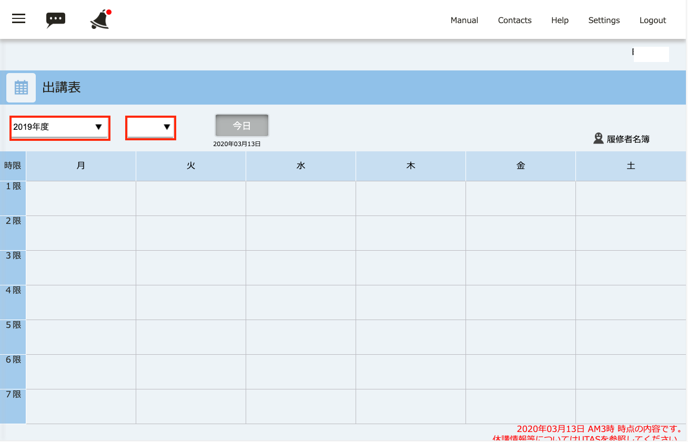
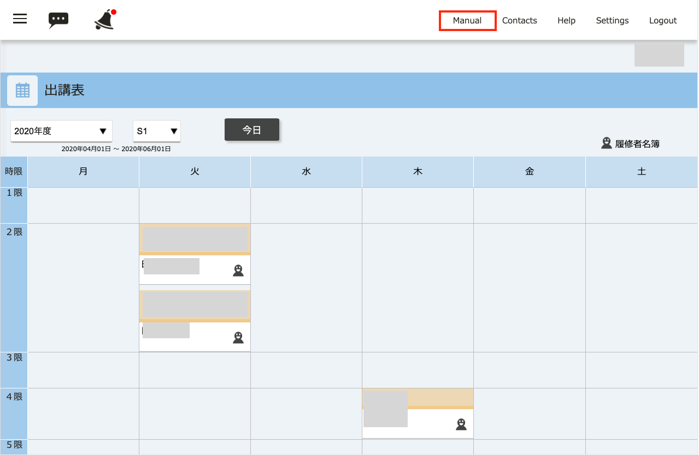

ログインすると，以下のような出講表が表示されます．

これは，2020年3月にアクセスしたものですが，アクセス時点での出講表が表示され，春休み中のため該当講義がありません．図中の赤い四角のプルダウンメニューで「年度」で「2020年度」，「開講区分」で「S1」を選択すると，2020年度Sセメスターに開講予定の講義を確認できます．「開講区分」はターム単位で指定しますが，Sセメスターの講義の場合は「S1」か「S2」のどちらかを指定しても同じものが表示されます．

「年度」と「開講区分」を選択すると上の画面のようにUTASに登録されている講義が表示されます．火曜2限の講義と，木曜4限の講義が表示されます．それぞれクリックすると，該当する講義 (LMSのマニュアル等では「コース」という名前で呼ばれます)にコンテンツを登録したり，設定をおこなうことができます．

## 同じ時限に自分の講義が複数ある時
火曜日2限には，同じ枠内に2つのコースが見えます．複数の組織で別の名前で開講される講義などでは，このようなことがあります．「コースグループ登録」機能により同一のコースグループに登録すると，一つのコースのように扱うことができます(コースグループ登録後も同じ枠内に2つのコースが見えるのは変わりません)．

「コースグループ登録」の方法に関しては，画面の赤い四角の「Manual」リンクで表示されるページから「ITC-LMS_教員向けマニュアル」というPDFファイルをダウンロードして，「11.1 コースグループ登録」を参照してください．

*  コースグループの登録は，使い始める前(コンテンツが存在しない時)におこなってください．使い始めた場合は，「全コンテンツ削除」機能でコンテンツを削除する必要があります．
* マニュアルには，「複数看板科目については自動的にグルーピングされているため、以下の操作は不要です。」とありますが，UTAS上の設定の関係で自動的にグルーピングされないことはしばしばあります．
* コースグループ登録後も

## 出講表の該当時限に自分の講義がないとき
出講表に表示されない場合の原因と対応方法を以下にまとめます．

* 講義開始よりもかなり前なので，まだシステムに登録されていない．
  * これが原因の場合は，UTAS上でも講義が登録されていないので，そちらで確認できます．
* 複数人で担当する講義だが，UTAS上では自分が担当として登録されていない．
  * 担当者になっている先生に，ITC-LMSで自分のアカウントを「担当教員」の権限でユーザ登録してもらうと，出講表に表示されるようになります．担当者の先生は，登録するユーザを氏名で検索して指定することもできますが，同姓同名の人がいる場合は共通IDで検索することも可能です．
* 曜日時間が決まっている講義だが，UTAS上では時限が登録されていない．
  * 出講表の下の方にある「集中コース等」にコースが含まれてないかどうか確認してください．

## 参考情報
* <a href="https://www.ecc.u-tokyo.ac.jp/itc-lms/faq.html">FAQ: よくある質問 (ITC-LMS)</a>
  * <a href="https://www.ecc.u-tokyo.ac.jp/announcement/2014/03/12_1822.html">ITC-LMSを利用するにはどうしたら良いですか？（教員）</a>
  * <a href="https://www.ecc.u-tokyo.ac.jp/announcement/2014/09/03_1946.html">ITC-LMS で前学期の時間割を表示したい (学生・教員)</a>
  * <a href="https://www.ecc.u-tokyo.ac.jp/announcement/2014/08/22_1942.html">ITC-LMS のコース登録時期について</a>
  * <a href="https://www.ecc.u-tokyo.ac.jp/announcement/2015/03/30_2026.html">ITC-LMS のコース登録について (学務システムとの自動連携機能)</a>
