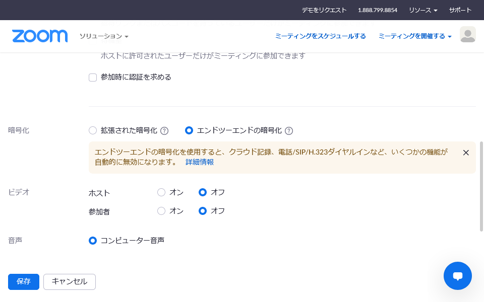
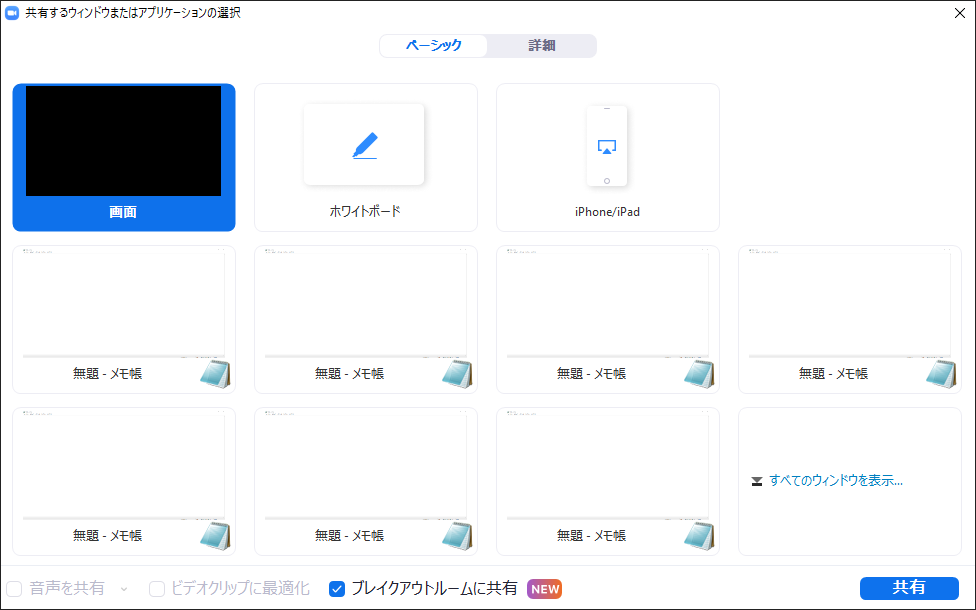

2021年11月

情報システム本部

東京大学のZoom利用者のみなさま

このたび，Zoom社から，Zoomアプリのアップデートポリシーを変更する旨の発表がありました．また，東京大学では，2021年9月以降，Zoom社の提供するZoomの機能拡張の一部を有効化しました．これらについて，最近の主なZoomの新機能等とあわせ，お知らせいたします．

## Zoomアプリの定期的なアップデートが必須になります

Zoom社から，Zoomアプリのアップデートポリシーを変更する旨の発表がありました（[Zoomヘルプセンター「9か月のリリース期間」](https://support.zoom.us/hc/ja/articles/360059429231-9-%E3%81%8B%E6%9C%88%E3%81%AE%E3%83%AA%E3%83%AA%E3%83%BC%E3%82%B9%E6%9C%9F%E9%96%93)）．当初は2021年11月に変更が行われるとされていましたが，延期されており，近日中に行われるということです．

具体的には，9か月以上前にリリースされたバージョンのアプリをアップデートしないまま利用していると，強制的にアップデートするよう求められることになります．Zoomアプリを常に最新バージョンにアップデートしていれば，今回の変更によって影響を受けることはありません．

Zoom社は従来より最新バージョンのアプリを利用するように推奨しています．セキュリティの観点からも，Zoom利用者のみなさまにおかれましては，Zoomアプリは最新バージョンにアップデートして利用するようお願いいたします．

## E2E（エンドツーエンド）暗号化を新たに利用できるようになりました

東京大学では，Zoomの[E2E（エンドツーエンド）暗号化機能](https://support.zoom.us/hc/ja/articles/360048660871-%E3%83%9F%E3%83%BC%E3%83%86%E3%82%A3%E3%83%B3%E3%82%B0%E3%81%A7%E3%81%AE%E3%82%A8%E3%83%B3%E3%83%89%E3%83%84%E3%83%BC%E3%82%A8%E3%83%B3%E3%83%89%E6%9A%97%E5%8F%B7%E5%8C%96-E2EE-)について，2021年9月に有効化を行いました．利用者が設定を行うことにより，通常の暗号化から切り替えて使うことができます．

Zoomの通常の会議室でも参加者とZoom社との間の通信は暗号化されていますが，Zoom社のサーバ内では原理上は通信の内容が分かる方式になっています．これに対しE2E暗号化では，参加者同士の間でのみ復号する（暗号を解く）ことができる方式で暗号化するため，通信がZoom社のサーバを経由する際にも暗号化されたままとなります．機密性の高い会議などを行う場合の選択肢としてご利用ください．

なお，E2E暗号化をオンにすると，性質上，一部の機能（クラウド録画やブレイクアウトルームなど）が利用できなくなることにご注意ください．このため，高度な機密性を保つ必要がない場合（一般的な授業など）は，通常はE2E暗号化はオフのままでよいと思われます．

E2E暗号化を利用したい場合は，まず，Zoomの「[設定](https://u-tokyo-ac-jp.zoom.us/profile/setting)」画面にて，「エンドツーエンドの暗号化の使用を許可する」をオンにしてください．この設定をオンにすると，ミーティングを作成（スケジュール）する際の設定に「暗号化」という項目が表示されるようになり，「エンドツーエンドの暗号化」と通常の「拡張化された暗号化」の2種類の暗号化をミーティングごとに選択できるようになります．
{:.medium}
{:.medium}

## デスクトップアプリで複数のミーティングに同時参加できるようになりました

東京大学では，2021年9月に，Zoom社の提供するデスクトップアプリの追加機能を有効化しました．WindowsとMacのデスクトップアプリで，東京大学のZoomアカウントにサインインしている場合，同時に異なる複数のミーティングに参加することができるようになっています（[Zoomヘルプセンター「デスクトップ上で同時に別のミーティングに参加する」](https://support.zoom.us/hc/ja/articles/360001120743-%E3%83%87%E3%82%B9%E3%82%AF%E3%83%88%E3%83%83%E3%83%97%E4%B8%8A%E3%81%A7%E5%90%8C%E6%99%82%E3%81%AB%E5%88%A5%E3%81%AE%E3%83%9F%E3%83%BC%E3%83%86%E3%82%A3%E3%83%B3%E3%82%B0%E3%81%AB%E5%8F%82%E5%8A%A0%E3%81%99%E3%82%8B)もご覧ください）．

なお，職員向けに提供している「事務業務端末」では，VDIと呼ばれる種類の異なるアプリを利用しているため，この機能に対応しておりません<!--（事務業務端末については，[UTokyo Portalのページ（教職員専用）]()をご覧ください）-->．ご了承ください．

## 追加ライセンスで提供しているウェビナー機能の参加者数上限が拡大されました

東京大学では，Zoomのウェビナー機能を追加ライセンスとして申請により限定的に提供しています．ウェビナーを開催する場合の参加者数の上限は，希望に応じ500人または3000人となっていましたが，2021年10月より，上限500人のライセンスが上限1000人に変更されました．これにより，現在，ウェビナー機能の参加者数の上限は，希望に応じ1000人または3000人となっています．

なお，ウェビナー機能の提供に関する詳細は，「[Zoomの追加ライセンス](/zoom/license)」のページをご覧ください．

## ブレイクアウトルーム機能で作成できるルームの個数が拡大されました

東京大学では，2021年9月に，Zoom社の提供するブレイクアウトルームの機能拡張を導入しました．

Zoomミーティングにおけるブレイクアウトルーム機能では，通常，作成できるルームの個数は50個までとなっており，また，参加者数が多い場合はそれに応じて作成できるルームの個数が減少します．

今回の機能拡張の導入により，東京大学のZoomアカウントで作成されたミーティングでは，ブレイクアウトルーム機能で100個までのルームを作成することができるようになりました．また，参加者数が多い場合でも作成できるルームの個数が減少することはありません．

これにより，特に大規模な授業等において，ブレイクアウトルームをより一層活用することができるようになります．

## ブレイクアウトルームに対してメインルームから画面共有できるようになりました

Zoomのアップデートにより，ブレイクアウトルーム利用中における画面共有の機能が強化されました（[リリースノート（英語）](https://support.zoom.us/hc/en-us/articles/4403110722317-Release-notes-for-June-21-2021)）．ブレイクアウトルーム機能の利用中に，メインルームにいるホスト・共同ホストが画面共有をする際，各ブレイクアウトルームの中にいる参加者にも見えるように画面共有をすることができるようになっています．

この機能を利用するには，画面共有を行う際のダイアログで，下部にある「ブレイクアウトルームに共有」のチェックボックスをオンにしてから「共有」ボタンを押してください．
{:.medium}

この機能により，授業におけるグループワークなどで，ブレイクアウトルームをより一層活用することができるようになります．
