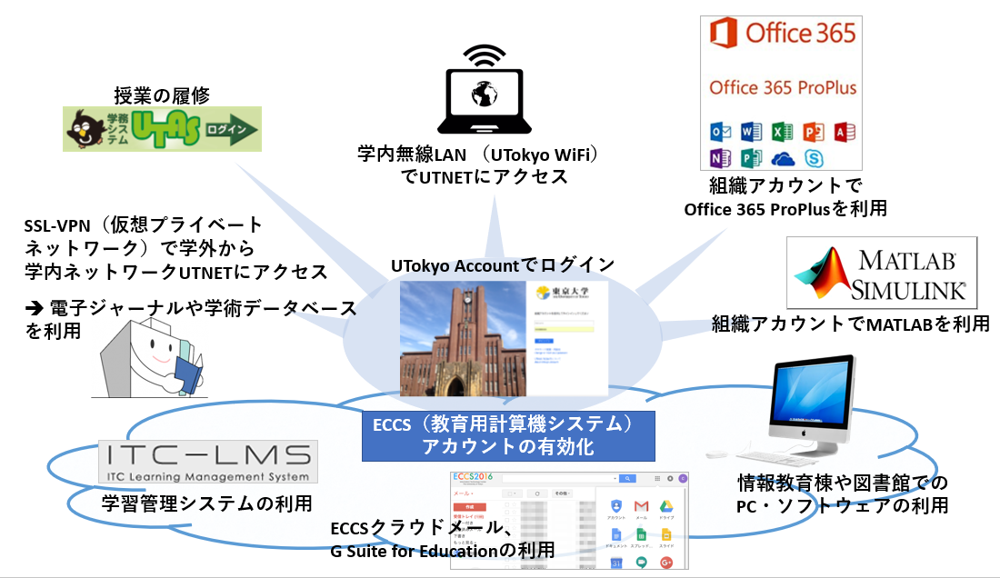

はじめに
---------------------------

新型コロナウィルスCOVID-19感染拡大を防止するため, 東京大学は2020年度の夏学期にオンライン授業を本格導入することになりました. 

学生の皆さんは, 登校が制限され, キャンパスで学ぶ楽しさや友達と語り合う楽しさの多くを奪われた状態で新学期をスタートしなくてはならなくなりました.

オンライン授業の実施は, 新型コロナウィルスによって, たとえキャンパスに来る機会が奪われても, 勉強をする機会は奪われてなるものかという, 大学の戦いであり, 構成員全員が一丸となって取り組む共同作業です.

先生, 職員, 学生, 全員で, 学びの場所である大学を守るための努力です.

4月, 5月, 6月に世界がどういう状況にあるのか今はまったくわかりません. 先生や職員が考えていることは「今準備をせずに無策に授業をキャンセルし, このまま感染拡大が長引いたら, 一体夏学期はどうなってしまうのか, そして大学はどうなってしまうのか?」ということです.

大学の準備が万端に整っているわけではありません. 先生・職員にとっても初めての試みであり, 試行錯誤をしながら進めています. 授業を受ける学生も自分たちにできることをして, この取り組みに参画してほしいと思います.

本ポータル編集に参画する教職員一同

オンライン授業って?
---------------------------

* オンライン授業にもいろいろな形態がありますが, 基本形は教員と学生が, インターネットを介してつながった状態で, リアルタイムに音声や動画で双方向のやりとりをする形態です**(同時双方向型)**. 授業への参加は通常, TV会議システムと呼ばれるソフト(アプリ)を使って行います. LINEなどで複数人の友達とつながって多人数会話をすることがあるとおもいますが, あれの大きなやつだと思ってください(1クラス分全員, 数十人から数百人がつながる). 具体的には下記でも説明しますし, このポータル全体がそれを説明するために作られています.
* その他の形態としては,
  * **録画配信(オンデマンド)型** : 授業を録画したビデオを視聴して, 別の手段(メールや掲示板など)で質問や議論を行う
  * **資料配信型** : ナレーション付きの講義資料(スライドなど)を視聴して, 別の手段(メールや掲示板など)で質問や議論を行う
  * **自習中心型** : 教科書による自習, 演習などを中心として, 別の手段(メールや掲示板など)で質問や議論を行う
などの形態があります.
* また, オンライン授業を導入すると言っても, 最初の1, 2回は, 限られた人数の登校を許可して必要最低限のガイダンスを行うという授業もあるかもしれません. 一部の学生は先生と同じ教室や, 大学の端末室にいるということもありえます. 形式は様々です. 自分が所属する学科や, 自分が履修する予定の講義がどのような形式で開講されるのか, をよく見ておいてください.

このページの残りの部分では, 「オンライン授業を無事受けられるようにするには, 学生は何をしておけばよいのか」を説明します. 多くの部分は在学生でも, 新入生でも共通です. 特にこの春から東大生になる人に注意しておいて欲しい情報は別に記述します.

学生の皆さんにしておいてもらいたい準備
---------------------------

オンライン授業を受けるための準備は大きく言って二つです

* ひとつは, これまでも[東京大学で使われている, 教育のためのICTシステム](#utokyo-edu-ict)を, 正しく使えるようにすることです. キャンパスで毎日顔を合わせていれば, ぼうっとしていても, 重要な情報を教室の中で友達から教えてもらったり, サークルの先輩から教えてもらったり, 他の人の会話から偶然得たりすることが出来るものですが, 登校が制限されているとそういうわけには行きません. 各自がチェックすべき情報源を正しくチェックしていることや, 自分の連絡先(メールアドレスなど)が然るべき場所に登録され, 連絡がつくようになっている, ということがとても大事になります.
* もうひとつは, [TV会議システム](#teleconf)につなげる機器を準備しTV会議に[ちゃんとつなげることを確認しておく](#check-online-ready)ことです. 普段からスマホを軽やかに使いこなしている若者には決して難しいことではないのですが, 機器にはトラブルがつきものです. 必ず「ちゃんとつなげることを確認しておく. 確認された機器で授業に臨む」のが大事です. 詳しくは, 下で述べます.

***

<a name="utokyo-edu-ict"> </a>
### 東京大学で使われている, 教育のためのICTシステム



全体像は上記の図のようになっています. 以下で作業をしてほしい要素に限って説明します. 以下の作業中, このページに書かれている通りにならないなど, 問題を見つけた場合は [utelecon-inquiries@googlegroups.com](mailto:utelecon-inquiries@googlegroups.com) まで連絡を下さい. その際, (a) 以下のどのステップで, (b) 自分が何をしたら, (c) どんな結果になったか, を含めて下さい(「できませんでした」というだけの情報だとこちらで問題がわからない場合が多いです). 

1. **UTokyo Account:** 他のサービスすべてのもととなる, 「あなたが東京大学の構成員である」ことを示すアカウントになります. 在学生であれば, これを使ったことがないという人はいないはずです. 新入生には, 2020/3/19 に閲覧可能になる合格者情報登録URLの中に, あなたのアカウント番号(10桁の数字. 共通IDという)と初期パスワードが書かれています.
  * **作業:** [初期パスワードを変更](https://utacm.adm.u-tokyo.ac.jp/webmtn/LoginServlet)してください. [手順動画](https://youtu.be/tTpAlqVhEXQ)
1. **UTAS (学務システム):** 授業の内容(シラバス)を参照して受ける授業を選び, 履修の登録をしたり, 成績を見たりするのに使うシステムです. オンライン授業に関する情報も, このシステムを経由して得ることになるでしょう. 使うためにはUTokyo Accountが正しく設定されている必要があります.
 * **作業:** (<font color="red">3/20 新入生へ: UTASのアカウントの作成がまだできておりませんでしたm(_ _)m. まだログインできるはずがないので少々お待ち下さいm(_ _)m. これができなくてもその先の作業は可能です</font>) [UTASにログイン](https://utas.adm.u-tokyo.ac.jp/campusweb/campusportal.do?page=main)し, 「現住所等変更入力」から, あなたに確実に届くメールアドレスを「E-MAIL 1」に登録して下さい (**手順動画作成中**). 在学生でやった覚えのない人も, ある人も, この機会に確認して下さい.
1. **ITC-LMS (学習管理システム):** 自分が履修した講義に関して, 課題が掲示されたり, 課題を提出したり, などの用途に使います. また, 講義資料がここにアップされたり, ここで出欠管理をする場合もあります. UTASと似ていて紛らわしいですが, UTASは授業が始まる前(履修登録)と後(成績確認), ITC-LMSは授業期間中に使うと, 大雑把には思っていてください. 使うためにはUTokyo Accountが正しく設定されている必要があります. 授業期間が始まった後, 授業に関するお知らせがITC-LMSを経由して流れてくることが多くなります.
 * **作業:** ITC-LMS [学生向けページ](../lms_students/)の指示に従い, お知らせの通知先を設定して下さい. [手順動画](https://youtu.be/xAur5zar5Sc)
1. **ECCSオンライン新規利用者講習:** <strike>下記二つのシステムを使うに先立ってパスしなくてはいけない講習です</strike>(<font color="blue">3/20 これができなくても以下の作業を可能にしました. 講習は受けておくことは有用ですが, これをせずに先に進んでもOKです</font>). 15分ほどのビデオで学びます. [オンライン新規利用者講習の受講方法](https://www.ecc.u-tokyo.ac.jp/onlineseminar.html)に従って受講し, パスして下さい.
1. **Office 365 (Microsoft) と G Suite for Education (Google):** これらはレポートやプレゼンテーションの作成など, いろいろなことに使えます. 使うためにはUTokyo Accountが正しく設定されている必要があるのと, どちらも使い始める際にそれぞれのシステムの有効化を一度ずつ行う必要があります.
  * **作業:** [UTokyo Account利用者メニュー](https://utacm.adm.u-tokyo.ac.jp/webmtn/LoginServlet) から「Office 365 ProPlus利用許諾」に合意し, Office 365の有効化をして下さい ([手順動画](https://youtu.be/OYl5P67mDYI)). できたらExcelのBookを一つ作ってみて下さい([手順動画](https://youtu.be/PcHlb-t2Dr8))
  * <font color="red">3/20 注:</font> 事前に郵送されていた文書の「情報サービスの利用設定手順」で, 「1-5については授業開始日までに完了しておきましょう。また、6 (注：Office 365のこと) についはライセンス契約上<font color="red">4/1以降</font>に設定してください。」という指示がありましたがそれは<font color="red">気にせず, すぐに作業をはじめて構いません(それを推奨します). </font>
  * **作業:** [UTokyo Account利用者メニュー](https://utacm.adm.u-tokyo.ac.jp/webmtn/LoginServlet) の「ECCSクラウドメール」からアカウント名, 「ECCSクラウドメール(パスワード変更)」からパスワードを設定して, G Suite for Educationを有効化して下さい (**手順動画作成中**).
  * **作業:** 上記が終わってから実際にG Suite for Education が使える(Googleにログインできる)ようになるまで, 最大1時間ほどお待ち下さい. 待ったら, ログインしてどんなアプリが使えるかを見渡して, Google のスプレッドシート(Excelみたいなもの)を一つ作ってみて下さい([手順動画](https://youtu.be/mVMPFpTuemY))

注意してほしいのは, MicrosoftもGoogleも, すでに自分で使っているという人もいるとおもいますが, そういう人も**大学のアカウントで使えるように**しないといけないということです. オンライン講義をするに当たって, 重要な情報を, 大学のメンバーだけで共有するという場面が多くなると想定され, そういう場合, 普段使っているGoogleやMicrosoftのアカウントでログインしている状態では見られない, ということになり得るのです.

両システムの有効化の手順は上の動画でも説明していますが, それらのシステムでどんなことができるかも含め, 東京大学[初年次ゼミナールのページ](https://fye.c.u-tokyo.ac.jp/students/)にある, 『東京大学ICT活用ハンドブック（文理共通）』 ([2019年度版](pdf/01_2019_ict.pdf))で詳しく説明しています. 以下の, 最低限必要な節だけは必ず読んで指示に従ってください. もうじき2020年度版が発行されますので, 上記ページを小まめに訪れてください.

 * Step 1.3 **マイクロソフトアカウント**の有効化
 * Step 1.4 **ECCS クラウドメール**の設定

なお, 「ECCS クラウドメール」は東京大学におけるG Suite for Educationの名称です.

***

<a name="teleconf"> </a>
### TV会議システム

本題の TV会議システム です. これに関する情報は今後このページにアップします. 今後もこのページをおとずれるようにしてください. それまでは以下を見ておいて下さい.

 * [Zoom](../zoom/join)
 * [WebEx](../webex/join_meeting.markdown)

以上ができたと思ったら, ページ下部の[オンライン授業を受ける準備ができているかのチェック](#check-online-ready)に進んでください.

特に新入生の皆さんにしておいてもらいたい準備
---------------------------

* ネット環境 : 自宅から授業を受けるためには, 大量の動画を見ても大丈夫な環境が必要です. 家ではスマホをWifiにつなげているという人は大丈夫ですが, モバイル(LTEなど)でしかつなげていない人は注意してください. 「ギガ不足」になってしまうと, 動画が視聴できない, 視聴しようと思ってギガを購入するとお金がかかる, ということにならないよう, 容量無制限のネット環境を引くことをおすすめします
* PCまたはMac : スマホで動画を視聴することは可能ですから, スマホだけでオンライン授業を視聴することは可能です. しかし, 大学での学習のためにはレポートの作成などでPC (WindowsやLinux), Macなどの環境が望ましいです. また, オンライン授業中の活動の中には, 動画を視聴しながらちょっとした作業や演習をする機会が増えます. 大きな画面の中に動画と他の作業用の窓を同居できるように, PCやMacの環境を用意しましょう.

注意: この時期(3月)はインターネットの申込みが増えるシーズンで, 申し込みをしてから開通までに時間がかかります. 数週間が普通と言われているので, 早めに申込みをしてください.

***

<a name="check-online-ready"> </a>
### オンライン授業を受ける準備ができているかのチェック

 <a name="check-excel"> </a>
 * この, <a href="https://univtokyo-my.sharepoint.com/:x:/g/personal/2615215597_utac_u-tokyo_ac_jp/EZN59-QgxfpHg7NX8Vc89wsBVE5wxTBpno2Z05UCwbkLUA?e=FaRkgq" target="_blank">Microsoft Excel のシート</a> が見られるかどうか, リンクをクリックして確かめてみてください. <font color="red">3/22更新: もし東京大学「サインイン」と書かれた窓が出てきて, "メール, 電話番号, Skype"などと聞かれたら,</font>
```
UTokyo Accountのアカウント番号@utac.u-tokyo.ac.jp
```
と記入して先へ進んで下さい. UTokyo Accountのアカウント番号は10桁の数字です. なお詳細はわかりませんがこの窓が出てこないこともあります. 次にUTokyo Accountのアカウント名とパスワードを入力する画面が出てきたら, 自分で設定したUTokyo Accountのアカウント名とパスワードを入力して下さい. それで無事見られれば, UTokyo Accountの設定ができています (<a href="https://youtu.be/iJbq6unDIOA" target="_blank">手順動画</a>). 
 <a name="check-google-spreadsheet"> </a>
 * この, <a href="https://docs.google.com/spreadsheets/d/1jf1O-lbDwIsz9QJdPWWhZTh-Nn4Z_ge3BXGIua2fyCs/edit?usp=sharing" target="_blank">Google スプレッドシート</a>が見られるかどうか, リンクをクリックして確かめてみてください. このときもし,
   * **パターン1:** 今回作った大学のアカウント(xxxx@g.ecc.u-tokyo.ac.jp)でGoogleにログインしている場合は直ちにアクセスできます
    <a name="check-google-spreadsheet-pattern-2"> </a>
   * **パターン2:** Googleに別のアカウント(例えば自分が普段使っているyyyy@gmail.com)でログインしている場合は「権限が必要です」という窓が出てきます. 右にある, **アカウントを切り替える**を選んで, 大学のアカウントでログインして下さい. 「アクセス権限のリクエスト」**ではありません.**  すでに何人かの人が「アクセス権限のリクエスト」を送っているようですが, 気にせずもう一度上記からアクセスして, **「アカウントを切り替える」**を選び直して下さい(この場合の<a href="https://youtu.be/yLQcnfZo_24" target="_blank">手順動画</a>).
    <a name="check-google-spreadsheet-pattern-3"> </a>
   * **パターン3:** そもそもGoogleにログインしていない場合は「ユーザ認証に失敗しました」と表示された後, Googleへのログインを促す画面が出てくるので大学のアカウントでログインして下さい(この場合の<a href="https://youtu.be/Gz5kObGuXMw" target="_blank">手順動画</a>).  
   * どうであれ無事見られれば, G Suite for Education (ECCSクラウドメール)の有効化ができています. ただし, 現在中国にいる人はこのシートにはつなげません. Microsoft Excelの方だけ確認してください
 * (<font color="red">3/20 ここから先はまだ準備中です</font>) できたら, どちらかのシート(どちらでもよいです)に書かれている, Zoom, WebEx, GoogleハングアウトMeet の横にある URL をクリックして, それぞれの TV 会議システムにつないでみましょう. クリックすると, スマホでもPCでもMacでも, ブラウザの中で始まるかも知れませんし, 何かアプリを入れるように言われるかもしれません. 言われたら入れてください. 入れ方がわからなくなったら, このサイト内にある, Zoom, WebEx, GoogleハングアウトMeetのページを参照して入れて, もう一度やってみてください. ただし中国にいる人は, GoogleハングアウトMeetにはつなげません. 

なにかおかしい, 接続できない場合は
---------------------------

* <font color="blue">3/20</font> 少し頑張っても問題が解決しないとか, このページに間違いがあるのでは? と思ったら, [utelecon-inquiries@googlegroups.com](mailto:utelecon-inquiries@googlegroups.com) へメールをお送りください. その際, 新入生か, 在校生(その場合学年, 学科, 専攻など)か, (a) どのステップで, (b) 自分が何をしたら, (c) どんな結果になったか, を含めて下さい(「できませんでした」というだけの情報だとこちらで問題がわからない場合が多いです). 

* チャットなどでもヘルプを求める手段を準備しています. 少々お待ち下さい.
