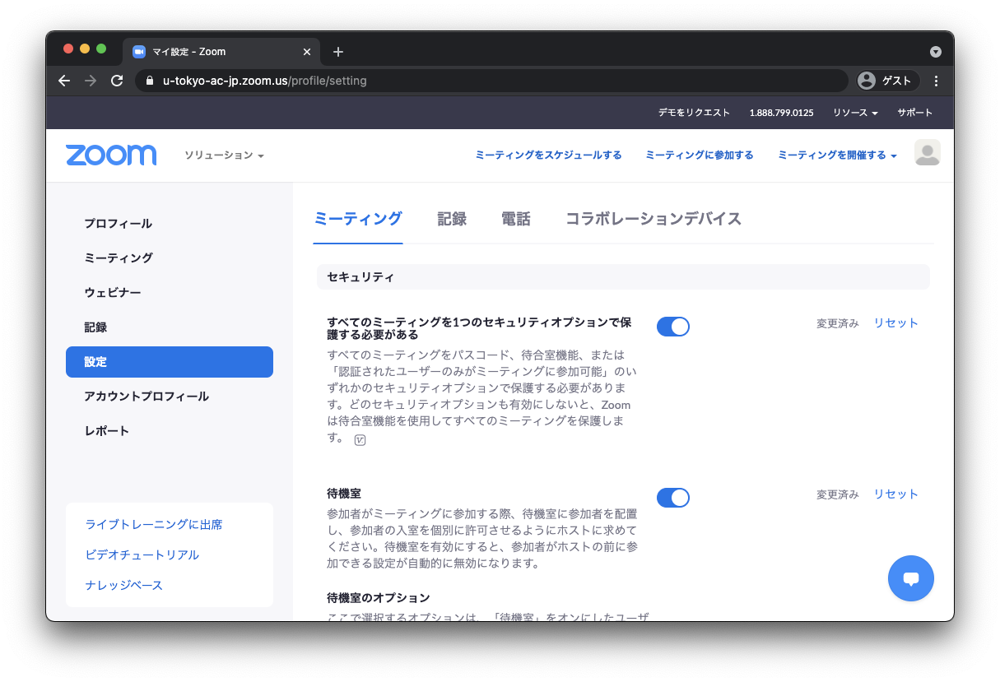
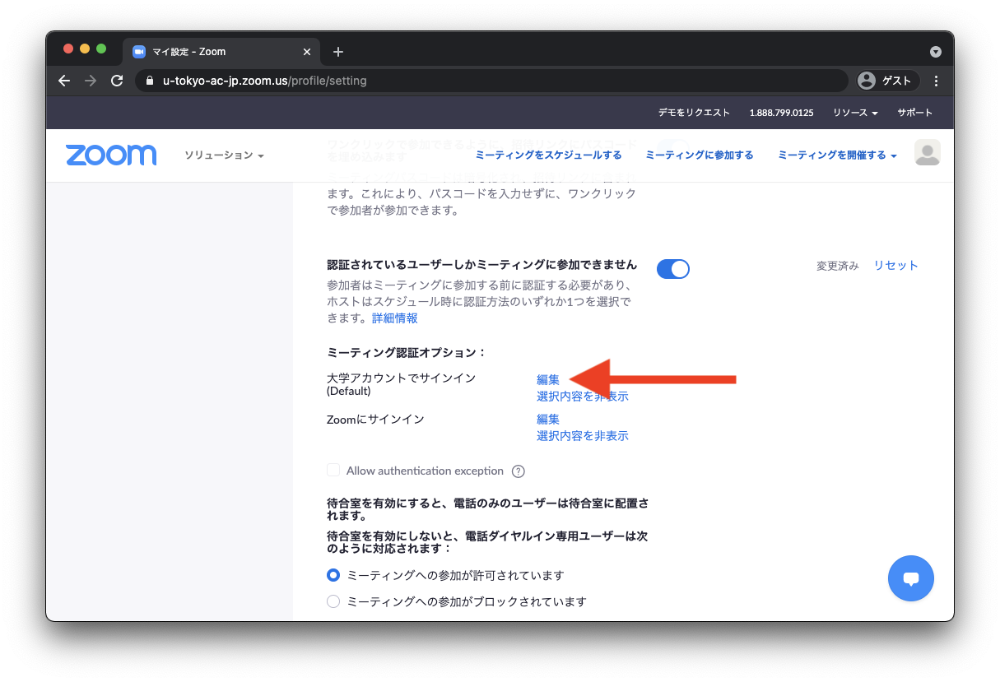

Zoomでは，ミーティングに参加できるユーザを制限することができます．特に「大学アカウントでサインイン」の設定を行うと，ミーティング参加時に東京大学のZoomアカウントでのサインインが必要になります．

ただし，大学のアカウントでのサインインに参加者が慣れていない場合（特に，授業の学期開始当初）は，設定をオフにすることを推奨します．設定に関する考え方については，「[授業におけるZoom会議室の入室制限](/faculty_members/zoom_access_control)」もご覧ください．

<a href="/change2021s/">2021年春のシステム変更</a>後，古い設定をそのまま利用していると，東京大学のアカウントに正しくサインインしているユーザが会議室に入れないことがありますので，このページの説明を読み設定内容を必ず確認してください．

## 個々のミーティングで設定する

1. Web ブラウザで[Zoomの「ミーティング」のページ](https://u-tokyo-ac-jp.zoom.us/meeting#/upcoming)へ移動します．
{:.medium}
2. ミーティングの設定画面を開きます．
    - 新しくミーティングを作成する場合は，「ミーティングをスケジューリング」を押します．
    - 以前に作成したミーティングの設定を確認・変更する場合は，一覧に表示されているミーティングにマウスを重ねると右側に「編集」ボタンが表示されるので，このボタンを押します．
    {:.medium}
3. 「セキュリティ」の中にある「参加時に認証を求める」から設定を行います．オンにした上で「大学アカウントでサインイン」を選択すると，東京大学の Zoom アカウントでサインインしないと入室できないようになります．オンにする場合は，「大学アカウントでサインイン」の下に表示されるドメインが　`*.u-tokyo.ac.jp` であることを確認してください（異なる場合は「編集」を押して `*.u-tokyo.ac.jp` に変更してください）．
{:.medium}

<strong class="box--alert">
<a href="/change2021s/">2021年春のシステム変更</a>後，東京大学のZoomアカウントは @utac.u-tokyo.ac.jp に変更されました．このため，これまでドメインの設定を <code>g.ecc.u-tokyo.ac.jp</code> としていた場合，そのままの設定では東京大学のアカウントに正しくサインインしているユーザが会議室に入れなくなります．必ず上記の通り <code>*.u-tokyo.ac.jp</code> に変更してください．
</strong>

## デフォルトの設定を変更する

新しく作成するミーティングのデフォルトの設定を変更することもできます．

1. Web ブラウザで[Zoomの設定ページ](https://u-tokyo-ac-jp.zoom.us/profile/setting)へ移動します．
{:.medium}
2. 「ミーティング認証オプション：大学アカウントでサインイン (Default)　」の編集ボタンをクリックします．
{:.medium}
3. 「以下の指定ドメインでZoomにサインインします」が<code>*.u-tokyo.ac.jp</code>となっていることを確認してください．なっていなければ<code>*.u-tokyo.ac.jp</code>を入力し保存してください．
{:.medium}
