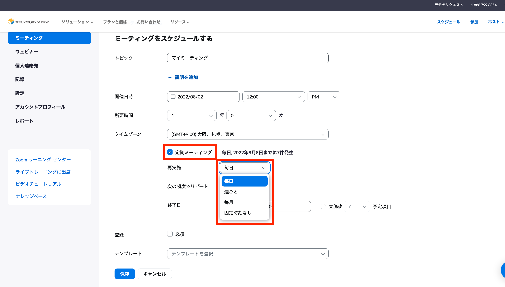
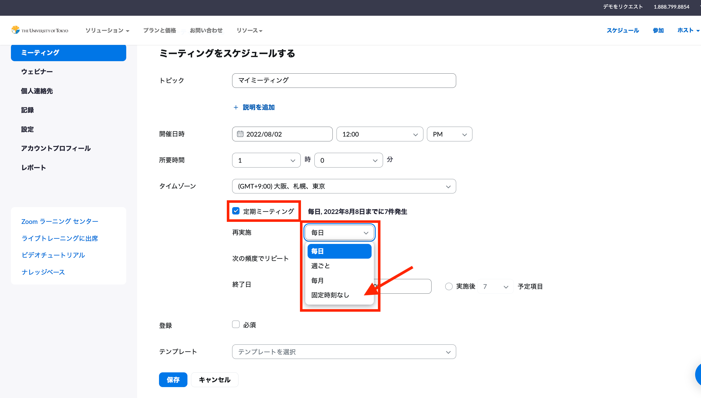

<!--
旧ページ内容
定期的なミーティングをスケジュールすることで，全13回 URL が変わらない会議室を作ることができます．  
ただ注意が必要なのは，**Web ブラウザからのみ**，定期的なミーティングを詳細に設定できます．  
まず，<a href="https://zoom.us/profile" target="_blank">Zoom のマイページ</a>にご自身のアカウントでサインインいただいた後，右上にある「ミーティングをスケジュールする」を押してください．  
その設定の中で「定期的なミーティング」という項目があり，こちらをチェックしていただくと，URL が変わらない定期的なミーティングをスケジュールすることができます．  
詳しい使い方に関しては以下をご参考にしてください．  

<iframe width="600" height="400" src="https://www.youtube.com/embed/rf_Tw0L5PLs" frameborder="0" allow="accelerometer; autoplay; encrypted-media; gyroscope; picture-in-picture" allowfullscreen></iframe>

再構成指針
tittle: Zoom 開催日時の詳細な設定
"概念：3種類
    単発
    定期（固定時刻あり）
    定期（固定時刻なし）
概念と具体的な設定画面の対応
補足：この設定の意味
    曜日振替の場合"
-->

<!--作業中．細かい言葉遣い等は後々改めます．-->

Zoom ミーティングには「インスタントミーティング」と「スケジュールされたミーティング」の2種類があります．この記事では，URLを変えずに複数回利用できる，会議室の設定方法について説明します．基本的なZoomミーティングの作成の方法については，[Zoomミーティングを作成する](/create_room)をご覧ください．

## Zoom ミーティングを開催する3つの方法
ミーティングをスケジュールする際には，一回限りのミーティングとするか，定期的なミーティングとするかを選ぶことができます．また，ミーティングの開始時間を固定するかどうかも選ぶことができます．ここでは，定期ミーティングのミーティングの特徴と設定方法を説明します．
なお，本記事中の内容は， zoom`Version: 5.10.4 ` のMac環境での執筆をしています．
- 一回限りのミーティング
- 定期ミーティング(開始時間を固定する)
- 定期ミーティング(開始時間を固定しない)

### それぞれの方法の使い分け方
- 一回限りのミーティングとして設定していたとしても，同じURlを使って複数回ミーティングを開催することができます．しかし，この場合は，ミーティング開始30日後に会議室を利用することができなくなるので，会議室を定期的に使い続けたい場合は，定期ミーティングに設定してください．
  - なお，なお，一度スケジュールしたミーティングを定期ミーティングに変更することも可能です．詳しくはをご覧ください．

<!--/misc/edit_meeting/に飛ばす-->
<!--使い分け方を先に書いておく方がよいか-->

## 一回限りのミーティングの設定方法
- ミーティングを設定する際，特に設定しない限りは一回限りのミーティングとなります．
- 「開催日時」の欄からミーティングを開催する日付・時刻を選択することで，指定した日付にスケジューリングされます．なお，そのスケジュールした日時の前にもその会議室に入ることができます．しかし，この一回限りのミーティングのURLでは，開始後30日後に失効します，そのため，定期的なミーティングを

## 定期ミーティング(固定時間あり)の設定方法
- ミーティングをスケジュールする際に，「定期的なミーティング」にチェックを入れることで開催日時を固定したミーティングを開催することができます．
- 「定期的なミーティング」にチェックを入れたのちに表示される「再実施」という項目から，ミーティングを開催する周期を「毎日・週ごと・毎月・固定時間なし(後述)」から選ぶことができます．
- ミーティングの周期を設定した後，「次の頻度でリピート」や「終了日」の項目から，2日に一回，計13回繰り返す，といったより詳細な設定もすることができます．
- 

<!--より詳細な設定についての説明に関しては，項目が多いので説明を割愛?-->

<!--
固定時間ありにするメリット
どういう時に固定時間ありにすると便利ですよ．と書きたいが，あまり便利な要素がない？
- calenderアプリと同期した際に開始時間が明示される
  - add-onを入れる時にはメリットだけど，普段使いとしてはメリットを感じにくいか．
- 招待状に固定時間が明示されるので，密に連絡を取らない場合には便利?
- アプリで出てくる．
- 固定時間の設定は表示上の意味しかないことを追記すべきか．
-->

## 定期ミーティング(固定時間なし)の設定方法
- 「定期的なミーティング」にチェックを入れた後で，ミーティングを開催する周期を「固定時間なし」と選択することで，開催時刻・周期を固定しない会議室を設定することができます．
- 開催時間を固定した場合でも，指定された時間以外に会議を行うことは可能です．しかし，時間を固定した場合，50回までしかミーティングの設定を行えず，同じ会議室を使い続けることができません．そのため，不定期のミーティングを開催する場合は，固定時間なしの設定した方が便利です．

<!--
参照にしたもの
https://support.zoom.us/hc/ja/articles/201362533 
https://support.zoom.us/hc/en-us/articles/360020187492
https://support.zoom.us/hc/ja/articles/201362503-%E3%82%B9%E3%82%B1%E3%82%B8%E3%83%A5%E3%83%BC%E3%83%AB-%E3%83%9F%E3%83%BC%E3%83%86%E3%82%A3%E3%83%B3%E3%82%B0%E3%81%AE%E6%9B%B4%E6%96%B0%E6%96%B9%E6%B3%95　
-->

<!--
- ID失効の話はしなくて良いか
  - インスタントミーティング: ミーティング終了後
  - 単発: スケジュールされた日付から30日後，
  - 定期: 最終使用日から365日後

https://utelecon.adm.u-tokyo.ac.jp/zoom/create_room/ 
との棲み分けが難しそう
-->