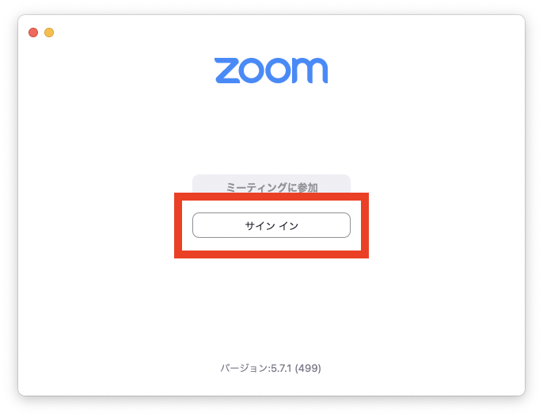

ここでは，Zoomのアプリから Zoom の会議室を作る方法を説明します．アプリから会議室を作る場合，設定できる項目が一部に限られているため，「[会議室の作り方](create_room)」のページで説明しているWebブラウザから作る方法が必要な場合もあります．また，授業などで定期的なミーティングを設定する方法は「[複数回利用できる URL が変わらない会議室を予約する](how/faculty_members/schedule)」のページをご覧ください．  

1. Zoom を起動します．
2. Zoomアプリで「サインイン」ボタンを押すなどして，Zoomのサインイン画面を開いてください．

3. サインイン画面で，「SSO」または「SSOでサインイン」と書かれた文字を探して押してください．（この画面のメールアドレス・パスワード欄にUTokyo Accountの情報を入力してもサインインできません．）

4. 「会社のドメイン」欄に `u-tokyo-ac-jp` と入力してください．（ `ac` の前後はピリオドではなくハイフンであることに注意してください．）

5. ブラウザに移動するので，UTokyo Accoutでサインインしてください．（UTokyo Accountにサインイン済みの場合は，この画面を経ずにそのままサインインが完了します．）

6. 「スケジュール」を押します．  
  

7. 以下の情報を設定してミーティングをスケジュールします．  
    
     

  以下，特に補足が必要な点に絞って説明します．  
  - **ビデオ** : ミーティング開始時にビデオを最初からオンにするかオフにするか，ホスト（開催者）と参加者別に設定可能    
  - **オーディオ** : 電話でも Zoom に繋げられてしまうため，特別な理由がない限り「コンピューターオーディオ」のみを選択することを推奨  
  - **カレンダー** : Outlook や Google カレンダーと連携可能だが，ミーティングの情報をコピー&ペーストするためにも「他のカレンダー」を選択することを推奨  
  - **詳細オプション** :   
     - **ホストより前の参加を有効にする** : オフにするとホストが入らないと他の参加者も会議室に入れない．他の参加者が早めに入って少し話しても良いのであれば ON にすることを推奨  
     - **エントリー時に参加者をミュート** : 最初は一方向的に説明したいときなどに ON にすること推奨  

8. スケジュールの情報を確認して，「Zoomミーティングに参加する」の下に記載されている**会議室の URL を抜き出して**，メールなどを用いて参加者に通知します．

   

  * 初期設定では **URL にパスワード情報が入っている**ため，パスワードを設定していたとしても別途パスワードを共有する必要はありません
  * ここで 上記 URL 以外も共有してしまうと「市内番号を検索」の右に記載されている URL にアクセスしてしまう参加者もいるため，招待情報全てではなく，**会議室の URL を抜き出して共有することをおすすめ**します  
