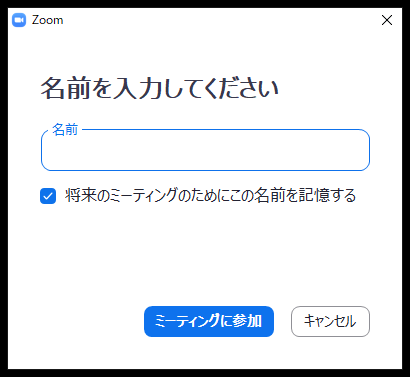

## はじめに

* ここでは Web会議ツール ZOOM の特徴や使い方について説明します
* 基本的に PC での利用について説明しますが，タブレットやスマートフォンでも ZOOM を用いることができます
* 2020年3月11日現在，2020年4月30日までは 本学のドメイン（xxxx@xxx.u-tokyo.ac.jp）のメールアドレスで作成した ZOOM の無料アカウントを用いることで時間無制限で利用できます（通常は連続利用40分の制限あり）

## 目次 TODO

## 特徴（TODO あとで）
* 会議室の URL からアクセスすることで Web 会議室に参加可能（TODO 全部同じだから共通の情報としてくくり出して良いかも，やはり最初のページに比較表がほしい）
* 同時接続可能数は無料アカウントだと100，有料アカウントにすると500か1000）
* 参加者はアカウントを作らなくても参加可能（開催者はアカウントを作り必要あり．また，開催者および参加者双方ソフトウェアをインストールする必要あり）

## 機能の説明
TODO 画面を出しながらどのような機能があるかを説明

## 利用の流れ
* 開催者・参加者共通
  * PC，タブレット，スマートフォンなど接続用デバイスを用意する
    * マイクやカメラが内蔵されていない場合はそれらも用意する
    * 一台のPCを同じ部屋の複数人で共有したり，講義室で登壇する人の姿を写したりする場合など，PCと参加者の距離が遠い場合，外付けのUSBカメラや高感度マイクを接続することを推奨します
  * ZOOM ソフトウェアやアプリを接続用デバイスへインストールする
  * 会議室へ参加する

* 開催者
  * アカウントを作成する
  * 会議室を作成して，周知する

## （開催者・参加者共通）ソフトウェアをインストールする

* <a href="https://zoom.us/download" target="_blank">ダウンロードページ</a>へ移動して，ミーティング用Zoomクライアントをダウンロードして ZOOM をインストールしてください
 

## （開催者・参加者共通）会議室へ参加する

URL（https://zoom.us/j/xxxxxxxxxx xは数字）を使って入る方法と ID（9～10桁の数字） を使って入る方法があるため，それぞれについて説明します．

### URL を使って参加する
* 会議室の URL にアクセスする
* Web ブラウザー上で Zoom Meetings を開くを押す（ZOOM がインストールされてない場合は，その画面からダウンロード可能であるため，そのままダウンロードして ZOOM をインストールする）
  * 
* 名前を設定していない場合，名前設定を促されるため名前の設定をする
  * 
* カメラがついていて，ビデオプレビューダイアログを表示する設定になっている場合，ビデオ付きで参加するかビデオなしで参加するか選択できるため，希望の方を選択する
  * 
* オーディオ（音声）の参加方法を聞かれた場合，「コンピューターでオーディオに参加」を選択する
  * 
* 以上の流れで参加できる

### ID を使って参加する
* ZOOM を起動する
* 「ミーティングに参加」を押す
  
* ①にミーティングID（9～10桁の数字）を入力，②に名前を入力して，「参加」を押す（パスワードが設定されている場合は，パスワードも知らせてもらってパスワードを入力する）
  
* カメラがついていて，ビデオプレビューダイアログを表示する設定になっている場合，ビデオ付きで参加するかビデオなしで参加するか選択できるため，希望の方を選択する
  
* オーディオ（音声）の参加方法を聞かれた場合，「コンピューターでオーディオに参加」を選択する
  
* 以上の流れで参加できる

## （開催者）アカウントを作成する
* <a href="https://zoom.us/signup" target="_blank">サインアップのページ</a>へ移動する
* 「メールアドレス」に東京大学ドメインのメールアドレス（xxxx@xxx.u-tokyo.ac.jp）を入力して，サインアップを押す
  
* 以下の画面が出てきたら，入力したメールアドレスへのメールを確認する
  
* メール内の「アクティブなアカウント」を押すと，Webブラウザで新たなページが開く
  
* ページ内で，アカウント作成者の「名」「姓」，設定するパスワードを「パスワード」「パスワードを確認する」に入力する
  
* 次に進むと，以下の画面のように他の人を招待する画面が出てきますが，スキップしていただいても問題ありません
  
* 次に進むと，以下の画面のようにテストミーティングを開始することもできますが，しなくても問題ありません
  

## （開催者）会議室を作成して周知する
* ZOOM を起動する
* 「サインイン」を押す
  
* 作成したアカウントの「メールアドレス」「パスワード」を入力して「サインイン」を押す
  
* 「スケジュール」を押す
  
* 以下の情報を設定してミーティングをスケジュールする．以下，特に補足が必要な点に絞って説明する
  * ビデオ: ミーティング開始時にビデオを最初からオンにするかオフにするか，ホスト（開催者）と参加者別に設定可能
  * オーディオ: 電話でも ZOOM に繋げられてしまうため，特別な理由がない限り「コンピューターオーディオ」のみを選択することを推奨
  * カレンダー: Outlook や Google カレンダーと連携可能だが，ミーティングの情報をコピー&ペーストするためにも「他のカレンダー」を選択することを推奨
  * 詳細オプション ホストより前の参加を有効にする: オフにするとホストが入らないと他の参加者も会議室に入れない．他の参加者が早めに入って少し話しても良いのであればオンにすることを推奨
  * 詳細オプション エントリー時に参加者をミュート: 最初は一方向的に説明したいときなどにオンにすること推奨
  

* スケジュールの情報を確認して，「Zoomミーティングに参加する」の下に記載されている会議室の URL をメールなどを用いて参加者に通知する
  * 【！重要！】パスワードを設定していたとしても，（設定を変更していなければ）URL にパスワードの情報が含まれているため，別途パスワードを共有する必要はありません
  * 【！重要！】ここで 上記 URL 以外も共有してしまうと「市内番号を検索」の右に記載されている URL にアクセスしてしまう参加者もいるため，招待情報全てではなく，会議室の URL を抜き出して共有することをおすすめします
  

## 授業で使える機能

