## はじめに
このページでは，Zoomミーティング中の画面表示を変更する方法について，画面共有がない場合，画面共有がある場合に分けて説明します．また，最後にホスト側が設定できる応用的な使い方についても紹介します．

## 画面共有なしの場合
ここでは，画面共有が行われていない場合の画面表示の設定方法について説明します．

### 発言者を大きく表示する（スピーカービュー）
画面共有が行われていない場合，デフォルトでは発言中の参加者を大きく表示するスピーカービューという表示になっています．スピーカービューでは，発言者が変わると大きく表示される参加者が自動的に切り替わります．

#### 特定の参加者を大きく表示する（ピン留め）
スピーカービューの状態で，特定の参加者を大きく表示させ，切り替わらないようにするピン留めという機能があります．以下が設定手順です．

1. ピン留めしたい参加者のビデオにカーソルを合わせて，右上の「...」を押してください．
2. メニューで「ピン」を押してください．
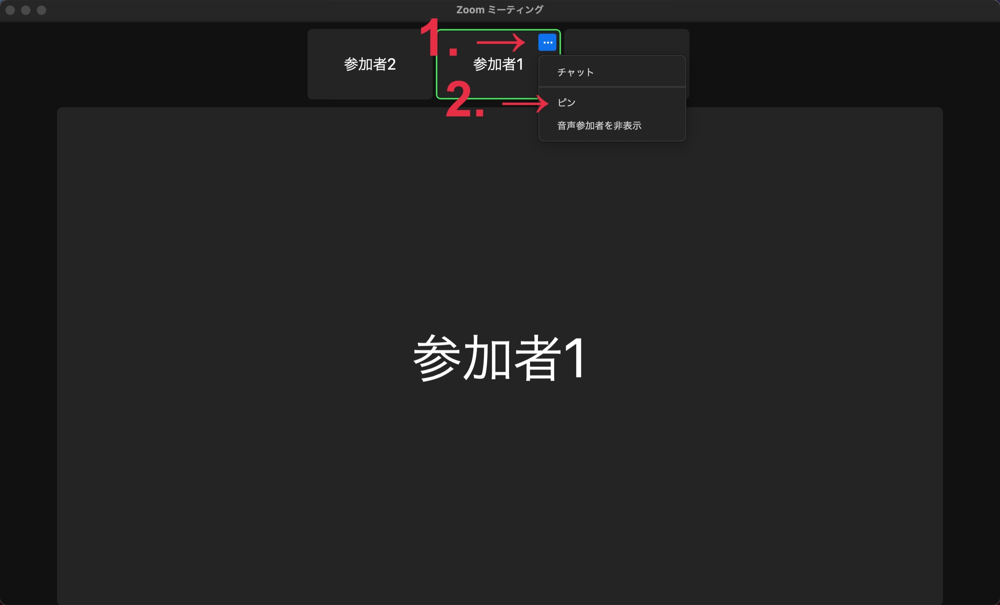

ピン留めを削除したい場合には，画面左上の「ピンを削除」を押すことで削除することができます．
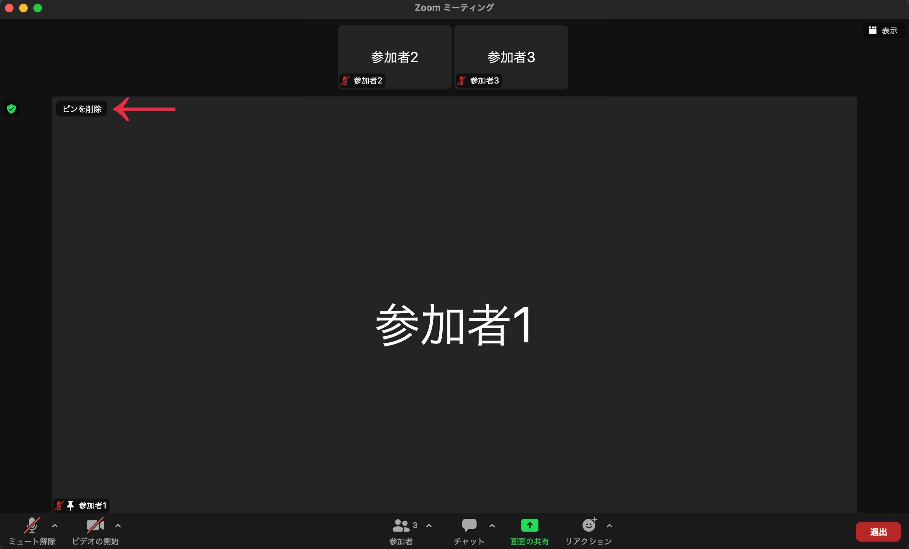

### 複数の参加者を表示する（ギャラリービュー）
複数の参加者のビデオを1画面に表示したい場合には，ギャラリービューという機能を使用することができます．ギャラリービューとは，1画面に最大25人（または49人）までグリッド状に表示する機能です．最大数までは画面の大きさが自動で調整され，最大数を超えるとページが追加されます．発言中の参加者は表示しているページに，自動的に移動されます．

#### 手順
スピーカービューとギャラリービューの切り替えは，画面右上の「表示」を押した後，表示されるウィンドウで「ギャラリー」または「スピーカー」を押すことで切り替えることができます．
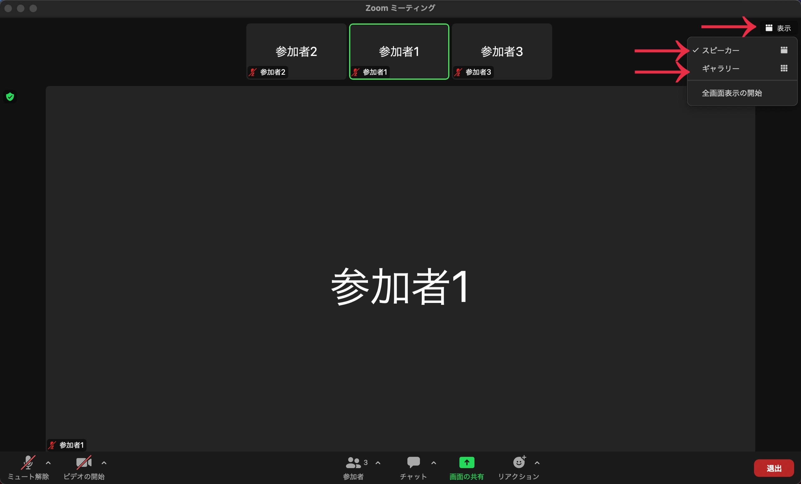

#### 最大人数の設定
ギャラリービューでは，1画面に表示する最大人数を25人と49人で設定することができます．以下が設定手順です．

※CPUの性能によって，49人に設定できない場合があります．詳しいCPU要件は「[バーチャルミーティング中にビデオレイアウトを調節する](https://support.zoom.us/hc/ja/articles/201362323)」をご確認ください．

1. 画面右上の歯車マーク（設定）を押してください．
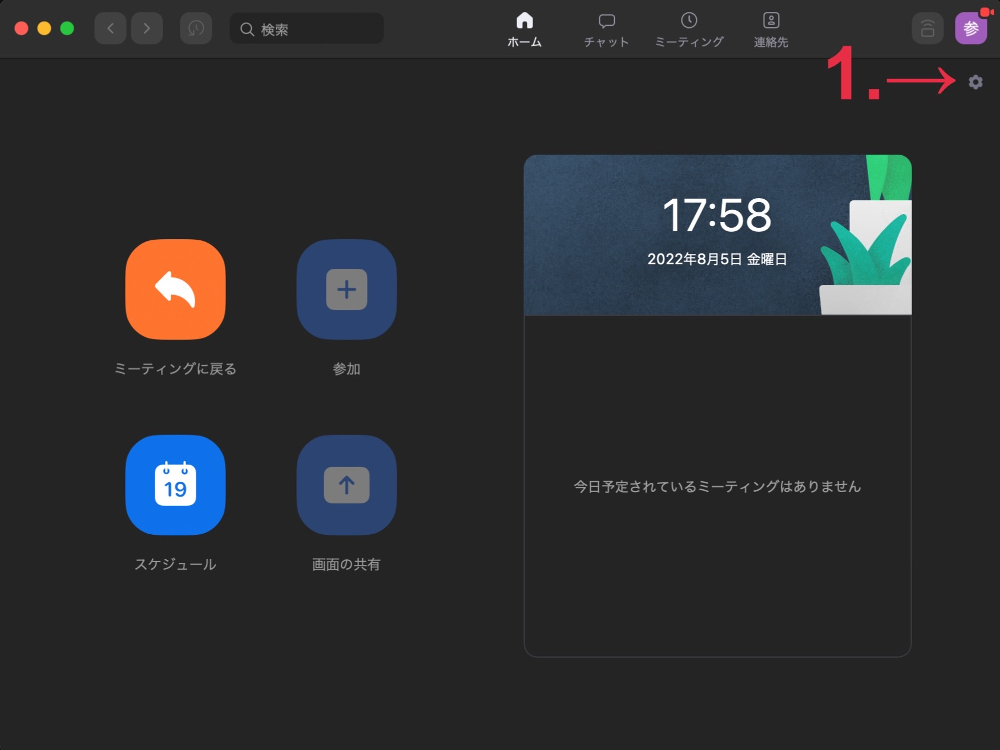
2. 設定ウィンドウの左側から「ビデオ」を押してください．

3. 「ギャラリービューで画面当たりに表示する最大の参加者数」で最大人数を選択してください．

#### ビデオの順番をカスタマイズする
ギャラリービューでは，参加者のビデオの配置を自分好みにカスタマイズすることも可能です．配置を移動させたい場合には，移動させたい参加者のビデオをドラッグして，移動先でドロップしてください．
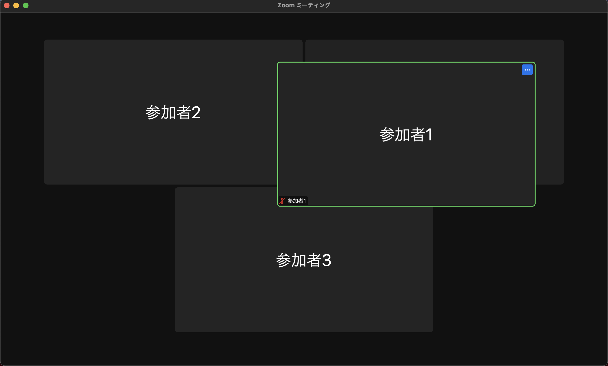
配置のカスタマイズを終了し，自動的に移動する設定に戻したい場合には，右上の「表示」を押して，「ビデオの順番をリセット」を押してください．
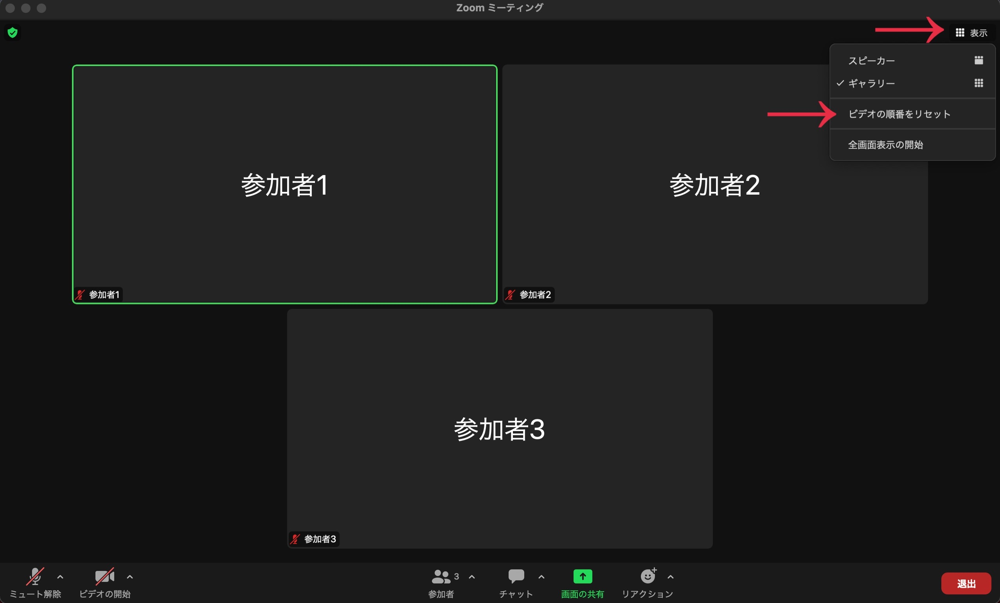

## 画面共有ありの場合
ここでは，画面共有が行われている場合の画面表示の設定方法について説明します．

### 共有画面と参加者のビデオを左右に並べて表示する（左右表示）
画面共有が行われている場合には，デフォルトでは共有画面が全画面表示されます．また，全画面表示を解除すると，共有画面が大きく表示され，参加者のビデオは上に小さく表示されます．しかし，場合によっては共有画面よりも参加者のビデオを大きく表示したい場合があります．その場合，左右表示という機能を使用すると便利です．
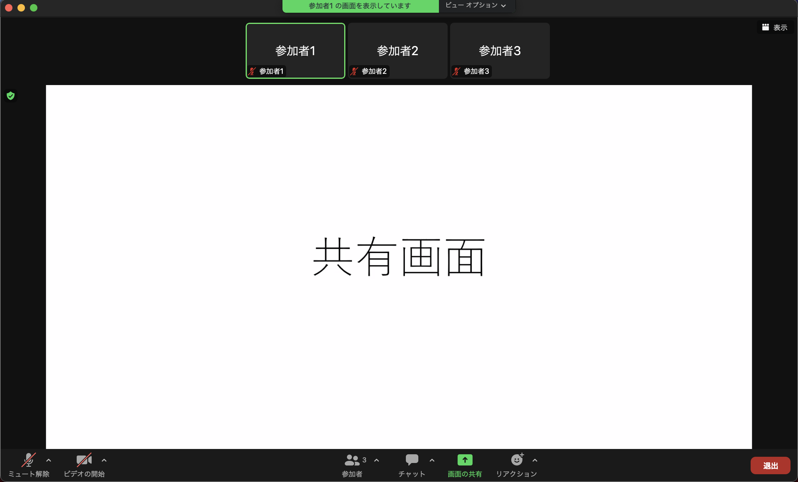
左右表示とは，画面共有が行われている場合に，左側に共有画面，右側に参加者のビデオを並べて表示する機能です．さらに参加者のビデオは，スピーカービューとギャラリービューを切り替えることが可能です．

#### 手順
左右表示を開始する場合には，以下の手順で設定して下さい．

1. 画面上部の「ビューオプション」を押してください．
2. 「左右表示モード」を押してください．
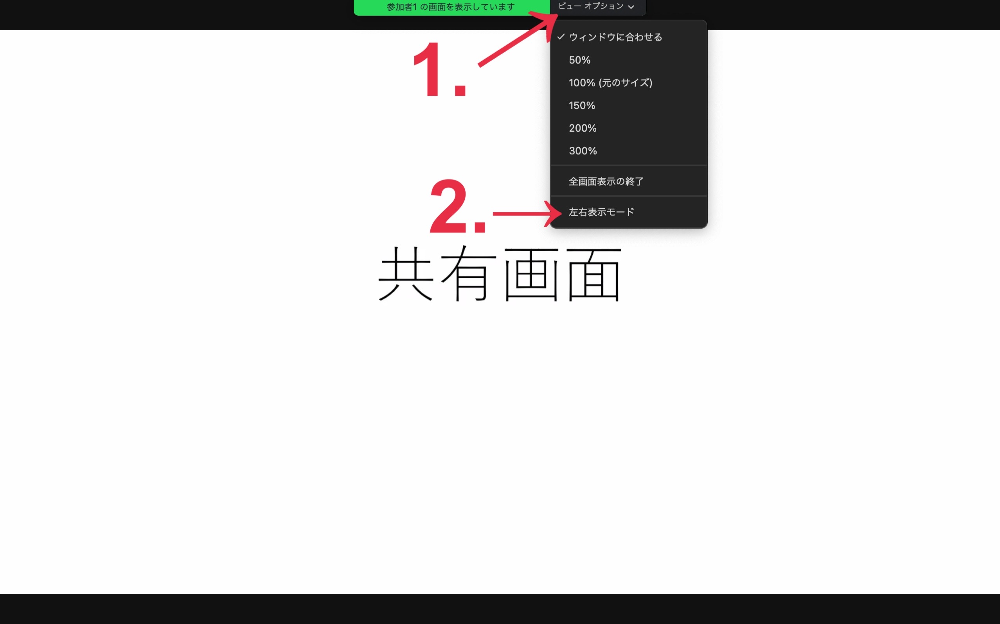

左右表示を終了したい場合には，2.の画面でチェックの入った「左右表示モード」を押してください．
また，画面右上の「表示」を押すことで，右側の参加者の表示を，スピーカービューとギャラリービューで切り替えることも可能です．
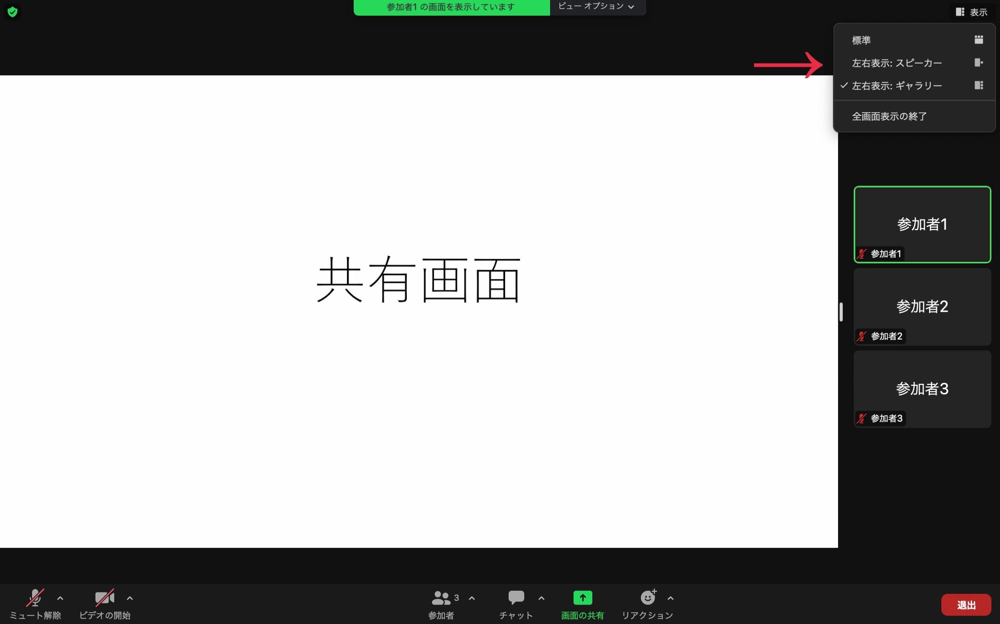

#### 共有画面と参加者のビデオの大きさの比率を変更する
左右表示の設定では，共有画面と参加者のビデオを区切るセパレータを調整することで，共有画面と参加者のビデオの大きさの比率を変更することが可能です．
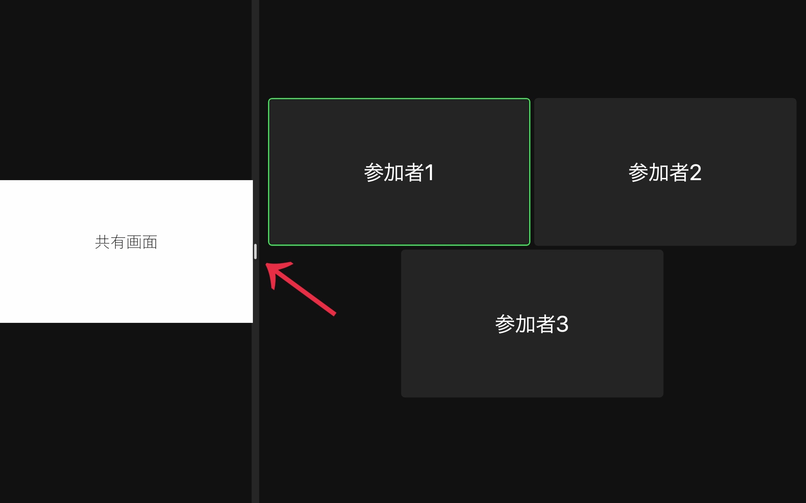
#### 左右表示をデフォルトに設定する
左右表示を毎回利用したい場合には，左右表示をデフォルトに設定すると非常に便利です．ここでは，設定手順を説明します．

1. 画面右上の歯車マーク（設定）を押してください．

2. 「画面の共有」を押してください．
3. 「左右表示モード」のチェックボックスをオンにしてください．
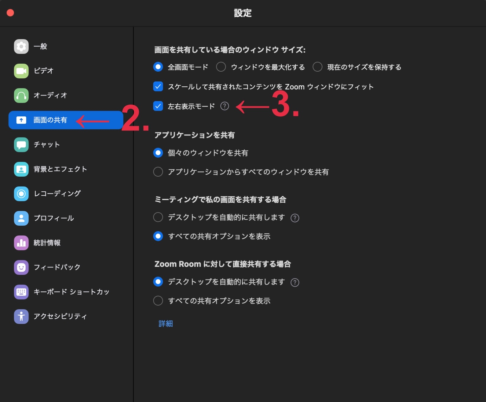

### （補足）共有画面と参加者のビデオを入れ替える（スワップ）
共有画面よりも参加者のビデオを大きく表示する別の方法として，共有画面と参加者のビデオを入れ替えるスワップという機能も存在しています．参加者のビデオの右上の「...」を押し，ピンを設定すると，一時的に共有画面と参加者のビデオを切り替えることができます．
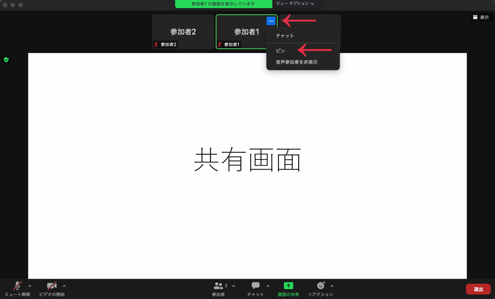
スワップを終了させたい場合には，画面左上に表示される「共有コンテンツに切り替え」を押すと元に戻ります．
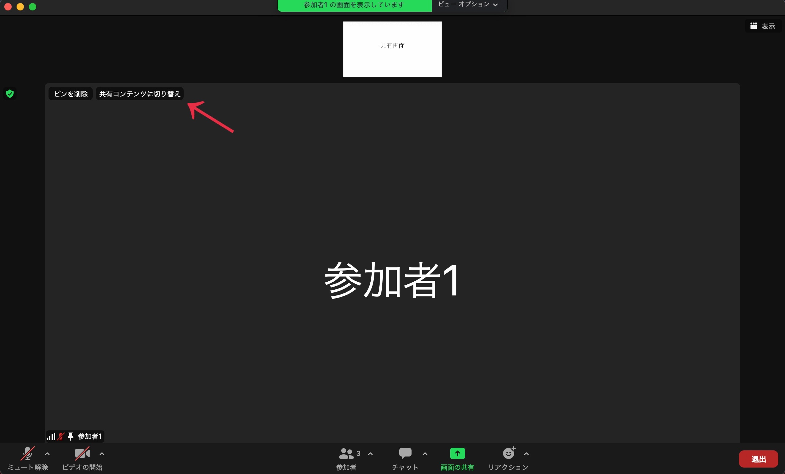
※再度スワップをしたい場合には，一旦ピンを削除してから同じ手順を繰り返す必要があるため，特別なこだわりがない限りは左右表示を使用した方が便利です．

## ホストが設定できる応用的な使い方
ここでは，ホスト側が使用できる機能のうち，便利なものを紹介します．
### 他の参加者に表示されるビデオを固定する（スポットライト）
他の参加者全員の画面に表示されるビデオをホストが設定できるスポットライトという機能があります．この機能は，ビデオONの参加者が3人以上いる場合に使用可能で，例えば教員以外が声や音を立てた場合に意図しない切り替えが発生するのを防ぐことができます．スポットライトには，最大9人まで設定が可能です．以下では，設定手順を説明します．

※この機能はホストが自分の画面だけでなく，参加者全員に影響を与える設定です．スポットライトがONの場合には参加者はピン留めが使用できません．

1. スポットライトを当てたい参加者のビデオにカーソルを合わせて，右上の「...」を押してください．
2. メニューから「全員のスポットライト」をクリックしてください．
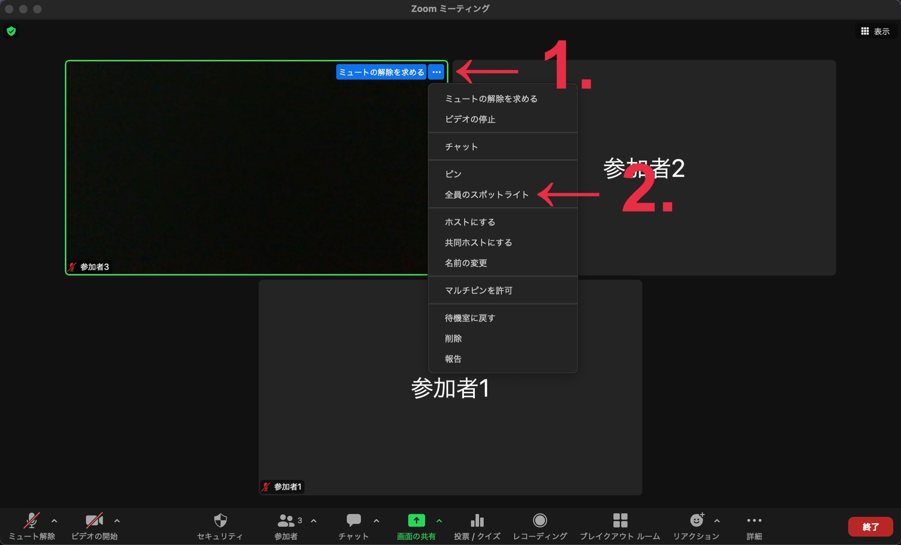

2人以上のスポットライトを設定したい場合には，再度参加者のビデオにカーソルを合わせて「...」をクリックした後，メニューから「スポットライトの追加」を押してください．
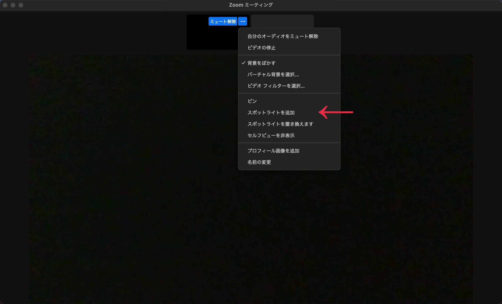
スポットライトを終了したい場合には，画面左上の「スポットライトを削除」を押してください．

### ホストのみが参加者のビデオを見える状態にする（フォーカスモード）
フォーカスモードという機能を使うと，ホスト・共同ホストは全ての参加者のビデオと共有画面を見ることができて，参加者からは自分やホスト・共同ホストのビデオと共有画面のみが見えるという状態を設定できます．この機能は，テストを行う場合など教員のみが学生の表情を確認したい場合に利用すると便利です．

#### 手順
フォーカスモードを開始したい場合には，以下の手順で設定してください．

1. 画面下部のミーティングツールバーの「詳細」を押してください．
2. 表示されるメニューから，「フォーカスモードを開始」を押してください．

3. 「フォーカスモードを開始しますか？」というメッセージが表示されたら，「開始」をクリックして確定するか，「今後このメッセージを通知しない」というチェックボックスをオンにして，今後この確認プロセスをスキップします．
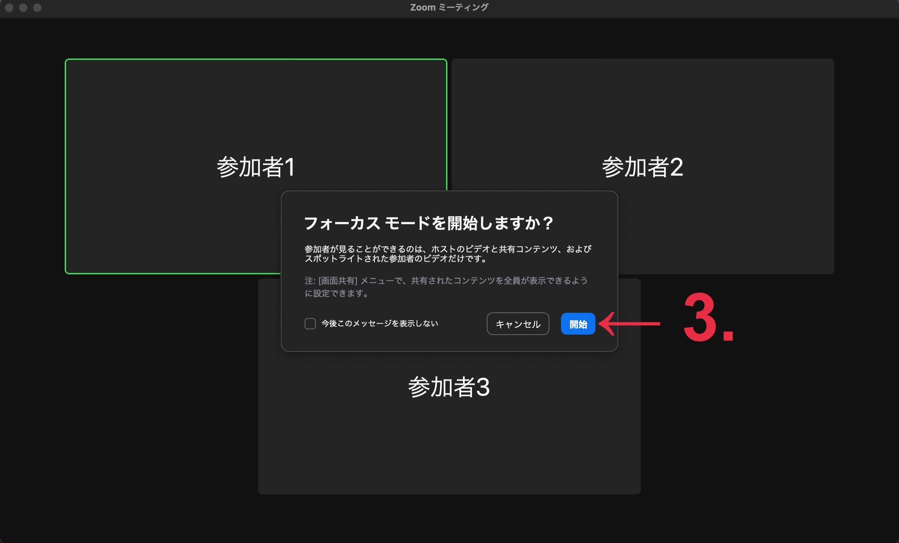
4. 画面上部に「参加者が見ることができるのは，ホスト，共同ホスト，およびスポットライトされたユーザーだけです」という通知が表示されれば正しく設定できています．
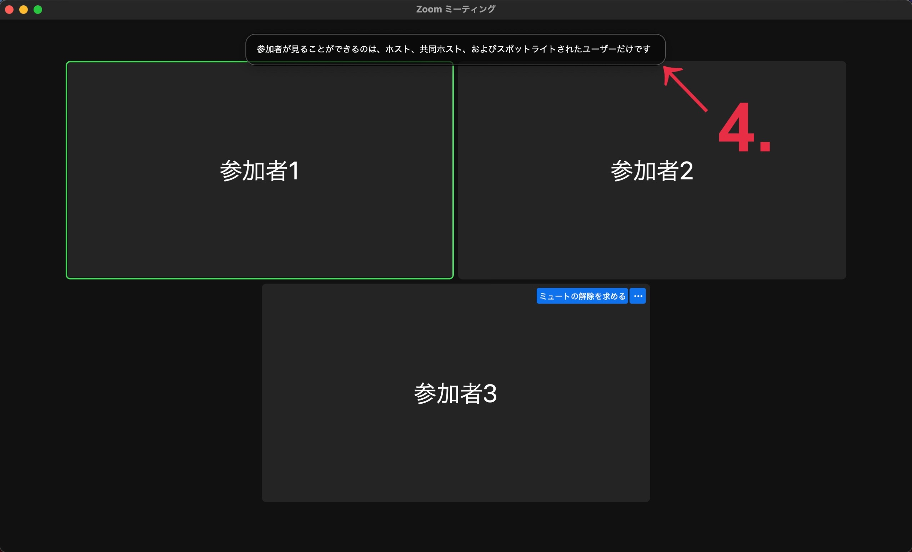

フォーカスモードを終了したい場合，1.の後に表示されたメニューで「フォーカスモードを停止」を押してください．
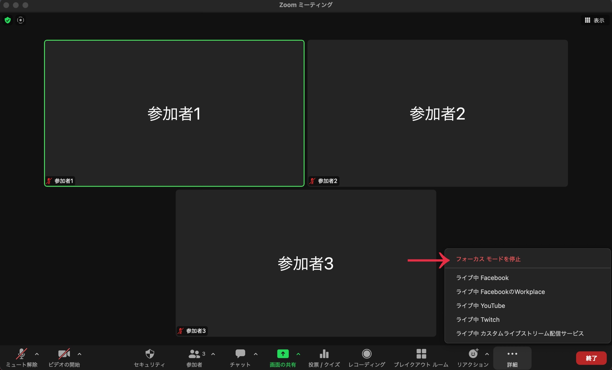

#### フォーカスモード中にスポットライトを当てる
フォーカスモード中にスポットライトを設定することで，スポットライトを当てた参加者のビデオを他の参加者にも表示させることが可能です．この機能は，発表で発表者のビデオのみを表示させたい場合などに便利です．スポットライトの設定方法は[他の参加者に表示されるビデオを固定する（スポットライト）](#他の参加者に表示されるビデオを固定するスポットライト)と同様です．

また，スポットライトを当てた学生の画面共有はデフォルトではホストにしか見えませんが，ホスト側が設定することで他の参加者にも表示させることが可能です．以下が設定手順です．

1. 画面下部のミーティングツールバーから，画面共有の右側にある上矢印「^」を押してください．
2. 「すべての参加者」を押してください．
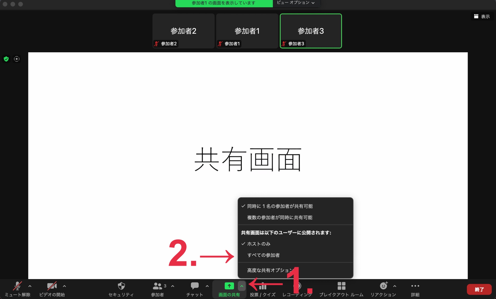

他の参加者への共有を終了したい場合には，上の画面で「ホストのみ」を押してください．
