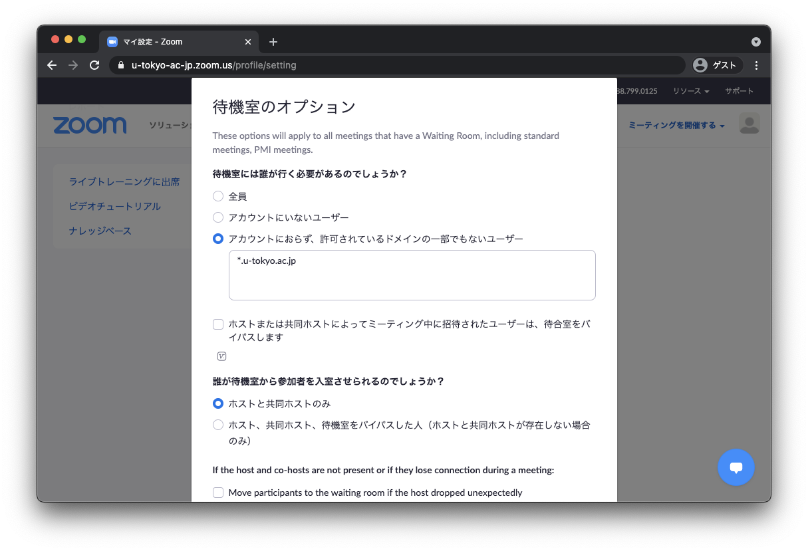

待機室機能は，参加ユーザを一旦待機室に入れ，ホストが明示的に入室を許可する機能です．
Zoomの設定画面から，待機室に誰を入れるかを設定することができます．

* 全てのユーザを一旦待機室に入れる設定
* 大学アカウントでサインインしたユーザは待機室に入れない(自動的に入室許可する)という設定

などがありますので，ミーティングを実施する前に意図した設定になっているかをご確認ください．この設定が全てのミーティングに反映されます．

Zoomミーティングの設定方法については，[Zoom会議室の作り方](create_room)もご確認ください．

オンライン授業において推奨する会議室の設定については，[オンライン授業での入室制限について](/faculty_members/zoom_access_control)もご確認ください．

## 設定方法
1. Web ブラウザで<a href="https://u-tokyo-ac-jp.zoom.us/profile/setting" target="_blank"> Zoom の設定ページ</a>へ移動します．
{:.medium}
2. 「待機室オプション」の「edit options」を選択します．
{:.medium}
3. 「待機室には誰が行く必要があるのでしょうか？」で適切なものを選択して設定してください。
    * **「全員」を選択した場合**: 全ての参加者が一旦待機室に入ります．面接や試験，個別の対応を行いたい時にはこの設定が適しています．
    {:.medium}
    * **「アカウントにいないユーザ」を選択した場合**: 東京大学のZoomアカウント(<code>@utac.u-tokyo.ac.jp</code>のメールアドレスで登録されているアカウント）でサインインしている参加者は，自動的に入室が許可されます．
    * **「アカウントにおらず、許可されているドメインの一部でもないユーザー」を選択した場合**: 東京大学のZoomアカウントでサインインされている参加者に加えて，特定のドメインのメールアドレスでZoomにサインインしている参加者は，自動的に入室が許可されます．オンライン授業においては，この設定にした上で，入力欄に<code>*.u-tokyo.ac.jp</code>を入力することを推奨します．
    {:.medium}